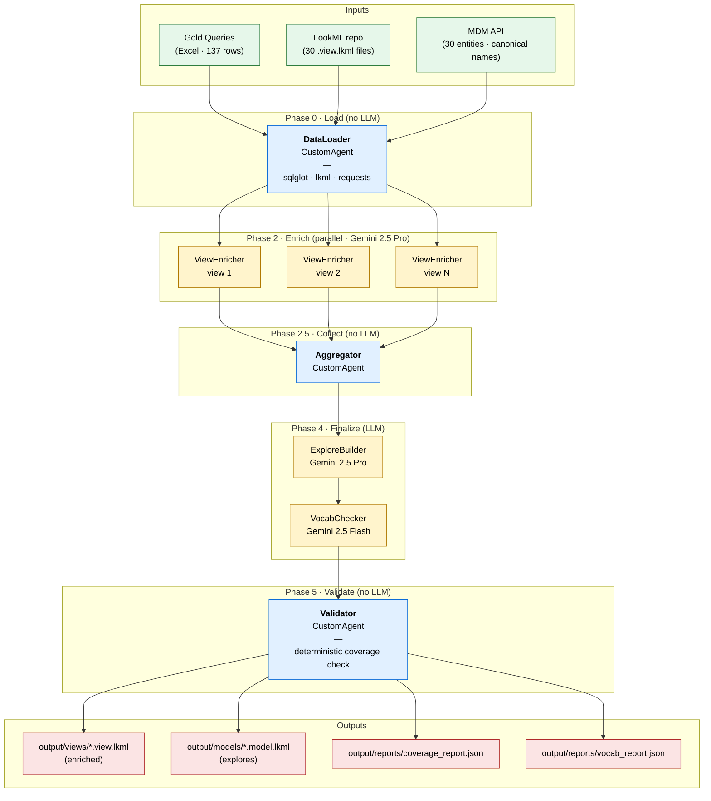
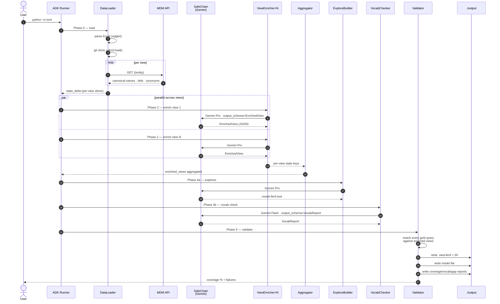

# LUMI — LookML Understanding & Metric Intelligence

A multi-agent pipeline that enriches LookML views using gold NL-to-SQL queries + MDM business metadata + Gemini reasoning, so a downstream NL2SQL agent can answer **any** question about those views — not just the ones it was trained on.

Built on Google ADK 1.31. SafeChain-routed LLM access. BigQuery-dialect SQL parsing. Deterministic everywhere possible, LLM only where intelligence actually adds value.

---

## Architecture



**Blue = deterministic (Python + sqlglot + lkml). Yellow = LLM (SafeChain → Gemini). Green = inputs. Red = outputs.**

---

## Run sequence



---

## Three sources of truth

| Source | What it provides | % of fields it covers |
|---|---|---|
| **Gold queries** (137 prompts + SQL) | User vocabulary ("NAA", "AIF"), aggregation patterns, join paths, default filters | ~30% |
| **MDM API** (30 entities) | Canonical business names, definitions, synonyms, allowed values | ~60% |
| **LLM inference** (Gemini Pro) | Domain-consistent descriptions for the remainder, tagged `inferred` for review | ~10% |

Every field in every view gets enriched. Nothing is left blank.

---

## Will this work?

| Layer | Confidence | Why |
|---|---|---|
| Schemas + 6 tools (Excel, Git, MDM, grouping, LookML, validation) | **High** | 40 tests pass, `mypy --strict` clean, `ruff` clean |
| DataLoader + Aggregator + Validator (deterministic agents) | **High** | Smoke-tested with the real ADK Runner |
| `SafeChainLlm` adapter | **High** | Lifted verbatim from `docs/ADK_INTEGRATION.md` |
| First real pipeline run on work laptop | **Medium** | Depends on SafeChain install, CIBIS creds, VPN, MDM shape, gold-query SQL quality |
| Coverage % on first run | **Low-Medium** | Expect 60-80% on run 1; iterate `lumi/prompts/view_enricher.md` to reach 95%+ |
| Large views (>150 fields) | **Medium** | `batch_fields` is written + tested but not yet wired into a `LoopAgent`; single-shot works up to Gemini Pro's context limit (~1M tokens, plenty for typical views) |

**Known sharp edges (documented, not hidden):**
1. ViewEnricher makes one LLM call per view regardless of size. Views with 14K+ lines may need `LoopAgent` batching — wire this in Session 9 if the first run shows truncation.
2. No rate-limit semaphore on `ParallelAgent` — 30 parallel calls should be fine for SafeChain, but swap for a `LoopAgent` with bounded concurrency if you hit HTTP 429.
3. MDM response shape is assumed to look like the fixture in `tests/fixtures/sample_mdm_response.json`. `mdm_tools._normalize` tolerates alternate shapes (`attributes`/`fields`/`columns`) but an exotic MDM response may need a normalizer tweak.
4. sqlglot may choke on non-standard BigQuery SQL (nested CTEs with `QUALIFY`, etc.). Those queries get `parse_error` set; they're still recorded, still tracked in the coverage report, just can't participate in field-frequency stats.

---

## Get started

Full instructions + troubleshooting matrix in **[BOOTSTRAP.md](./BOOTSTRAP.md)**. TL;DR:

```bash
git clone https://github.com/bardbyte/wyla.git lumi && cd lumi
python -m venv .venv && source .venv/bin/activate
pip install -e ".[dev]"

# Local dev — these run without Amex infra
pytest tests/                                # 40 tests, all green
ruff check lumi/ src/ tests/
mypy lumi/ src/

# Full pipeline — needs SafeChain + .env + lumi_config.yaml
cp .env.example .env                         # fill CIBIS_* + CONFIG_PATH + MDM_BEARER_TOKEN
cp lumi_config.example.yaml lumi_config.yaml # fill repo, views, entity mappings, gold Excel path
./scripts/preflight_deps.sh
./scripts/preflight_github.sh
./scripts/preflight_mdm.sh
./scripts/preflight_llm.sh
python -m lumi
```

---

## Repo layout

```
lumi/
├── agent.py                     # build_root_agent — the Sequential/Parallel tree
├── __main__.py                  # `python -m lumi` entry point
├── config.py                    # YAML → LumiConfig loader (pydantic)
├── util.py                      # safe_key — one fn, enforces DataLoader↔ViewEnricher contract
├── schemas/                     # config · query · view · report (pydantic, strict)
├── tools/                       # 6 deterministic tools · sqlglot · lkml · requests
├── agents/                      # 5 ADK agents · 1 parallel · 3 LLM · 2 custom
└── prompts/                     # view_enricher · explore_builder · vocab_checker

src/adapters/adk_safechain_llm.py   # SafeChain chat model → ADK BaseLlm bridge

tests/                              # 40 tests: schemas · 6 tools · 3 agent smoke tests
│   ├── test_schemas/
│   ├── test_tools/
│   ├── test_agents/
│   └── fixtures/                   # sample Excel · view · MDM response

scripts/                            # 4 preflights: deps · github · mdm · llm
docs/                               # DESIGN.md · PLAN.md · README (SafeChain) · ADK_INTEGRATION
```

---

## Design principles (the 12 rules)

Enumerated in [CLAUDE.md](./CLAUDE.md). The ones that matter most:

1. LLM **never** sees raw `.lkml` text. Always `lkml.load()` first.
2. SQL parsing = `sqlglot`. Never regex. Never LLM.
3. LLM is only for: descriptions, tags, labels, explores, vocab check. Nothing else.
4. Temperature = 0 for every LLM call.
5. LLM access goes through SafeChain only. No `openai` / `google.generativeai` / `vertexai` imports anywhere.
6. Structured LLM output = `output_schema=PydanticModel`. Never regex-parse free text.
7. Every field in every view gets enriched — not just the ones gold queries touch.

---

## Cost + time budget

```
Phase 0 — Load              ~30s            $0
Phase 2 — Enrich (30 pro)    60-90s          ~$0.94
Phase 4 — Explores + vocab   ~15s            ~$0.12
Phase 5 — Validate           <5s             $0

Total                        3-5 min         ~$1.10 per run
```

32 LLM calls per full run, via SafeChain → CIBIS/IDaaS → Amex-hosted Gemini.
