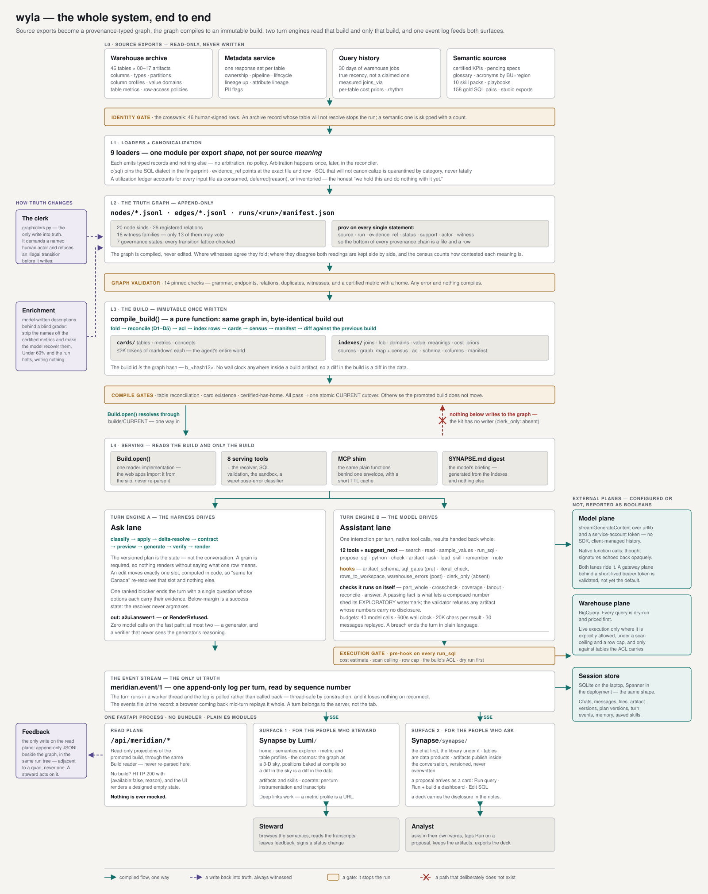

# The system, end to end

One sheet for the whole solution: source exports on one end, a person
asking a question on the other, and every gate in between.

The drawing is a single hand-authored SVG
([`end-to-end.svg`](end-to-end.svg)). It carries its own light and dark
palettes, so it reads on either background and needs no second copy.

For the layer-by-layer version with source citations, read
[wiki page 2](../wiki/02-architecture.md); this page is the one to send
someone who has ten minutes and no context.

---

## What the sheet is claiming

**The graph is compiled, never edited.** Information moves down. Each
boundary has exactly one crossing mechanism, named on its arrow. The
compiler is a pure function of the graph, so the build id *is* the graph
hash and a diff in the build is a diff in the data.

**A gate stops the run.** Four of them: identity at the door, the
validator before anything compiles, the compile gates before the atomic
`CURRENT` cutover, and the execution gate before anything reaches the
warehouse. None of them degrade a run into a weaker result. They stop it,
and the promoted build does not move.

**The build is a membrane.** The agent's world starts at `Build.open()`
and ends there. The crossed arrow on the sheet is the invariant the rest
of the design leans on: no tool in the chat kit writes to the graph — an
absence registered as a hook (`clerk_only`, `kind: "absent"`) so that it
is documented and testable rather than merely true.

**Truth changes three ways, all witnessed.** A named human through the
clerk, which refuses an illegal lattice transition before it writes. A
model through the enricher, behind a blind grader that halts the run and
writes nothing rather than ship weak output. And feedback, which lands
beside the graph in the same run tree — quads-adjacent, never a quad —
for a steward to act on through the clerk.

---

## If it helps, a courthouse

The sources are **witnesses**, and the system treats them that way: every
statement records who saw it, in which run, and the exact file and row it
came from. Sixteen witness families, of which only thirteen may vote —
the gold queries are the answer key, so letting them rank evidence would
be the system grading its own exam.

When witnesses disagree the reconciler does not pick a winner and discard
the loser. It keeps both readings side by side and counts how contested
the meaning is; that count is the census, a difficulty meter rather than
a confidence score.

The **clerk** is the only officer who can amend the record, on a named
human's motion and only along a legal transition. The compiled build is
the published transcript: immutable, citable, stamped with its own hash.
The agent is counsel who may argue only from that transcript — it enters
no new evidence, every number carries its citation, and a figure it
assembled itself wears an `EXPLORATORY` watermark until a check it ran
clears it.

---

## Where each piece lives

| path | what it is |
|---|---|
| [`scripts/pipeline.py`](../../synapse-agentic-harness-system/scripts/pipeline.py) | one CLI over every runbook: census, build-graph, compile, promote, enrich |
| [`sahs/loaders/`](../../synapse-agentic-harness-system/sahs/loaders/) | one module per export shape; each emits typed records and nothing else |
| [`sahs/canon/canonical.py`](../../synapse-agentic-harness-system/sahs/canon/canonical.py) | `c(sql)` — the canonical form every fingerprint hangs off |
| [`sahs/graph/quads.py`](../../synapse-agentic-harness-system/sahs/graph/quads.py) | the quad store and the witness vocabulary |
| [`sahs/graph/validate.py`](../../synapse-agentic-harness-system/sahs/graph/validate.py) | the fourteen pinned checks |
| [`sahs/graph/clerk.py`](../../synapse-agentic-harness-system/sahs/graph/clerk.py) | the only write into truth |
| [`sahs/compiler/compile.py`](../../synapse-agentic-harness-system/sahs/compiler/compile.py) | quads → an immutable build, then the atomic cutover |
| [`sahs/tools/api.py`](../../synapse-agentic-harness-system/sahs/tools/api.py) | `Build.open()` — the read API everything downstream shares |
| [`sahs/ask/`](../../synapse-agentic-harness-system/sahs/ask/) | the deterministic lane and the `a2ui.answer/1` envelope |
| [`sahs/assistant/`](../../synapse-agentic-harness-system/sahs/assistant/) | the thin loop, the twelve tools, the hooks, the checks |
| [`apps/synapse_admin/backend/`](../../apps/synapse_admin/backend/) | the read plane both surfaces share, and the turn API |

---

## A note on the counts

Every number on the sheet was read out of the tree rather than recalled:
node kinds and governance states from `sahs/graph/ids.py`, relations and
witness families from `sahs/graph/quads.py`, the fourteen checks from
`sahs/graph/validate.py`, and the tools, hooks and budgets from
`sahs/assistant/`.

Two of them have moved since the older documents were written, and those
documents have not caught up: there are now **26 registered relations**
and **16 witness families** (13 of which rank), the sixteenth being `kc`,
the catalog read-back — a witness of what the catalog says, filed
pending, never overriding the graph. The wiki's scale table, page 4, the
paper and the deck still carry 25 and 15.

## Editing the drawing

It is plain SVG with no build step: open it, move a `y`, reload. The
layout is a stack of bands on a shared grid — the spine runs `x=236..1254`
with its centre at `745`, the write-back lane sits left of it, the
external planes right of it. Colours are CSS custom properties with
literal fallbacks (`var(--dg-flow, #14706a)`), defined once at the top for
light and again under `prefers-color-scheme: dark`, so a palette change is
one edit in one place.
