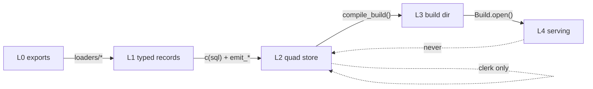
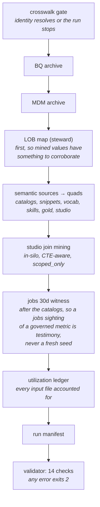
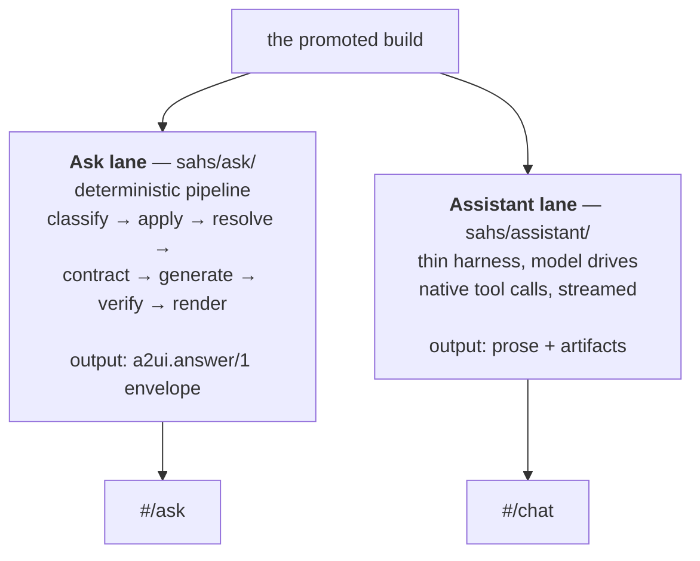
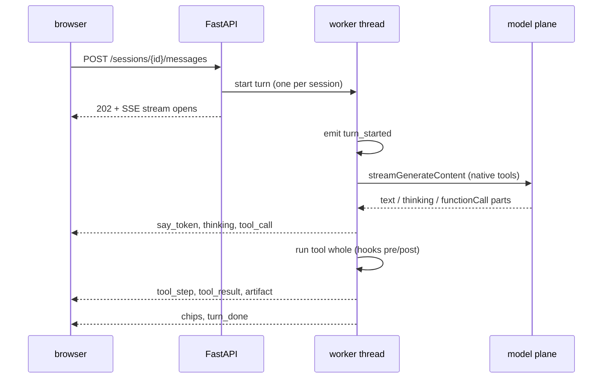

# 2 · Architecture and Data Flow

**Relevant source files**

- [`sahs/graph/quads.py`](../../synapse-agentic-harness-system/sahs/graph/quads.py)
- [`sahs/compiler/compile.py`](../../synapse-agentic-harness-system/sahs/compiler/compile.py)
- [`sahs/tools/api.py`](../../synapse-agentic-harness-system/sahs/tools/api.py)
- [`scripts/pipeline.py`](../../synapse-agentic-harness-system/scripts/pipeline.py)
- [`docs/runbooks/pipeline_end_to_end.md`](../../synapse-agentic-harness-system/docs/runbooks/pipeline_end_to_end.md)

---

## Purpose and Scope

The five layers, what crosses each boundary, and which invariants hold at
each one. This is the page to read before changing anything.

---

## The five layers

| layer | name | artifact | mutability |
|---|---|---|---|
| **L0** | source exports | files on disk | read-only, never written |
| **L1** | typed records | in-memory `ExpressionRecord`, `VocabRecord`, … | transient |
| **L2** | the truth graph | `graph/{nodes,edges}/*.jsonl` | **append-only** |
| **L3** | the build | `builds/b_<hash12>/` | **immutable once written** |
| **L4** | serving | `Build.open()` + tools + agent | read-only |

Each boundary has exactly one crossing mechanism.



The two dotted arrows are the whole governance story:

- The only write back into L2 is `sahs/graph/clerk.py`, which requires a
  human `actor` and refuses illegal lattice transitions before writing.
- Nothing in L4 writes to L2. The chat toolkit contains no writer — a
  hook named `clerk_only` is registered with `"kind": "absent"` precisely
  so the absence is documented rather than merely true.

---

## The pipeline CLI

`scripts/pipeline.py` is one surface over every runbook. Subcommands:

| command | reads | writes | gates |
|---|---|---|---|
| `census` | sources + registry | `census.json`, `census_tail.jsonl` | canonicalization rates |
| `make-tasks` | sources + gold | eval task JSONL | — |
| `build-graph` | archives + sources + crosswalk | `graph/` quads, run manifest | `crosswalk_resolution`, `jobs_canon_rate`, `graph_valid` |
| `compile` | `graph/` | `builds/b_<hash>/`, moves `CURRENT` | table reconciliation, card existence, certified-has-home |
| `enrich` | promoted build + graph fold | `llm_enriched` quads | blind name recovery ≥60% |

Every subcommand:

- streams `meridian.event/1` to `<out>/events.jsonl`
- renders TTY progress, or plain heartbeats (`--plain`)
- checkpoints long loops (`--resume` default, `--fresh` restarts)
- prints a summary block on every exit
- honors the pinned exit codes
- emits a machine summary with `--json`

```
0  ok        1  gate failure    2  validation error
3  env/auth  4  interrupted
```

Fixture CI runs **every** subcommand end to end. That is the guard
against runbook drift — the failure mode where the docs describe a
command nobody has run in a month.

---

## The build-graph run order (pinned)

Order matters, and each step's position is a decision:



Three orderings you should not swap:

1. **Crosswalk first.** Identity confusion is the one error class that
   corrupts everything downstream, so it fails at the door.
2. **Steward LOB map before the catalogs.** A steward declaration mints
   the `lob:` node; catalog and mined values then *corroborate* it.
   Reversed, mined noise would mint identity.
3. **Jobs witness last.** A jobs sighting of an already-governed metric
   is testimony, never a fresh seed (E7).

---

## What crosses each boundary

### L0 → L1: loaders

One module per source **shape**, not per source *meaning*. Each emits
typed records and nothing else — no arbitration, no policy. Arbitration
happens once, in the reconciler.

Records carry an `evidence_ref` back to the exact source location. The
bottom of every provenance chain is a file and a row.

### L1 → L2: `c(sql)` + `emit_*`

Anything SQL-shaped passes through canonicalization
([Page 3](03-canon-and-identity.md)); everything gets a `prov` block and
a witness family ([Page 4](04-quad-store.md)).

Two failure policies, deliberately different:

| class | policy | why |
|---|---|---|
| archive record whose table won't resolve | **BLOCK the run** | identity errors corrupt everything downstream |
| semantic record whose table won't resolve | **skip with a count** | semantic sources legitimately mention out-of-scope tables |
| SQL that won't canonicalize | **categorized quarantine** | one junk row in 35.7K must not kill a run |

### L2 → L3: `compile_build()`

A pure function. Same graph → byte-identical build. The build id *is* the
graph hash:

```python
build_id = f"b_{graph_hash(graph_root)}"     # sha256 over sorted jsonl, 12 hex
```

No wall clock anywhere in a build artifact; run metadata lives in the
event stream. See [Page 6](06-compiler.md).

### L3 → L4: `Build.open()`

```python
"""The agent's world ends here: every function reads ONLY the immutable
build directory (cards + indexes + acl + schema) — never the truth
graph."""
```

`Build.open(builds_root)` resolves through `builds/CURRENT`. Explicit
paths are for tests. See [Page 7](07-serving.md).

---

## Two independent turn engines

The tree carries two agent lanes, both over the same build. They are not
versions of each other; they answer different shapes of question.



| | Ask lane (E18) | Assistant lane (v3) |
|---|---|---|
| who drives | the harness | the model |
| shape | fixed 7-stage pipeline | one interaction, tool calls until done |
| model calls per turn | 0 on the fast path | as many as the model needs, ≤40 |
| governance | a contract gate before rendering | hooks around every tool call |
| refusal | `RenderRefused` if no meridian line or no grain | artifact validator refuses undisclosed numbers |
| output schema | `a2ui.answer/1` | artifact types + streamed prose |
| best at | a governed number with receipts | analysis, deliverables, conversation |

Pages [9](09-ask-lane-a2ui.md) and [8](08-agent-harness.md) respectively.

The design note behind the split
([`docs/harness-discipline.md`](../../synapse-agentic-harness-system/docs/harness-discipline.md))
is principle 1: *don't build an agent where a workflow will do.* classify,
apply, resolve, typecheck, contract and verify are code paths with known
shapes. The model is invited only where the path is genuinely open.

---

## The event stream is the only UI truth

Every stage of every lane emits `meridian.event/1`. The events **file**
is the record: replay is re-consuming it, so a reconnecting browser sees
the same turn it would have seen live.



The bus is deliberately **poll-based rather than callback-based**: the
turn pipeline runs in a worker thread (the resolver is CPU work, model
calls are blocking HTTP) while SSE consumers live on the event loop. A
lock-protected append log read by sequence number is thread-safe by
construction and loses nothing on reconnect.

Practical consequence: **a turn belongs to the server, not the tab.**
Leaving the page closes only the listener; coming back mid-turn
reattaches from the turn's first event and replays it whole.

---

## Next

→ [Page 3 · Canonicalization and Identity](03-canon-and-identity.md)
