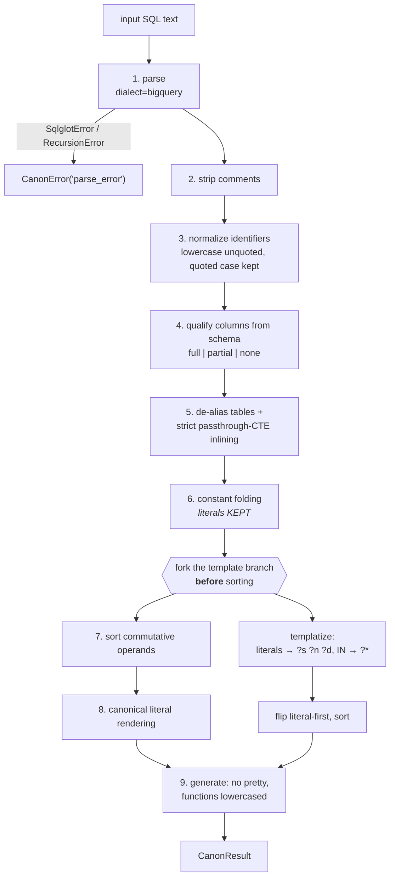

# 3 · Canonicalization and Identity

**Relevant source files**

- [`sahs/canon/canonical.py`](../../synapse-agentic-harness-system/sahs/canon/canonical.py)
- [`sahs/canon/fingerprint.py`](../../synapse-agentic-harness-system/sahs/canon/fingerprint.py)
- [`sahs/canon/authority.py`](../../synapse-agentic-harness-system/sahs/canon/authority.py)
- [`sahs/canon/census.py`](../../synapse-agentic-harness-system/sahs/canon/census.py)
- [`sahs/graph/ids.py`](../../synapse-agentic-harness-system/sahs/graph/ids.py)
- [`tests/test_canon.py`](../../synapse-agentic-harness-system/tests/test_canon.py)

---

## Purpose and Scope

How two expressions that *mean* the same thing come to have the same
identity, and how every id in the graph is a pure function of the thing
it names.

This is the foundation layer (P0). Everything downstream — equivalence
classes, the authority lattice, the census, metric identity, the verdict
lattice — keys on its output.

---

## `c(sql)` — one function, nine passes

```python
def c(sql: str, *, schema=None, dialect="bigquery") -> CanonResult
```

Pinned operation order. Changing it bumps `CANON_RULESET` and remints
every fingerprint deliberately.



### Why literals are kept

Predicates are literal-bearing. `country_cd = 'GB'` and
`country_cd = 'US'` are *different filters*, and a semantic layer that
fuses them has lost the distinction its users care about most. So
`fp_expr` keeps literals.

The template branch exists for the other question — "what pattern is
this?" — and it forks **before** operand sorting so that pattern identity
is arity-blind: an `IN` list of 3 and an `IN` list of 300 collapse to the
same `?*`.

### What comes out

```python
@dataclass
class CanonResult:
    canonical_sql: str
    fp_expr: str          # 12 hex — exact expression identity
    fp_template: str      # 12 hex — pattern identity
    tables: list[str]     # CTE names excluded
    kind: str             # select | union | …
    qualified: str        # full | partial | none
    canon_version: str
    ast: Any
```

`qualified` is honest about degradation: with a schema, `qualify` is
attempted; on failure it degrades to alias resolution only and the result
says `"partial"` rather than pretending.

---

## The fingerprint carries its own version

```python
fp = sha256(canonical_text ⊕ NUL ⊕ dialect ⊕ NUL ⊕ canon_version)[:12]

CANON_VERSION = f"{CANON_RULESET}:{sqlglot.__version__}"
```

**A fingerprint can never accidentally collide across rulesets or parser
upgrades.** An upgrade changes every fingerprint, which is exactly the
loud behaviour we want.

| scenario | without version in fp | with version in fp |
|---|---|---|
| sqlglot upgrade changes canonical form for *some* expressions | those expressions silently re-fingerprint; the graph forks identities; no error | **every** fp changes; `test_canon.py` goes red |
| recovery | none — you cannot tell which ids drifted | remint from stored `canonical_sql`, mechanically |

The canonical text is stored beside every fingerprint precisely so the
remint is mechanical: `SAHS_REGEN_GOLDENS=1`.

> A failure in `tests/test_canon.py` after a dependency change almost
> always means the sqlglot pin moved.

---

## Quarantine categories

`c()` raises `CanonError` with one of four categories. `try_canon()` is
the wrapper with a documented guarantee: **it never raises.**

| category | cause | counted as |
|---|---|---|
| `parse_error` | tokenizer or parser refused (unterminated backticks and worse) | pipeline failure |
| `fragment` | empty statement | pipeline failure |
| `dialect` | wrong-dialect input (e.g. SQLite demo SQL) | deliberate, pre-filtered |
| `transform` | any transform or generator blow-up | pipeline failure |

Source-level categories layer on top of these; `blue_insights` adds
`out_of_scope` (the row's table is not in this run's registry — nothing is
missing) and `not_sql` (prose in the SQL column, caught *before* the
parser so the canon rate measures the pipeline on rows that claim to be
SQL).

Two recovery behaviours worth knowing:

- **Column swap.** Some export rows arrive with label and SQL swapped.
  Detection is deterministic — this side fails to parse, that side parses
  — and the row is recovered with `extra.column_swap=True`. A row broken
  on both sides still reaches the parser and fails there honestly.
- **Wrappers.** WHERE fragments and CASE expressions enter the one
  pipeline wrapped, so fingerprints fuse across witnesses:

```python
def wrap_predicate(fragment, table): return f"SELECT 1 FROM {table} WHERE {fragment}"
def wrap_case(fragment, table):      return f"SELECT {fragment} FROM {table}"
```

The jobs miner wraps *exactly the same way*, which is why a predicate
mined from raw query history fuses with the same predicate pasted into a
wiki six years ago.

---

## Rules that came from the corpus

Two normalizations exist only because a conflict count was too high and
somebody asked why.

```python
# ruleset 2: COUNT(*) ≡ COUNT(1) — BigQuery treats them identically;
# two fingerprints for one function is a lie the jobs witness exposed
# (catalog said COUNT(1), jobs said COUNT(*), and the same metric
# refused to fuse)
```

```python
if len(node.expressions) == 1 and not node.args.get("query"):
    # x IN ('B')  ≡  x = 'B' — collapse so the census doesn't count a
    # phantom second class (found by fixture census)
```

**No CNF expansion** — explosion risk on the 35K snippet corpus. Two
logically equivalent predicates with different boolean structure will not
fuse. Commutative operands are sorted; that is where it stops.

---

## The ID grammar

Never auto-increment, never UUID. An id is a pure function of the entity,
so two runs producing the same fact produce the same line.

```
table:<dataset>.<table>              project lives in prov, not the id
col:<dataset>.<table>.<column>       nested field paths keep full dotted name
pred:<fp12>   tmpl:<fp12>            canonical-AST fingerprints
metric:<fp12>                        fp(expr + grain + entity)
mgroup:<key>                         dmp/gmns id, else label@entity
concept:<label_norm>@table:<ds>.<t>
term:atlas:<id>
acr:<symbol>@<bu>@<region>           missing scope → all
skill:<pack>
schema:<dataset>.<table>@v<n>
domain:<dataset>.<table>.<column>    low-cardinality value domain
status:<state>                       the governance lattice
doc:<slug>  run:<id>  policy:<slug>  owner:<slug>
review:<fp12>
lob:<slug>                           line of business
mdom:<slug>                          metric domain
```

Twenty kinds, each with a compiled regex in `ID_PATTERNS`. `kind_of(id)`
returns the kind or `None`, and `append_node` refuses an id that fails
the grammar.

### The mint-site rule

Where an id embeds a source-provided string, the slug happens at
**exactly one mint site** and the verbatim value stays in `props`.

```python
def concept_id(label_norm: str, physical_table: str) -> str:
    """The node id is a DERIVATION, not the label: E9 keeps the concept
    label verbatim on the record, while the id slugs every character the
    grammar forbids to `_` (real tribal labels carry `/ . ::`).
    Deterministic; punctuation-only variants may fold — their provs both
    survive the fold."""
```

| helper | slugs | note |
|---|---|---|
| `table_id`, `col_id` | lowercase + trim | |
| `concept_id` | `[^a-z0-9_ -]` → `_` | real labels carry `/ . ::` |
| `mgroup_id` | `[^a-z0-9_:@-. ]` → `_` | a mined id can carry the expression text itself |
| `term_node_id` | `[^a-z0-9_-]` → `_` | **the term node and every `mapped_term` edge must derive the id identically — mint here only** |
| `owner_id` | `[^a-z0-9_-.@]` → `_` | MDM ownership values are sometimes display names |
| `lob_id`, `mdom_id` | `[^a-z0-9_-]` → `_` | slug of the **code**, so `"GMNS"` and `"gmns"` corroborate |
| `acr_id` | lowercase, `@` → `_`, missing scope → `all` | the same symbol can mean several things |

The `lob_id` docstring is the discipline in miniature:

> A display name used as a code slugs to a DIFFERENT node — divergence
> stays visible in the graph rather than being guessed away.

---

## The authority lattice

Defined once, in `canon/authority.py`, and imported everywhere —
including by the census, which is why it lives in the canonicalization
package and not in the compiler.

```
certified(dmp) ≻ pending(gmns) ≻ skill-contract ≻ mined(support, recency) ≻ snippet
```

```python
class Authority(IntEnum):
    SNIPPET = 1          # tribal fragments
    MINED = 2            # distilled query history
    SKILL_CONTRACT = 3   # skill-pack metric contracts
    PENDING = 4          # submitted for approval
    CERTIFIED = 5        # the meridian line
```

| source name | tier | confidence ceiling |
|---|---|---|
| `metrics_dmp` | CERTIFIED (5) | 0.95 |
| `extended_gmns` | PENDING (4) | 0.80 |
| `skill_contract`, `gold_queries` | SKILL_CONTRACT (3) | 0.70 |
| `measures_catalog`, `jobs_30d` | MINED (2) | 0.55 |
| `blue_insights` | SNIPPET (1) | 0.40 |

> Within a tier, support and recency break ties; **across tiers, nothing
> does** — the resolver sorts lexicographically on
> `(authority, everything else)`, so support can never outvote
> certification.

`authority_for(source)` raises on an unknown source name and lists the
known ones. There is no silent default tier.

---

## The census — the honest difficulty meter

Recomputed every build. For every `(concept_label_norm, table)` cell and
every metric intent: how many distinct canonical classes exist, with what
support and what maximum authority.

One number per cell answers *"how contested is this meaning?"* — which is
simultaneously the governance work queue and the resolver's ambiguity
map.

Three honesty constraints, pinned:

| constraint | consequence |
|---|---|
| label normalization is lower/trim/collapse-whitespace **only** (E9) | `ALIF` and "active locations in force" count separately; the census `meta` says so out loud, so totals must not be read as deduplicated |
| content is run-independent — no timestamps, no run ids | byte-identical re-runs are provable; run metadata lives in the event stream |
| tail control | main file keeps classes with support ≥2 or authority above snippet; the long tail spills to `census_tail.jsonl`; ≤10 classes render per cell with an overflow count |

The compiled census (in the build) adds a `meta` block that states what
the counters *cannot* see — see [Page 6](06-compiler.md).

---

## Next

→ [Page 4 · The Quad Store and the Witness Model](04-quad-store.md)
