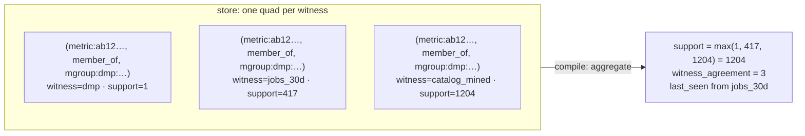
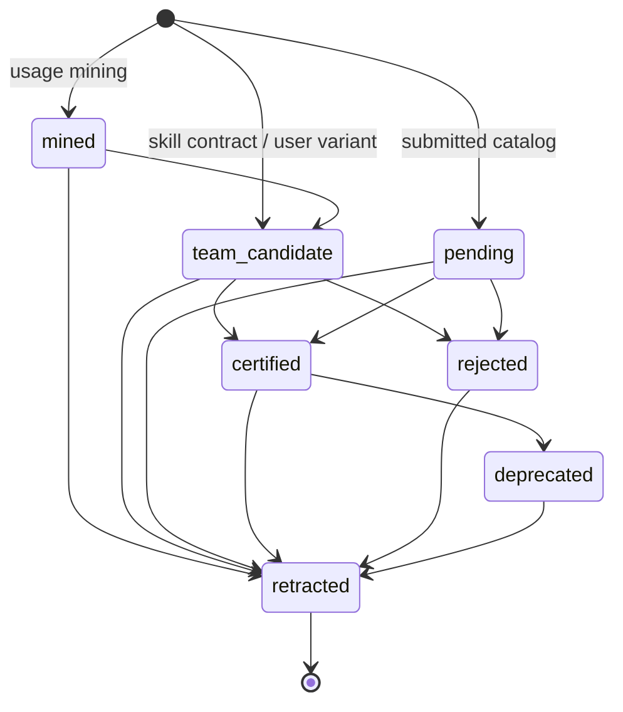

# 4 · The Quad Store and the Witness Model

**Relevant source files**

- [`sahs/graph/quads.py`](../../synapse-agentic-harness-system/sahs/graph/quads.py)
- [`sahs/graph/validate.py`](../../synapse-agentic-harness-system/sahs/graph/validate.py)
- [`sahs/graph/crosswalk.py`](../../synapse-agentic-harness-system/sahs/graph/crosswalk.py)
- [`sahs/graph/lob.py`](../../synapse-agentic-harness-system/sahs/graph/lob.py)
- [`sahs/graph/review.py`](../../synapse-agentic-harness-system/sahs/graph/review.py)
- [`sahs/graph/clerk.py`](../../synapse-agentic-harness-system/sahs/graph/clerk.py)
- [`tests/test_p2_graph.py`](../../synapse-agentic-harness-system/tests/test_p2_graph.py)

---

## Purpose and Scope

The storage layer: what a quad is, how provenance rides on every
statement, what a *witness* is and why the fold key includes it, the
25-relation registry, and the 14 checks that block a build.

---

## Layout

```
graph/
  nodes/<kind>.jsonl        {"id", "props", "prov"}
  edges/<relation>.jsonl    {"s", "r", "o", "props"?, "prov"}
  runs/<run_id>/manifest.json
  identity/
    crosswalk.jsonl         46 signed rows — table identity
    aliases.jsonl           alternative names
    lob_map.jsonl           line-of-business membership
    org_map.jsonl           org units (sub-LOBs)
    exclusions.jsonl        the 46→45 rule
  skills/                   analyst-authored session skills
```

> Discipline replaces the database: single writer, append-only (nobody
> edits history), current state = a fold where the LAST line wins per
> identity.

**Why JSONL in git.** It diffs. A pull request over the store is
readable, `git blame` answers "who added this statement," and the store
is derivable from the archives, so the honest recovery from corruption is
rebuild rather than repair.

---

## The record models

```python
class Prov(BaseModel):
    source: str                      # the ingestion source name
    run: str                         # which run wrote it
    retrieved: str = ""              # when the source was captured
    valid_for: list[str] = ["unversioned"]
    status: str = "active"           # active | superseded | retracted
    support: int | None = None       # ≥1 where present
    evidence: str = ""               # back to the exact source location
    actor: str | None = None         # REQUIRED when source == "clerk"
    witness: str = ""                # ∈ WITNESSES; derived from source
                                     # when a writer doesn't set it

class NodeRecord(BaseModel):
    id: str
    props: dict[str, Any] = {}
    prov: Prov

class Quad(BaseModel):
    s: str
    r: str
    o: str
    props: dict[str, Any] = {}
    prov: Prov
```

`Prov` has a `model_validator` that fills `witness` from `SOURCE_WITNESS`
when the writer left it blank, so every statement ends up witnessed
whether or not the loader thought about it.

**`evidence` is the bottom of the chain.** It points at a file and a row
(`blue_business_insights.csv#row=8814`, `…/02_logical_columns.csv#L12`).
That pointer is what lets a compiled card print `[prov:…]` on every line
and mean it.

---

## Witnesses

A **witness** is *who saw it* — the independent evidence family behind an
assertion.

```python
WITNESSES = (
    "catalog_mined",    # upstream measures_catalog mining
    "jobs_30d",         # in-silo mining of raw 30-day job history
    "audit_30d",        # audit-log corroboration (never a feature source)
    "dmp",              # the certified catalog
    "gmns",             # the pending catalog
    "skill_contract",   # skill-pack metric contracts
    "snippet",          # tribal fragments
    "atlas",            # governed vocabulary
    "lumi",             # the metadata service plane
    "bq",               # the warehouse itself
    "steward",          # clerk-written human decisions
    "user_variant",     # on-the-fly variants
    "llm_enriched",     # enricher output
    "gold_attested",    # the 158 gold pairs — the answer key
    "studio",           # observed certified-metric SQL, CTE-scoped
)
```

### The fold key includes the witness

This is the single most consequential line in the storage layer:

```python
def fold_edges(self) -> dict[tuple[str, str, str, str], Quad]:
    """Current state per (s, r, o, WITNESS) — E12/A1: each witness family
    testifies independently, and a retraction by one witness never erases
    another's testimony. Aggregation across witnesses (support arrays,
    max-combiner) is compiler output, never fold state."""
```



Fold on `(s, r, o)` and the last writer wins: you have destroyed the fact
that three families agreed, which is the single most useful signal in the
system. **Aggregate at read time; store at witness granularity.**

`fold_nodes()` is different — it folds on `id` and *merges* props, so a
later run adding `description_atlas` does not erase an earlier run's
`data_type`.

### Two witnesses that never vote

```python
RANKING_WITNESSES = tuple(w for w in WITNESSES
                          if w not in ("gold_attested", "audit_30d"))
```

| witness | full graph citizen? | ranked on? | why |
|---|---|---|---|
| `gold_attested` | yes — census, cards, steward evidence | **no** | the 158 gold pairs are the eval answer key. The SUT must not contain its own test set. |
| `audit_30d` | yes — corroborates | **no** | it witnesses the same events as `jobs_30d`; two witnesses of the same events don't count twice. |

The guard is an **import-time assertion** in the compiler:

```python
assert "gold_attested" not in RANKING_WITNESSES
assert "audit_30d" not in RANKING_WITNESSES
```

---

## The relation registry

25 relations, each with declared subject and object kinds. `append_edge`
refuses an unregistered relation; the validator refuses illegal endpoint
kinds.

| relation | subject kinds | object kinds | what it says |
|---|---|---|---|
| `has_column` | table | col | structure |
| `has_schema` | table | schema | versioned shape |
| `bound_to` | concept | pred | a business phrase means this predicate |
| `defines_metric` | mgroup | metric | catalog grouping |
| `measured_on` | metric | table | the metric's home |
| `variant_of` | metric | metric | a team variant of a certified fp |
| `member_of` | metric | mgroup | catalog membership (per witness) |
| `mapped_term` | col, table | term | declared column↔term links |
| `alias_of` | acr | term, concept, mgroup | vocabulary |
| `joins_via` | table | table | **HOW** two tables relate (with `on`, `scope`) |
| `co_queried_with` | table | table | they appear together (digest, not how) |
| `fk_references` | col | col | a declared join key |
| `derived_from` | col | col | column lineage |
| `upstream_of` | table | table | table lineage |
| `owned_by` | table | owner | stewardship |
| `certified_as` | metric, pred, mgroup | status | the governance lattice |
| `has_policy` | table, col | policy | access; `policy:unknown_denied` included |
| `has_domain` | col | domain | observed value domain |
| `evidenced_by` | (any kind) | doc, run | evidence attachment |
| `valid_in` | pred, metric, col | schema | schema-version scoping |
| `described_by` | table, col | doc | documentation |
| `concerns` | review | (any) | a ReviewItem's subject |
| `in_lob` | table, mdom, lob | lob | **ownership** |
| `used_by` | table | lob | **usage** — who runs the queries |
| `in_domain` | metric | mdom | metric domain |

### Ownership is not usage

The comment in the registry is worth quoting because it is the kind of
distinction that gets collapsed by accident:

> usage is a DIFFERENT fact from ownership: the mined `business_unit`
> names who RUNS the queries (a risk team's patterns sit on a merchant
> team's tables) — it feeds `used_by`, never `in_lob`

Multi-membership is legal: one edge per `(subject, lob, witness)`.

### Five join-knowledge families

The compiler names them explicitly in `indexes/joins.jsonl`, because
"these tables are related" is a much weaker claim than "join them on
this":

| `source` | says | strength |
|---|---|---|
| `co_query` | the two tables appear in the same jobs | weakest — no `ON` |
| `catalog` | a metric's real queries join them, and for what metric | no `ON` recorded — never tiers above candidate |
| `jobs_30d` | measured `ON` equalities from real query history | measured |
| `studio` | `ON` equality observed inside certified-metric SQL | may be `scope: scoped_only` |
| `constraints` | a declared foreign key | by fiat |

`scope: scoped_only` means the equality was observed between
**transformed CTEs**: evidence the relationship exists, never that the
raw tables join safely. That distinction is carried all the way to the
UI and enforced again by the verifier's fan-out guard.

The families annotate each other on a shared pair: a catalog row gains
`also_witnessed_by`, and a measured row gains `also_in_catalog` with the
metrics that catalog saw joining it.

---

## Crash hygiene

```python
"""Crash hygiene: a run killed mid-append can leave a torn final line
(no trailing newline). Before the first append to a file this process,
the tail is checked — torn bytes move to a ``.torn`` sidecar (evidence,
never deleted) and the file truncates back to its last complete line."""
```

Corruption anywhere **else** is refused loudly, with the recovery
instructions in the message:

```
graph store corrupt at nodes/metric.jsonl:8814 (Expecting value) —
the append-only store is derivable: remove graph/nodes and graph/edges
(KEEP graph/identity and graph/runs) and re-run build-graph
```

### The Unicode line-separator trap

`json.dumps` passes **U+2028 / U+2029 / NEL** through raw, and every
line-based tool — `str.splitlines()` included — treats them as line
breaks. Real catalog and warehouse descriptions carry them.

Two mitigations, both required:

```python
# on write: escape so one record is always one physical line
line = (line.replace("
", "\\u2028")
            .replace("
", "\\u2029")
            .replace("\x85", "\\u0085"))

# on read: split on REAL newlines only — splitlines() would tear a
# valid legacy record into fragments
for n, line in enumerate(path.read_text().split("\n"), 1):
```

If your store is JSONL, this bug is waiting for you.

---

## Identity sidecars

### The crosswalk (E1)

```json
{"physical": "dw.gms_transaction", "lumi_asset_id": "…",
 "atlas_entity_id": "…", "verified_by": "…",
 "verified_on": "YYYY-MM-DD", "notes": ""}
```

46 rows, one per table, human-verified once.

> Every archive-derived quad's table subject MUST resolve through this
> file — an unresolvable source record **BLOCKS the build** (never
> quarantines): identity confusion is the one error class that corrupts
> everything downstream, so it fails loudly at the door.

Semantic sources are treated differently and legitimately so: they
mention out-of-scope tables, so a counted skip is honest there.

### The LOB map, org map, aliases, exclusions

All four are **strict**: a row whose `physical` is not a crosswalk row
refuses to load. *Classification never mints identity.*

| sidecar | declares | witness |
|---|---|---|
| `lob_map.jsonl` | (line of business, table) ownership, with the other spellings the catalogs use | `steward` |
| `org_map.jsonl` | org units (sub-LOBs) and their parent LOB — who *queries* | `steward` |
| `aliases.jsonl` | alternative names: data-product display names, pack nicknames | `steward` |
| `exclusions.jsonl` | a crosswalk table that does not compile, with a signed reason | gate input |

`build-graph` **copies the sidecars into `graph/identity/`** so that
`compile` stays a pure function of the graph directory — the
reconciliation gate needs them, and a compiler that reached outside its
input would not be a pure function.

---

## ReviewItems

A ReviewItem is a node like everything else:

```
review:<fp12>  props {kind, subject, evidence[], proposal,
                      agent_recommendation?, priority,
                      status: open|decided|spawned_task,
                      decided_by?, decided_at?, verdict?, correction?}
+ edge (review:<id>, concerns, <subject>)
```

Ten kinds: `naming`, `metric_conflict`, `structural_d1`…`structural_d5`,
`variant`, `witness_divergence`, `enrichment_correction`.

Priority is pinned:

```
support_effective × usage_recency_weight × blast_radius
  blast_radius: certified-adjacent conflict 3 ≻ ungoverned-but-used 2 ≻ cosmetic 1
```

### User variants are quads, not memory

The Alice/Bob case, pinned:

> A confirmed on-the-fly variant is written AT CREATION as ordinary
> metric quads — `witness: user_variant`,
> `certified_as → status:team_candidate` with `prov.actor = <user>`,
> `variant_of` → the nearest certified fingerprint — plus a
> ReviewItem(kind=variant). **One store, one status lattice; variants are
> never "memory."** The resolver serves a team_candidate variant only
> with disclosure, never as the meridian line.

That is the difference between a semantic layer and a preferences file.

---

## The validator — 14 checks

`validate_graph(graph_root)`. A build that fails validation never
compiles (`exit 2`).

| # | check |
|---|---|
| 1 | every line parses as its record model |
| 2 | required keys present + `source` non-empty |
| 3 | IDs match the grammar regexes |
| 4 | every edge endpoint resolves to a node (2-pass) |
| 5 | relation registered; subject/object kinds legal |
| 6 | `valid_for` references a real schema-version node or `"unversioned"` (warning) |
| 7 | evidence paths exist when the run manifest marks the source archived |
| 8 | no duplicate `(s, r, o, run)` |
| 9 | E7: `certified_as` transitions legal per the lattice |
| 10 | `prov.status` in the quad-status enum |
| 11 | `support ≥ 1` where present |
| 12 | post-fold: **every certified metric retains ≥1 active binding** — a certified metric with no home is a lie |
| 13 | measure-plane quads carry `prov.witness ∈ WITNESSES` |
| 14 | review nodes: kind/status enums, numeric priority, a resolving `concerns` edge |
| E7 | `prov.actor` REQUIRED when `source == "clerk"` |

Warnings never block: orphan nodes, unversioned `valid_for`.

---

## Governance transitions

```python
STATUS_STATES = ("mined", "team_candidate", "pending", "certified",
                 "rejected", "deprecated", "retracted")

LEGAL_TRANSITIONS = {
    "mined":           {"team_candidate", "retracted"},
    "team_candidate":  {"certified", "rejected", "retracted"},
    "pending":         {"certified", "rejected", "retracted"},
    "certified":       {"deprecated", "retracted"},
    "rejected":        {"retracted"},
    "deprecated":      {"retracted"},
}
```



There is no `mined → certified` edge. Promotion goes through review, and
the clerk refuses the jump **before** writing. See
[Page 11](11-governance-enrichment.md).

---

## Next

→ [Page 5 · Loaders and Source Contracts](05-loaders.md)
