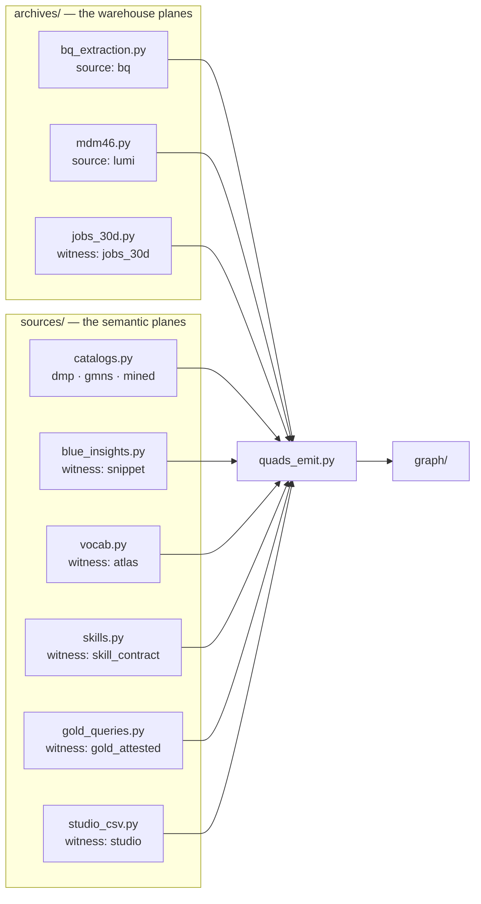
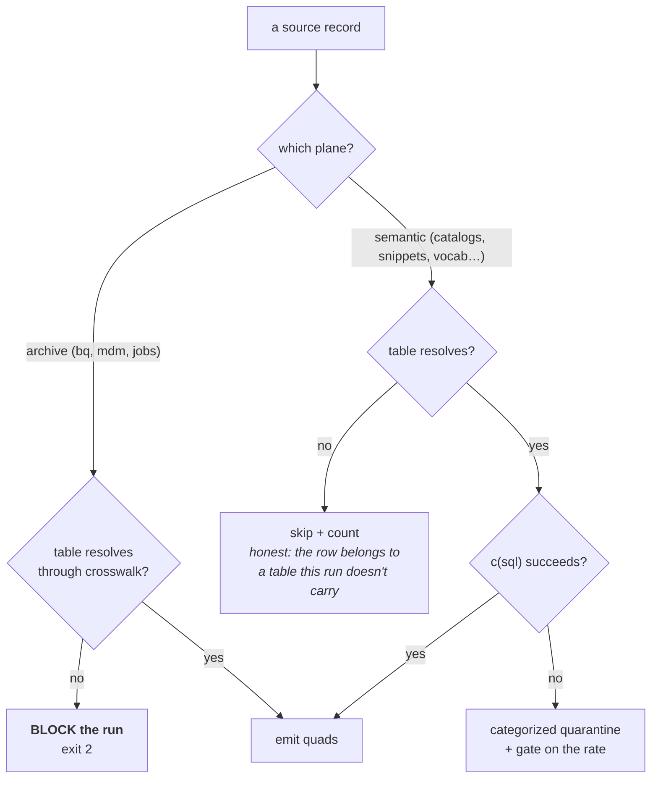

# 5 · Loaders and Source Contracts

**Relevant source files**

- [`sahs/loaders/records.py`](../../synapse-agentic-harness-system/sahs/loaders/records.py)
- [`sahs/loaders/quads_emit.py`](../../synapse-agentic-harness-system/sahs/loaders/quads_emit.py)
- [`sahs/loaders/ledger.py`](../../synapse-agentic-harness-system/sahs/loaders/ledger.py)
- [`sahs/loaders/registry.py`](../../synapse-agentic-harness-system/sahs/loaders/registry.py)
- [`sahs/loaders/archives/`](../../synapse-agentic-harness-system/sahs/loaders/archives/) · [`sahs/loaders/sources/`](../../synapse-agentic-harness-system/sahs/loaders/sources/)
- [`docs/contracts/`](../../synapse-agentic-harness-system/docs/contracts/)

---

## Purpose and Scope

The nine loaders, the export shapes they read, what each contributes, and
the three cross-cutting policies: identity blocking, categorized
quarantine, and the utilization ledger.

Each loader **emits and nothing else**. No arbitration, no policy —
arbitration happens once, in the reconciler ([Page 6](06-compiler.md)).

---

## The nine loaders



| loader | export shape | scale | contributes |
|---|---|---|---|
| `archives/bq_extraction.py` | `real_extractions_production/`, 00–17 per table | 46 tables | columns, types, partitions, table metrics, column profiles, low-cardinality domains, row policies, query history |
| `archives/mdm46.py` | `mdm_46_patched_v2/` run_manifest + `responses/*.json` | 46 tables | ownership, pipeline, lifecycle, lineage up, attribute lineage, PII flags |
| `archives/jobs_30d.py` | `17_queries_30d/jobs_30d.jsonl.gz` | per table | true recency, measured `joins_via`, per-table cost priors, usage rhythm |
| `sources/catalogs.py` | `metrics_dmp.json`, `extended_gmns_semantics.json`, `measures_catalog.json` | 35 + 14 + 6,223 | certified KPIs, pending specs, mined patterns with usage support |
| `sources/blue_insights.py` | `blue_business_insights.csv` | ~35.7K rows | predicates and CASE expressions as concept bindings |
| `sources/vocab.py` | `data_cleaned.csv`, `business_terms.csv`, `std_tech_metadata/` | ~12.3K + ~4.4K + 46 | acronyms scoped by BU+region, governed terms, declared column↔term links |
| `sources/skills.py` | ten skill packs (`skill.yaml`, `metric_contracts.yaml`, …) | 10 packs | exact contract expressions |
| `sources/gold_queries.py` | `extracted_gold_queries.json` | 158 pairs | the answer key + the eval task material |
| `sources/studio_csv.py` | `studio_results_*_cte_or_subqueries.csv` | — | observed certified-metric SQL with CTEs, grain, data owners |

Each shape is documented under
[`docs/contracts/`](../../synapse-agentic-harness-system/docs/contracts/) —
that is the file to read before adapting a loader to a new warehouse.

---

## Typed records: the L0→L1 currency

```python
ExpressionRecord   # anything SQL-shaped headed for c(sql) and the census
VocabRecord        # acronyms / terms, BU+region scoped
TermRecord         # governed catalog terms with status
StdTechEntry       # catalog entries with declared column→term links
ValueMeaning       # stored code → business phrase
Quarantined        # category + evidence_ref + message
```

> Every record keeps an `evidence_ref` back to its exact source location
> — the bottom of the provenance chain starts here.

---

## Policy 1 · Identity errors block, everything else quarantines



Why the asymmetry: an archive record whose table cannot be identified
means the *warehouse extraction* and the *crosswalk* disagree, and
everything downstream of a mis-identified table is wrong. A semantic
record mentioning an unknown table just means the export is
enterprise-wide and this run's scope is 46 tables.

### The table registry

Bare table names (`blue_business_insights` rows carry `table_name` with
no dataset qualifier and occasional truncation) resolve through
`registry.py`:

> Resolution rule (pinned): **exact match first, else UNIQUE suffix
> match**; an ambiguous suffix quarantines the row — *guessing a table is
> how wrong numbers get born.*

---

## Policy 2 · `DENIED` is not absence

Both archive loaders carry status semantics through rather than
flattening them.

| source signal | naive reading | what the loader does |
|---|---|---|
| row-access-policy listing returns `DENIED` | "no policies" | `has_policy → policy:unknown_denied`; the ACL builder marks the table **restricted** |
| policy file present but empty | same as denied | **confirmed none** — emits nothing |
| metadata coverage entry `HTTP_503` / `DENIED` | "unhealthy" or "absent" | explicit prop `lifecycle_status: "unknown_unavailable"`; downstream trust logic fails closed |

Those pairs look identical in a naive loader and mean opposite things.
Fail-closed on unknown is the whole E3 story ([Page 6](06-compiler.md)).

---

## Policy 3 · The utilization ledger

> "Are we utilizing everything we're getting?" stops being a question you
> answer from memory: every file under the archive (and sources) roots is
> checksummed and marked

| mark | meaning |
|---|---|
| `consumed` | a loader actually read it this run |
| `deferred(reason)` | deliberately unread, with the pinned reason |
| `inventoried` | present, unread, **not** deliberately deferred — the honest "we have this and do nothing yet" |

No archive artifact may be absent from the ledger: the walk guarantees
presence, and a CI completeness test guarantees the `inventoried` set
only ever contains files we already know about. The ledger lands in the
run manifest as `utilization[]`.

> Read the inventoried list; anything you don't recognize is a file we're
> silently not using — **that's a finding, not a detail.**

A worked example of `deferred`: running with `--no-jobs-30d` (the "A8"
case, where the 30-day history was judged incorrect) defers the whole
`17_queries_30d` directory *with the reason*, rather than leaving 46
files unaccounted for.

---

## The jobs witness in detail

The design sentence, written verbatim into the module so nobody "fixes"
it later:

> **the catalog winning the max is the design working — the jobs witness
> was never hired to out-count a longer-horizon miner; it was hired for
> true recency, corroboration, and discovery of what the catalog
> missed.**

### Top-level-only extraction

| what | where from | why |
|---|---|---|
| measure fragments | aggregates in the **outermost** select list | a fragment lifted out of nested context changes meaning |
| predicate fragments | conjuncts from the **outermost** `WHERE`, wrapped exactly as the snippet pipeline wraps | so fingerprints fuse across witnesses |
| anything nested | correlated subqueries, `EXISTS`, derived tables | → `nested` quarantine category, **counted, never silently skipped** |

> a wrong fragment with support 200 is worse than none

### Pins

| pin | value |
|---|---|
| support | **distinct `job_id` count** per fingerprint (repeats → `run_count`) |
| recency | job `creation_time` — the only true timestamps in the corpus |
| joins | `ON` equalities between resolvable tables → `joins_via` with jobs-witness support |
| cost | per-table `cost_prior` (p50/p95 bytes per job, n_jobs) + `usage_rhythm` |
| audit | `audit_*` digests **corroborate only**; a jobs-vs-audit divergence emits `ReviewItem(kind=witness_divergence)`, never a feature |
| gate | ≥90% of a table's jobs canonicalized-or-understood (nested counts as understood; parse/dialect breakage does not) |

"200 people ran this" and "one dashboard ran it 200 times" are different
facts. Distinct-job-id support is what keeps them apart.

---

## Emission: `quads_emit.py`

```python
"""Predicates become ``pred:`` nodes bound to ``concept:`` subjects;
metric expressions become ``metric:`` nodes (id = fp(expr ⊕ grain ⊕
entity), pinned) grouped under ``mgroup:`` identities with initial
governance states seeded per source (dmp → certified, gmns → pending,
skills → team_candidate, mined → mined)."""
```

| source | mints metric at | rationale |
|---|---|---|
| `metrics_dmp` | `status:certified` | the meridian line |
| `extended_gmns` | `status:pending` | submitted for approval |
| `skill_contract` | `status:team_candidate` | a team's own contract |
| mined / snippets / jobs | `status:mined` | evidence, not governance |

Atlas `std_tech` entries land their **declared** column↔term links as
`mapped_term` edges plus atlas-attributed props; the merge policy
arbitrates against BQ/MDM **at compile time, not here.** That separation
— loaders describe, the compiler decides — is what keeps the
disagreement handling in one auditable place.

---

## Studio export: custody and the grain decision

The studio CSV is a filtered re-export of the certified catalog. Two
decisions in its loader are worth studying.

**Custody rule.** *Meridian reads the RAW export and derives everything
itself — never an upstream tool's normalization pass.* If you accept a
neighbouring system's normalization you have inherited its bugs without
its tests.

**Grain is deliberately outside the identity fingerprint.**

> `grain` → `grain_observed` prop. DELIBERATELY outside the identity
> fingerprint: the certified catalog has NO grain field, so
> identity-bearing grain would fork every fusion into duplicate nodes.

Fusion rules on `metric_ref = dmp:<metric_catalog_id>`:

| case | outcome |
|---|---|
| same id + same SQL | corroborates the canonical metric as a new `studio` witness |
| same id + different SQL | lands as a **flagged second class** |
| novel id | becomes a MINED candidate |

And `associated − base` tables becomes *our own computed
lineage-mismatch warning*, not a claim.

---

## Sources that skip canon

`vocab.py` records are not SQL-shaped, so they skip `c(sql)`. They are
still parsed and counted in the census phase, and fixture CI runs every
branch — because a loader nobody exercises is a loader that is already
broken.

One deliberate quarantine: `sample_codes.sql` in the skill packs is
SQLite-dialect demo material, **not** canonicalized as BigQuery. It is a
dialect-quarantine trap left visible on purpose.

---

## Gold queries: the third return value

```python
def load_gold_queries(path) -> tuple[records, quarantined, empty_sql_backlog]
```

> Empty SQL is **NOT** quarantine — it is the triage backlog (genuine-
> abstention gold vs broken extraction), returned separately so the exit
> criterion can count it.

A pair with no SQL might be a correct abstention (the right answer is "I
can't") or a broken extraction. Those are different facts, and collapsing
them into "quarantine" would hide an abstention answer key.

---

## Next

→ [Page 6 · The Compiler and Build Artifacts](06-compiler.md)
