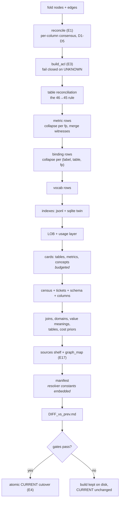

# 6 · The Compiler and Build Artifacts

**Relevant source files**

- [`sahs/compiler/compile.py`](../../synapse-agentic-harness-system/sahs/compiler/compile.py)
- [`sahs/compiler/reconcile.py`](../../synapse-agentic-harness-system/sahs/compiler/reconcile.py)
- [`sahs/compiler/cards.py`](../../synapse-agentic-harness-system/sahs/compiler/cards.py)
- [`sahs/compiler/indexes.py`](../../synapse-agentic-harness-system/sahs/compiler/indexes.py)
- [`sahs/compiler/diff.py`](../../synapse-agentic-harness-system/sahs/compiler/diff.py)
- [`sahs/compiler/display.py`](../../synapse-agentic-harness-system/sahs/compiler/display.py)
- [`sahs/compiler/graph_map.py`](../../synapse-agentic-harness-system/sahs/compiler/graph_map.py)
- [`tests/test_p2_compiler.py`](../../synapse-agentic-harness-system/tests/test_p2_compiler.py)

---

## Purpose and Scope

`compile_build(graph_root, builds_root) -> (build_dir, manifest, gate_failures)`.

The stages, the E1 disagreement handlers, every artifact the build emits,
the witness aggregation, the gates, and the atomic promotion.

---

## The contract

```python
"""compile(graph, crosswalk) → builds/b_<graph_hash12>/ — deterministic.

The compiler is a pure function of the truth graph: same graph, byte-
identical build (no timestamps inside build artifacts — run metadata
lives in the event stream)."""
```

```python
def graph_hash(graph_root: Path) -> str:
    digest = hashlib.sha256()
    for path in sorted(glob("nodes/*.jsonl")) + sorted(glob("edges/*.jsonl")):
        digest.update(path.name.encode())
        digest.update(path.read_bytes())
    return digest.hexdigest()[:12]
```

The build id **is** the graph hash. The runbook tells you to run compile
twice and watch the id repeat, which is a good habit for any pipeline
claiming reproducibility.

---

## Stages



---

## E1 · Reconciliation and the five disagreement handlers

Three sources describe the same column: the catalog (`atlas`), the
metadata service (`lumi`), and the warehouse (`bq`). They disagree
constantly.

`reconcile(graph)` produces one `TableConsensus` per table, containing
one `ColumnConsensus` per column with per-field `{value, source}` and an
`agreement_count` — the number of witnesses concurring on the winning
value, exposed as a ranking feature.

| code | disagreement | handler | ticket |
|---|---|---|---|
| **D1** | documented in catalog, **absent in BigQuery** | **omitted from cards entirely** | `catalog_stale` |
| **D2** | in BigQuery, **undocumented** | on the card, flagged `ungoverned`; resolver binds only with a disclosure flag | `coverage_gap` |
| **D3** | type/DDL mismatch | **BigQuery wins** everywhere execution-facing | `catalog_mismatch` |
| **D4** | description divergence catalog↔metadata | **both kept** with attribution, catalog display-first | none (usually complementary) |
| **D5** | sensitivity flags disagree | **most-restrictive applied immediately**; restrictive holds while the ticket is open | `sensitivity_conflict` |

### Why each handler is the way it is

**D1 — omit.** *The agent must never see a column the runtime can't
serve.* A documented column that does not exist is not a gap in the
graph, it is a trap.

**D2 — keep and flag.** The column is real; the *meaning* is missing.
Hiding it would hide the warehouse from itself. So it is served with an
`ungoverned` flag and a disclosure requirement.

**D3 — the warehouse wins.** The catalog can be right about meaning and
wrong about type, and only one of those breaks at runtime. This is a
hierarchy of *consequence*, not of prestige.

**D4 — keep both.** Two descriptions of the same column are usually
complementary rather than contradictory, so both survive with
attribution and one is chosen for display. No ticket: this is not a
defect.

**D5 — restrictive now, resolve later.** When witnesses disagree about
*risk*, apply the restrictive reading immediately and open the ticket.
Do not wait for resolution.

Counts land in `census.json` under `structural`, per table and in total —
so "did the catalogs and the warehouse drift closer or further apart this
month" is a diffable number.

---

## E3 · The ACL, failing closed

```python
def build_acl(graph, consensus) -> dict:
    """E3 — fail closed on UNKNOWN. Any table whose row-access policy is
    UNKNOWN (DENIED/503) is marked restricted; PII columns listed from
    the most-restrictive consensus."""
```

| policy object | `restricted` value |
|---|---|
| `policy:unknown_denied` | `"unknown_policy"` |
| `policy:row_access*` | `"row_access"` |
| nothing on record | `None` |

`pii_columns` is the union of every column any witness flagged, from the
D5 most-restrictive consensus.

---

## The 46→45 rule

A table can drop out silently: reconciliation iterates `has_column`
edges, so a table node with **zero** columns never reaches consensus.

Every crosswalk row must therefore either **compile** or be
**explained**:

```python
reason = (
    "table node exists but ZERO columns on record: no has_column edge "
    "from any plane (archive 02, atlas std_tech)"
    if f"table:{phys}" in nodes else
    "no table node in the graph: never attested by any archive or "
    "catalog quad")
entry = {"physical": phys, "reason": reason}
if phys in excluded:
    entry["intentionally_excluded"] = excluded[phys]
else:
    recon_failures.append(f"crosswalk table missing from build, unexplained: …")
```

The manifest's `table_reconciliation` block accounts for every row either
way. An unexplained gap **blocks promotion**. An exclusion naming a
non-crosswalk table also blocks — you cannot excuse a table that was
never declared.

---

## Witness aggregation — where the fold's separation pays off

```python
def _finish_witness_features(row):
    """support_effective = max over RANKING witnesses (never a sum —
    the catalog was mined from a superset of the same history);
    agreement = ranking families attesting; recency from the jobs
    witness alone when present (the only true timestamps), else the
    catalog-provided dates, flagged."""
    ranking = {f: v for f, v in row["support_by_witness"].items()
               if f in RANKING_WITNESSES}
    row["support"] = max(ranking.values(), default=0)
    row["witness_agreement"] = len(ranking)
    seen = row.get("seen_by_witness") or {}
    if seen.get("jobs_30d"):
        row["last_seen"] = seen["jobs_30d"]; row["recency_source"] = "jobs_30d"
    else:
        row["last_seen"] = max(catalog_dates, default="")
        row["recency_source"] = "catalog" if catalog_dates else ""
```

| choice | reason |
|---|---|
| **max, not sum** | the catalog was mined from a superset of the same query history the jobs witness reads; summing double-counts the same events and rewards overlap |
| **agreement reported separately** | "strongest single evidence" and "how many independent families" are different questions a sum smears together |
| **max *within* a family too** | `_merge_witness_maps` — the same witness corroborating from two directions is one witness, not two |
| **recency from jobs alone** | job creation times are the only true timestamps; a fallback is flagged `recency_source: "catalog"` |

### Metric collapse

A metric fused across catalogs (same fingerprint) holds several `mgroup`
memberships. One row comes out, with:

- groups merged into `mgroups`
- **max** status by rank and **max** authority
- per-witness support merged (max within family)
- blank fields filled from whichever row had them
- and the **primary group** chosen by catalog primacy:

```python
_CATALOG_RANK = {"dmp": 0, "gmns": 1, "skill": 2, "mined": 3}
# a fused metric ANSWERS as its highest-authority catalog name;
# the other memberships stay in mgroups as corroboration
```

### Enrichment never clobbers

```python
# E13: the catalog answer wins FOREVER; enrichment only fills blanks,
# and the source flag keeps the provenance readable
question = record.props.get("question_answered", "")
question_source = "dmp" if question else ""
if not question and record.props.get("question_enriched"):
    question = record.props["question_enriched"]
    question_source = "llm_enriched"
```

Every enriched field carries its own `*_source`, so a reader always knows
whether a sentence came from a catalog or a model.

---

## The served status vocabulary

Governance **status** and evidence **origin** are different axes, and the
store's word `mined` conflates them for a reader.

```python
_STATUS_SERVED = {"mined": "unreviewed", "pending": "pending_certification",
                  "team_candidate": "team_candidate", "certified": "certified",
                  "rejected": "rejected", "deprecated": "deprecated"}

_EVIDENCE_ORIGIN = {"metrics_dmp": "certified_catalog",
                    "extended_gmns": "pending_catalog",
                    "measures_catalog": "usage_mining",
                    "jobs_30d": "query_history",
                    "studio_queries": "studio_sql",
                    "blue_insights": "snippet_mining",
                    "skill_contract": "skill_contract",
                    "gold_queries": "gold_pair"}
```

The agent-facing surface says **"unreviewed (evidence: usage_mining)"**
while the store state and the clerk lattice stay untouched. Display
vocabularies are translations, never renames.

`display.py` adds the tier bridge to the UI's four-symbol trust language
— `● ha` (hard evidence) · `◆ gr` (grounded) · `◐ in` (indicative) ·
`○ gu` (guess) — with **crimson reserved for definition CONFLICT and
nothing else.** The mapping is pinned with tests, never decided per page.

---

## Cards — the agent's entire world

```python
"""Three templates (pinned sections; every line carries a ``[prov:…]``
ref; conflicts are ALWAYS printed — a card that hides ambiguity is lying
to the agent). Table cards budget to ≤2K tokens with a fixed drop order
— column long-tail → history/usage → join detail — and NEVER drop grain,
conflicts, or access."""
```

| card | contents |
|---|---|
| **table** | grain, columns with type/meaning/sensitivity, metrics measured here, filters on record, LOB ownership + usage, joins (scoped + catalog + co-query), access, conflicts |
| **metric** | label, definition line, canonical SQL, status + evidence origin, grain, approved dimensions, sign convention, variants, group memberships, usage texture |
| **concept** | every binding for the label, each with its predicate SQL, authority, support and witness — **conflicts printed side by side** |

`TOKEN_BUDGET_TABLE = 2000`. The budgeter drops in a fixed order and the
drops are counted into the manifest's `budget` block, so a diff can say
"this table started dropping columns this build." The complete column
list still exists in `columns.json` for surfaces that can afford it.

**Truncation is inevitable at scale; *what* you truncate is a design
decision.** Most systems make it accidentally, by ordering. Here the
twelfth column can go and the conflict cannot.

---

## Build artifacts, complete

```
builds/b_<hash12>/
  cards/tables/<dataset__table>.md
  cards/metrics/<fp12>.md
  cards/concepts/<label_slug>.md
  indexes/
    metrics.jsonl            + index.sqlite twin (precomputed rank columns)
    bindings.jsonl
    vocab.jsonl              + FTS5 where available, LIKE/difflib fallback
    joins.jsonl              five named witness families, cross-annotated
    domains.jsonl            observed values + distinct_estimate
    value_meanings.jsonl     one row per (table, column, value, synonym)
    tables.jsonl             row counts + declared primary keys
    lob.jsonl                ownership and usage per LOB
    cost_priors.json         p50/p95 bytes per job, per table
    sources.json             the display-plane Sources shelf (E17)
    graph_map.json           3-D positions baked at compile (E17)
  census.json                conflict counts + structural D1-D5 + meta
  tickets.jsonl              the governance queue
  acl.json                   fail-closed access
  schema.json                only columns BigQuery can serve
  columns.json               the same columns, with meaning and flags
  manifest.json              counts, index report, budget, resolver constants,
                             census summary, structural totals, table_reconciliation
  DIFF_vs_prev.md            the promotion gate's reading material
```

**JSONL is the diffable source of truth; `index.sqlite` is a derived
artifact rebuilt from the same rows.** The reviewable thing is
authoritative; the fast thing is disposable.

### Two indexes worth calling out

**`tables.jsonl`** exists because a fan-out judgement needs *data*, not
prose:

> the table facts a fan-out judgement needs as DATA rather than as prose
> on a card: row counts and declared primary keys. Whether a join can
> double-count is decidable from these two facts plus the join's witness,
> so the preview can be honest *before* any query runs instead of
> guessing after it.

**`graph_map.json`** bakes 3-D positions at compile time, seeded from
sha256 of stable identifiers — **no RNG** — so the same build always
renders the same sky and a diff in the map is a diff in the data. Mined
metrics (~3k unnamed) are counted in `meta.truncated`, not drawn: *41
named stars are a legible sky; 3,000 anonymous ones are noise.*

---

## The census's `meta` block

Scope honesty, so nobody reads a zero as a claim it cannot support:

```python
"meta": {
  "metric_conflicts":
    "same-IDENTITY drift only: two expression classes under one catalog "
    "id (or one exact label@table). Mined labels are near-unique by "
    "construction, so same-intent-different-formula across DIFFERENT "
    "names is invisible to this counter; that class of disagreement "
    "surfaces through concept_conflicts, alias work, and enrichment "
    "review, not here.",
  "metric_duplicate_ids":
    "one expression class registered under multiple catalog ids: "
    "duplicate catalog entries (steward review material).",
}
```

A census field whose docstring explains what it cannot see is worth more
than one that quietly overclaims.

Note `metric_duplicate_ids` is the **inverse** finding to
`metric_conflicts`: one expression under many catalog ids, i.e. duplicate
catalog entries.

---

## The diff — what a human reads before promoting

`DIFF_vs_prev.md`, in order:

1. semantic deltas — metric expression/status changes, binding flips
2. census deltas, **including E1 structural drift** ("catalogs and
   warehouse drifted closer/further")
3. budgeter-drop deltas
4. changed-card inventory

Capped. The first real compile says *"no previous build: this is the
first promotion candidate"* — honest, not empty.

The runbook's instruction is: **review the DIFF like a PR.**

---

## Gates and promotion

```python
failures = list(recon_failures)                      # the 46→45 rule
for table in consensus.values():
    if not card_path(table).exists():
        failures.append(f"missing table card: {table.physical}")
for row in metric_rows:
    if row["status"] == "certified" and not row["table"]:
        failures.append(f"certified metric without table: {row['id']}")

if not failures:
    tmp = current_path.with_suffix(".tmp")
    tmp.write_text(build_id + "\n")
    os.replace(tmp, current_path)                    # E4: atomic
```

| gate | states |
|---|---|
| table reconciliation | every crosswalk row compiled or explained |
| card existence | every reconciled table has a card |
| certified-has-home | **a certified metric without a table is a lie** |

`builds/CURRENT` is one line of text, replaced with `os.replace`. A
reader sees the old build or the new one, never a half state. A build
that fails a gate still exists on disk with its census and its diff — go
read why — it simply never becomes `CURRENT`.

---

## Next

→ [Page 7 · Serving Tools and the Build API](07-serving.md)
