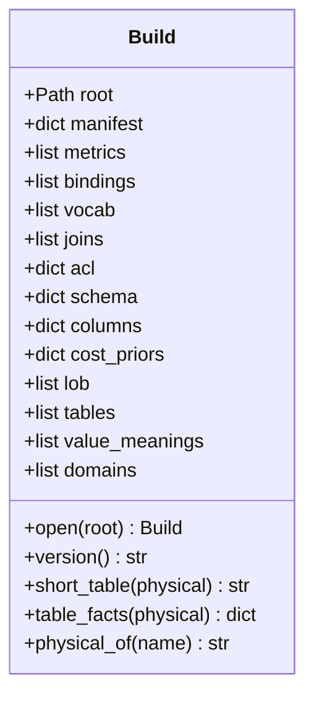
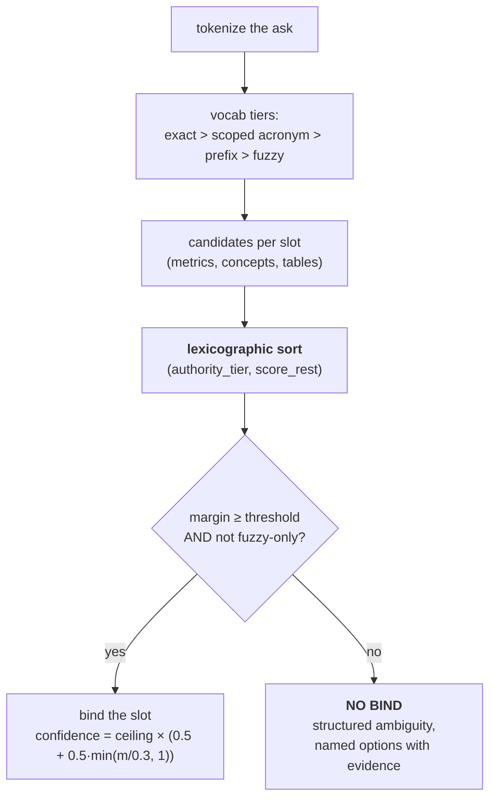
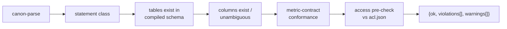

# 7 · Serving Tools and the Build API

**Relevant source files**

- [`sahs/tools/api.py`](../../synapse-agentic-harness-system/sahs/tools/api.py)
- [`sahs/tools/resolver.py`](../../synapse-agentic-harness-system/sahs/tools/resolver.py)
- [`sahs/tools/constants.py`](../../synapse-agentic-harness-system/sahs/tools/constants.py)
- [`sahs/tools/validate_sql.py`](../../synapse-agentic-harness-system/sahs/tools/validate_sql.py)
- [`sahs/tools/sandbox.py`](../../synapse-agentic-harness-system/sahs/tools/sandbox.py)
- [`sahs/tools/qualify.py`](../../synapse-agentic-harness-system/sahs/tools/qualify.py)
- [`sahs/tools/warehouse_errors.py`](../../synapse-agentic-harness-system/sahs/tools/warehouse_errors.py)
- [`sahs/tools/mcp_server.py`](../../synapse-agentic-harness-system/sahs/tools/mcp_server.py)

---

## Purpose and Scope

Layer 4 — the read API, the binder, the SQL pre-flight and the only door
to the warehouse. Everything the agent can reach is here.

> The agent's world ends here: every function reads **ONLY** the
> immutable build directory (cards + indexes + acl + schema) — never the
> truth graph.

---

## `Build` — the one reader

```python
build = Build.open(builds_root)     # resolves through builds/CURRENT
```



Every field is a file in the build. Missing files degrade gracefully to
empty — a build compiled before an index existed still opens, and readers
fall back to the card.

The error message when there is no build teaches the next command:

```
no build at <path>: run `pipeline.py compile` first
(or point at a builds/ root containing CURRENT)
```

### The read functions

| function | returns |
|---|---|
| `search_metrics(build, intent, top_k)` | ranked metric rows with their meaning, not bare ids |
| `search_concepts(build, phrase, table)` | concept bindings, conflicts included |
| `describe_table(build, name)` | the table's facts and card pointer |
| `sample_values(build, table, column)` | observed values, `distinct_estimate`, meanings on record |
| `get_definition_line(build, metric_id)` | **the meridian line** — the one-sentence disclosure |

> Search-over-list throughout; every response returns meaning, not bare
> IDs; error messages teach the correct call.

---

## The resolver — the compiled ranking function

```python
"""resolve() — the compiled ranking function, exposed as a tool.

The agent doesn't decide what "consumer" means; this does — or it
refuses to."""
```



```
score_rest = 0.4·log1p(support)/log1p(max_support)
           + 0.3·recency_decay(last_seen, half-life 90d)
           + 0.3·context_fit
```

### Three properties, each deliberate

**1. Support can never outvote certification.** The sort is
lexicographic on `(authority_tier, score_rest)`, not a weighted sum. A
mined pattern with 6,000 executions loses to a certified KPI with 3,
always, by construction. A coefficient is something people tune; a sort
key is not.

**2. Recency decay is data-relative, not wall-clock.**

```python
"""DATA-relative decay: age is measured against the build's own newest
last_seen, not the wall clock — deterministic forever, and a build never
'goes stale' by merely being re-scored later."""
```

**3. Disambiguation is a success state.**

```python
"""m < margin_threshold OR a top candidate reached only via fuzzy ⇒ NO
BIND — a structured ambiguity with named options instead (never argmax;
disambiguation is a success state)."""
```

### Versioned constants

```python
RESOLVER_CONSTANTS = {
    "version": "rc1",
    "weights": {"support": 0.4, "recency": 0.3, "context_fit": 0.3},
    "recency_half_life_days": 90,
    "margin_threshold": 0.15,
    "tier_ceiling": {"5": 0.95, "4": 0.80, "3": 0.70, "2": 0.55, "1": 0.40},
    "fuzzy_reach_forces_ask": True,
}
```

Embedded in every build manifest, cited in every `resolve()` response as
`constants_version`. Openly labelled uncalibrated bets. **A wrong bind is
always traceable to the constants that produced it.**

Every slot also carries its `features` — `{tier, support_score, recency,
context_fit, margin}` — so a wrong bind is a readable trace rather than a
mystery.

---

## `validate_sql` — the deterministic pre-flight

Runs **before any execution object exists.**



> a **violation** is a refusal reason, a **warning** is a disclosure;
> every entry carries a `hint` that teaches the correct call.

| violations (codes are contract; tests pin them) |
|---|
| `parse_error` · `statement_not_allowed` · `not_a_select` · `unknown_table` · `unknown_column` · `ambiguous_column` · `sensitive_column` · `select_star_over_sensitive` · `cross_join_unconstrained` · `unknown_metric` · **`metric_expression_missing`** · `dim_not_approved` |

| warnings |
|---|
| `policy_unknown` · `restricted_table` · `select_star` · `no_where_filter` · `dims_unchecked` · `sensitive_column_in_filter` · `group_by_at_metric_grain` · `qualification_partial` |

`sensitive_column` and `select_star_over_sensitive` are violations
under `SAHS_SENSITIVE_COLUMNS=deny`; under `allow` — the default for
the first launch — the same two codes come back as warnings with
`policy: allow`, so the record still says a sensitive column was read
and nothing is refused for it ([13-configuration](13-configuration.md)).

**`metric_expression_missing` is what "never invents a metric" means in
code.** The certified expression rides into the generator verbatim, and
containment on the *canonical* text is checked on the way out. Drop the
certified expression and the query is refused — not warned about.

Metric-contract conformance also checks that `GROUP BY` dimensions are a
subset of the metric's approved dimensions (token match), and flags grain
degeneracy — grouping at the metric's own grain, which produces a table
of ones.

---

## `execute_sandboxed` — the only door to the warehouse

```python
"""execute_sandboxed — the ONLY door to the warehouse, and the model is
never the lock (E3).

Order is the security property, pinned: parse → resolve tables → **ACL
verdict BEFORE any execution object is constructed** → then, and only
then, a substrate (snapshot = dry-run) or runner (live) may exist."""
```

That ordering is the whole design. If the ACL check happened after
constructing a client, a bug in the check would still leave a live
connection to a restricted table sitting there.

| mode | what it does | UNKNOWN policy |
|---|---|---|
| `snapshot` | dry-run: validity + result schema + bytes, **zero rows ever** | permitted, with `meta.policy_unknown = true` — the disclosure travels with the answer |
| `live` | **default DENY.** Requires `SAHS_ALLOW_LIVE=1`, a dry-run cost gate (`SAHS_LIVE_MAX_BYTES`, default 1e9) and a row cap (LIMIT injected/tightened via the AST) | **refused** — fail-closed |

> Every decision — allowed, denied, errored — is appended to an
> append-only JSONL ledger beside the builds directory. The ledger is the
> audit trail; **silence is not an outcome.**

Two limits the model cannot lift: the scan ceiling in bytes and the row
cap. Both are disclosed on every result.

---

## `qualify` — the two-part-name problem

```python
"""Table qualification: the graph says ``dw.gms_transaction``; the
warehouse wants ``demo-warehouse.dw.gms_transaction``. …
Deterministic, in code, never a prose rule the model has to follow:
a query written from the cards resolves where the data lives."""
```

BigQuery resolves a two-part name against the project that *runs* the
query, which is the billing project, not the one hosting the data. So the
sandbox qualifies every table the build knows with
`SYNAPSE_BQ_DATA_PROJECT` before any dry run.

Already-qualified names pass through. Names the build does not know are
left for the validator to refuse with a real hint.

This is a small, exemplary decision: it would have been easy to write "always
fully qualify your tables" in the system prompt. Doing it in code means it
cannot be forgotten under context pressure.

---

## `warehouse_errors` — a failure that teaches

A raw warehouse error is enough when the fix is the model's and useless
when it is not. This module classifies deterministically — no model call,
no guessing; everything named comes from the build or the error itself.

| kind | yours to fix | the hint carries |
|---|---|---|
| `sql` | **yes** | the closest real names, the snippet |
| `cost` | **yes** | narrow the scan |
| `environment` | no | the exact `.env` change, the smoke command |
| `access` | no | which table, which permission |
| `unknown` | yes | read it; if configuration → say so |

The recovery eval suite grades both behaviours: fixing what is yours, and
*stopping* when it is not. An agent that retries a permission error
forever is failing in a way a naive success metric would not catch.

---

## The MCP shim

```python
"""MCP shim — the eight tools behind one envelope.

Thin by design: every handler is `envelope(tool_name, plain_function)`;
the plain functions in tools/api.py / resolver.py / validate_sql.py /
sandbox.py ARE the product (ADK-wrappable as they stand); this file only
adds transport, the response envelope … and a small TTL cache."""
```

```json
{"status": "ok|denied|error", "data": …, "error": …,
 "meta": {"tool": …, "build_version": …, "latency_ms": …}}
```

The cache note is a nice consequence of immutability: *a compiled build
is immutable, so the cache can only ever be stale about **which** build
is CURRENT* — hence a short TTL, and no caching at all for
`execute_sandboxed`.

`FastMCP` is imported lazily so the envelope and cache stay unit-testable
without the `mcp` extra.

---

## The v1 toolkit (`sahs/loop/tools.py`)

The v3 kit ([Page 8](08-agent-harness.md)) is a thin door over these 14
functions, which map a coding agent's toolkit onto the graph
one-for-one:

| coding agent | here |
|---|---|
| Grep | `grep_cards` |
| Glob / ls | `list_tables`, `list_metrics` |
| Read | `read_card` |
| Bash | `run_sql` (sandboxed) |
| TodoWrite | `plan_set`, `note` |
| Task | `delegate_scout` |
| — | `search_semantics`, `resolve`, `sample_values`, `get_join_paths`, `get_definition_line`, `ask_user` |

Three pins:

1. **Read-only except `plan_set` / `note` / `ask_user`.** Nothing in the
   loop writes truth (clerk only); nothing executes live (snapshot only);
   and `verify` is *not* a tool — the harness runs it on the final plan
   in fresh context.
2. **Determinism relocated, not lost.** `resolve` is the same scored
   binder; `plan_set` typechecks every call; the sandbox's
   parse → ACL → substrate order is unchanged. *The model chooses WHEN to
   call, never how a tool decides.*
3. **The trace is the sub-graph.** Cards read, resolves made and bindings
   committed are recorded on the state automatically, so disclosure costs
   the model nothing.

> descriptions are the product — each tool ships with exactly the
> description the spec wrote (a test pins the text), and each error
> message names the correct next call. **The error channel is a teaching
> channel, never a dead end.**

---

## Next

→ [Page 8 · The Agent Harness](08-agent-harness.md)
