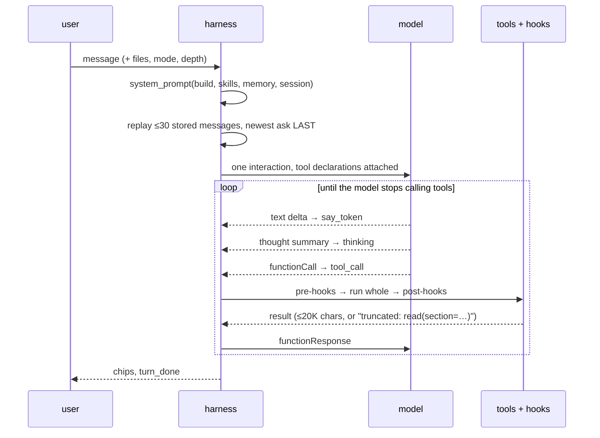
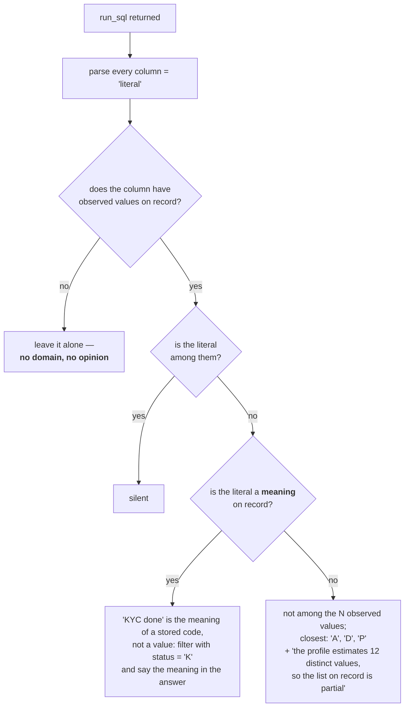

# 8 · The Agent Harness

**Relevant source files**

- [`sahs/assistant/loop.py`](../../synapse-agentic-harness-system/sahs/assistant/loop.py)
- [`sahs/assistant/kit.py`](../../synapse-agentic-harness-system/sahs/assistant/kit.py)
- [`sahs/assistant/hooks.py`](../../synapse-agentic-harness-system/sahs/assistant/hooks.py)
- [`sahs/assistant/artifacts.py`](../../synapse-agentic-harness-system/sahs/assistant/artifacts.py)
- [`sahs/assistant/checks.py`](../../synapse-agentic-harness-system/sahs/assistant/checks.py)
- [`sahs/assistant/runtime.py`](../../synapse-agentic-harness-system/sahs/assistant/runtime.py)
- [`sahs/assistant/agent.py`](../../synapse-agentic-harness-system/sahs/assistant/agent.py)
- [`sahs/assistant/store.py`](../../synapse-agentic-harness-system/sahs/assistant/store.py) · [`sandbox.py`](../../synapse-agentic-harness-system/sahs/assistant/sandbox.py) · [`skills_loader.py`](../../synapse-agentic-harness-system/sahs/assistant/skills_loader.py) · [`files.py`](../../synapse-agentic-harness-system/sahs/assistant/files.py) · [`export.py`](../../synapse-agentic-harness-system/sahs/assistant/export.py)
- [`docs/specs/synapse_v3_harness.md`](../../synapse-agentic-harness-system/docs/specs/synapse_v3_harness.md)

---

## Purpose and Scope

The v3 assistant lane: the thin loop, the system prompt, the 12 tools,
the hooks, the budgets, the two autonomy modes, artifacts, checks,
memory, skills, files and export.

The design note is
[`synapse_v3_harness.md`](../../synapse-agentic-harness-system/docs/specs/synapse_v3_harness.md);
this page describes what is in the tree.

---

## What "thin" means, and why

The v3 harness exists because two real transcripts were read line by
line. What they showed:

| symptom | cause | fix |
|---|---|---|
| a long answer with SQL in it died | strict JSON per step + a 1,200-token output cap | delete both |
| the same card read three times | per-result compaction starved the model — a whole card reached it as four lines | results go back **whole** |
| the thinking line and artifact panel never hid | `display:flex` in CSS overrode the HTML `hidden` attribute; the browser walk asserted the property, not visibility | `[hidden]{display:none!important}`; assert visibility |
| a simple question took 35 seconds | seven model calls per answer, each with full thinking | one interaction, tools called natively |

> Every one of these is harness, not model. **"Never bet against the
> model" is the operating rule from here.**

That is the whole thesis of the lane: governance stays in code, and
everything the harness was doing to *manage* the model gets deleted.

### What was deleted

strict-JSON protocol · strikes · the 1,200-token cap · the 24-step cap ·
per-result compaction · the `think` field · RULES prose that repeated
tool descriptions · "what the model saw" in the chat · 22 of 33 tools ·
the projects UI · the skills picker.

### What was kept because it was measured

the checks · the rendering rules · the business map · the skill packs ·
memory scoping · the session handoff · the eval suites.

---

## The turn

```python
"""The assistant loop: one interaction per turn, the model driving
through native tool calls.

The harness is thin on purpose. It builds a stable system prompt
(identity, the chain of command, the graph digest, the skill shelf,
what is remembered), replays the conversation as messages with the
newest ask last, hands the model the kit's declarations, and then
streams: text goes to the user as it arrives, thought summaries feed
the one live line, tool calls run whole and their results go back
whole (capped at ~20K characters with an explicit note)."""
```



| limit | value | on breach |
|---|---|---|
| model calls per turn | `MAX_CALLS = 40` | ends the turn in plain language with what was already said |
| wall clock | `WALL_SECONDS = 600` | same |
| output tokens | `MAX_OUTPUT_TOKENS = 16384` | — |
| replayed history | `HISTORY_MESSAGES = 30` | — |
| one tool result the model sees | `RESULT_CAP = 20_000` chars | explicit truncation note naming the follow-up call |
| session token ceiling | budget in `runtime.py` | the breaker; shares one abort path with the stop button |

> Limits are a wall clock, a call ceiling, and the session breaker; each
> ends the turn in plain language with what was already said, **never a
> vanished turn.** Streamed text is never discarded.

---

## The system prompt

Assembled stable-parts-first so the prefix caches (implicit caching
engages at ≥4,096 tokens):

```
<identity>   who you are; general reasoner first; numbers come from tools
<chain>      platform governance > Synapse the product > this user's
             memory and asks > defaults
<mode>       chat | autopilot
<graph>      SYNAPSE.md — the world digest, generated from the build
<skills>     loaded packs whole; the rest of the shelf by name
<memory>     the project block + what is remembered about this user
<session>    today's date, artifacts in this chat, working notes
```

Then the conversation as messages, with **the user's newest ask last**
("instructions after data").

Three details that earn their place:

**The digest is generated, never written.**

```python
"""SYNAPSE.md — the world digest (≤2K tokens). Generated from the
compiled build's indexes and NOTHING else … Hand-written prose has no
entry point here — if a fact is not derivable from the build, it does
not appear (the reality law applies to the model's briefing exactly as
it applies to answers). Deterministic per build by construction, so the
assembled system prompt is byte-identical across turns."""
```

**The date block exists because a model has no clock.**

```python
"""The model has no clock and no calendar: without this line "last
month" resolves against its training-time sense of now, and a window
with no upper bound rides into the future. It lives in the session
section, the last one, so the cached prefix stays stable within a day."""
```

It spells out today, this month, last month, this quarter with its start
date, last quarter, year-to-date — *and* the newest partition the build
saw, so "rows after it may not exist yet" is a stated fact rather than a
surprise.

**Governance is not in the prose.**

> The governance rules do not live in prose any more. They are hooks.
> Prose only steers preferences the model cannot know: tone, the
> disclosure sentence shape, when to ask.

---

## The kit — 12 tools plus `suggest_next`

33 → 11 was the design target; the tree carries 12 after `propose_sql`
(the handover) was added, plus `suggest_next` for follow-up chips.

| tool | signature | absorbs | notes |
|---|---|---|---|
| `search` | `search(query, kind?)` | search_semantics, grep_cards, list_metrics, resolve | one door. `kind=list` for "all X metrics"; `exact` greps card text; `vocab` expands an acronym with its scope; `values` turns a phrase into the stored code |
| `read` | `read(id, section?, graph_ids?)` | read_card, get_definition_line, get_join_paths, subgraph | whole card by default; a metric card carries its definition line; `graph_ids` returns the subgraph |
| `sample_values` | `sample_values(table, column, n?)` | — | **call before writing any filter literal** |
| `run_sql` | `run_sql(sql, mode?, limit?)` | run_sql, whatif | `dry_run` default; `run` under a scan ceiling and a row cap; rows auto-save as `q<N>` |
| `propose_sql` | `propose_sql(sql, title, why?, metric_id?)` | — | **ends the turn.** The handover card: Run query / Run + dashboard / Edit SQL |
| `python` | `python(code)` | python, compare | the session workspace; numpy + a `meridian` module; files persist |
| `check` | `check(kind, …)` | 6 check tools + verify_answer | one tool, kind enum; returns a citable **fact** |
| `artifact` | `artifact(type, title, spec_json, artifact_id?)` | artifact, artifact_update, list_artifacts, constellation | id present ⇒ new version |
| `ask` | `ask(question, options)` | ask_user | **ends the turn.** 2–4 named options, each with its evidence |
| `load_skill` | `load_skill(name)` | list_skills | the result **is** the doctrine |
| `remember` | `remember(text, scope?)` | memories, forget | a preference, never a definition or a number |
| `note` | `note(text)` | plan_set, note | persists across turns; your later self reads it |
| `suggest_next` | `suggest_next(options)` | — | ≤3 follow-ups, once, at the end |

> Descriptions carry the "when", in one or two sentences. **No tool
> description repeats what another tool does.**

Each is a thin door over the deterministic implementations already in the
silo. *The model reasons; the tools never guess; the hooks hold the
must-haves.*

---

## The hooks — governance in code, named

```python
HOOKS = (
    {"name": "artifact_schema",   "kind": "pre",    "tool": "artifact",
     "enforces": "rule 1 (disclosure) and rule 2 (watermark)"},
    {"name": "sql_gates",         "kind": "pre",    "tool": "run_sql",
     "enforces": "cost gates and ACL before any execution"},
    {"name": "literal_check",     "kind": "post",   "tool": "run_sql",
     "enforces": "filter literals against observed values"},
    {"name": "rows_to_workspace", "kind": "post",   "tool": "run_sql",
     "enforces": "results saved as q<N> for python and check"},
    {"name": "warehouse_errors",  "kind": "post",   "tool": "run_sql",
     "enforces": "a failure comes back classified — yours to fix, or "
                 "configuration to report, with the fix"},
    {"name": "clerk_only",        "kind": "absent", "tool": "",
     "enforces": "no chat tool writes to the graph"},
)
```

`clerk_only` is registered with `kind: "absent"`. There is no code to
run: the guarantee *is* the absence of a writer in the kit. Registering
it anyway means the absence is documented and testable rather than merely
true.

### The literal check, in detail

Deterministic, and it does three different things depending on what it
finds:



Three refinements that stop it from lying:

- **No domain, no opinion.** A column with no recorded values gets no
  warning at all.
- **A partial list is a hint, not a verdict.** If the profiler's distinct
  estimate exceeds the observed list, the warning says so.
- **A business phrase gets the code.** "Approved" is not a value; `'A'`
  is. The value-meaning index turns the phrase into the predicate.

This is the hook that replaced two prose rules ("read before use",
"sample before filter"). *The literal hook and the card-shaped tools make
the right path the easy path.*

---

## Artifacts — governance as schema

```python
TYPES = ("chart", "table", "document", "kpi", "dashboard", "diagram")
STATUSES = ("certified", "pending", "composed", "exploratory")
SELF_STANDING = ("certified", "pending")   # may shed the watermark alone
PANEL_TYPES = ("kpi", "chart", "table", "document")  # a dashboard nests tiles, never a dashboard
```

Three rendering rules:

| rule | where it lives | what it does |
|---|---|---|
| **1 — disclosure** | `validate_artifact` | any artifact showing a number carries `provenance: {status, meridian_line}` **in-schema**. The validator refuses one that doesn't, with a teaching message; the model fixes its own spec. |
| **2 — watermark** | `validate_artifact` | `status: composed` keeps the **EXPLORATORY** watermark until a passing `reconcile`/`crosscheck` fact from *this trajectory* is cited in `provenance.facts`. Forced by the validator, **never negotiated by prose.** |
| **3 — clerk only** | absence | nothing here writes truth. |

> Every stored spec is normalized: build id stamped, watermark decided,
> unknown fields dropped. **What the panel renders is exactly what the
> validator passed — the renderer never patches an artifact up.**

The validator's refusals are written as teaching, not as errors:

```python
_problem("status_unknown", …,
    "say what the number IS: certified (on the meridian), pending "
    "(governed but unreviewed), composed (you built it from parts), "
    "exploratory (a look, not a claim)")
```

A dashboard's **every numeric panel carries its own provenance** — one
disclosure at the top of a dashboard would be a lie about the tiles.

Versions are append-only rows keyed `(artifact_id, version)`: an edit is a
new version, never an overwrite, *so "what did the dashboard say on
Tuesday" stays answerable.*

---

## Checks — verification the model runs on itself

```python
"""Each check returns {fact_id, kind, passed, method, detail} and is
recorded on the turn's state; a PASSED fact id cited in an artifact's
provenance.facts is what lets a composed number shed the EXPLORATORY
watermark (rule 2)."""
```

| kind | question |
|---|---|
| `part_whole(breakdown, total)` | do the slices add up? |
| `crosscheck(a, b)` | do two routes agree? |
| `coverage(result)` | rows present, no null keys? |
| `fanout(tables)` | is there a raw-safe join? |
| `reconcile(sql, metric)` | does the SQL contain the certified expression? |
| `answer(sql, claim)` | the fresh-context verifier |

> **Honesty of method is part of the fact:** a structural reconcile says
> `structural` (the certified expression is contained in the composed
> SQL), a numeric one says `numeric` (totals compared over snapshot
> rows). **A fact never claims more than its method delivered.**

That last sentence is the difference between a check and a rubber stamp.

---

## The two modes

```python
MODES = {"chat": …, "autopilot": …}
```

| | **Chat** (default) | **Autopilot** |
|---|---|---|
| a data question ends with | `propose_sql` — the query on a card with its price, status and meridian line | the model runs it under the limits |
| who presses Run | the person | nobody; it just runs |
| then | Run query / Run + build dashboard / Edit SQL | check, build the deliverable |
| limits | identical | identical |

> The mode is a **prompt section, not a gate**: the limits hold in both.

Two things happen with **no model call at all**:

- **Run.** `run_proposal_turn` executes the proposal: the rows land as a
  table artifact and as `q1`, the receipts stream as prose, the chips
  offer a dashboard.
- **The first picture.** `chart_rows_turn` draws saved rows: x = the
  first date-like or text column, numeric columns as series, a line on a
  date axis and a bar otherwise, under the run's provenance.

> Only the showcase and the designed dashboard need the model; execution
> and the first picture never wait on it.

### The depth dial

| stop | thinking | when |
|---|---|---|
| **Quick** | low | a lookup, a definition, a rename, a follow-up on rows already here |
| **Standard** | medium | the default: find the right metric, prove the query, hand it over |
| **Deep** | high | a multi-step analysis, an unfamiliar join, a question with several readings |

The call ceiling and the wall clock are the same at every depth. Only the
per-step thinking changes.

---

## Memory

Bound to the person, on by default, under the account block in the
sidenav.

| writer | when |
|---|---|
| the model (`remember`) | a preference or disambiguation is stated |
| a post-turn memory pass | a Flash-tier call, thinking low, proposes durable preferences from the turn |
| the user | directly, on the memory page |

Rules:

- Every save discloses inline — *"Remembered: by spend you mean acquirer
  net spend · undo"*.
- Retiring sets `status=retired`; it never deletes. Retired entries
  strike through.
- Scope is `global` or `project:<id>`; everything active is disclosed in
  the system prompt.
- **Never a metric definition or a number.** Those belong in the graph,
  through the steward's door.
- The chain of command puts platform governance above memory, so **a
  remembered preference can never soften a rendering rule.**

---

## Skills — doctrine on demand

Two shelves, one index; progressive disclosure is the point. The system
prompt carries the shelf *by name*; `load_skill(name)` pulls one pack in
whole and the result **is** the doctrine.

| origin | where | label |
|---|---|---|
| **built-in** | `sahs/assistant/skills/*.md` — the search doctrine, the analysis playbooks, dashboard grammar, the executive-summary shape | `built-in` |
| **user** | `<graph>/skills/` — the analyst's own briefings | `unreviewed`, everywhere they appear |
| **a person's own** | `<graph>/skills/users/<owner>/` | `unreviewed`, `owner` set; loads only for that owner |

> A user pack **cannot shadow a built-in name** — the built-in wins and
> the user copy is ignored, so nobody smuggles new doctrine under a
> trusted label.

And the pin that keeps skills honest:

> **skills steer, they never assert facts.** A skill cannot add a table,
> metric, or number to the world — the tools still serve only the
> compiled build, and the verifier still holds every claim to it. A skill
> that says "spend means gross" changes where the model LOOKS first, not
> what exists.

`/skill-name` in the composer loads that pack for the turn.

---

## The `python` tool — an honest sandbox

```python
"""What "sandbox" honestly means here: a subprocess with isolated mode
(-I: no site, no user packages, no cwd on path), a scrubbed environment
(no credentials, no proxy config), a private per-session workspace
directory as its only writable ground, a hard wall-clock timeout, and
truncated output. **It is a working room, not a security boundary
against a hostile analyst — the analyst already has the laptop.**"""
```

A `meridian` module is written into the workspace: read-only access to
the promoted build's indexes plus `rows("q1")` for saved query results.
numpy when the host has it — *the sandbox REPORTS what is importable
rather than promising pandas it does not have.*

---

## Files, export, search

| capability | behaviour |
|---|---|
| **files** | PDF, images and text ride natively as `inlineData`. Office files are **converted here** (sheets → CSV text, paragraphs → text) and **disclosed as such**. Audio/video are native to the model but not offered — *this is an analytical chat, and a recording is not a data file.* Anything else is refused with the reason, never silently dropped. |
| **export** | a dashboard becomes a PPTX deck: one panel per slide, **the meridian line in the slide NOTES** (where a presenter actually looks), the build id in every footer, the EXPLORATORY watermark drawn where the panel carries one. Charts become **native PowerPoint charts** (editable, not screenshots); scatter falls back to a line with markers **and says so in the notes rather than pretending.** |
| **search** | across every chat, fuzzy, with the matching lines as snippets. *Nothing here is a ranker anyone tunes — it is a finder.* |

---

## The model seam

```python
"""``VertexAgent`` rides the proven REST client's ``converse`` and
charges the session budget from real usage; ``ScriptedAgent`` is the
test double — it emits the same events from scripted PARTS (text and
tool calls), so the loop, the tools, the store, and the surface are
exercised for real while only the model is stand-in."""
```

The transport is urllib + a service-account token, no SDK, extended to
speak native function calling on `streamGenerateContent`:
`functionCall` parts in, `functionResponse` parts back,
`thoughtSignature` carried opaquely on every echoed part, `thinking_level`
set per turn. Client-managed history, so the store stays the single
system of record and the same transport serves the scripted double.

> Start with the API, never a framework. Every abstraction that hides a
> prompt or a response is a debugging tax paid forever.

---

## Next

→ [Page 9 · The Ask Lane and the A2UI Answer Envelope](09-ask-lane-a2ui.md)
