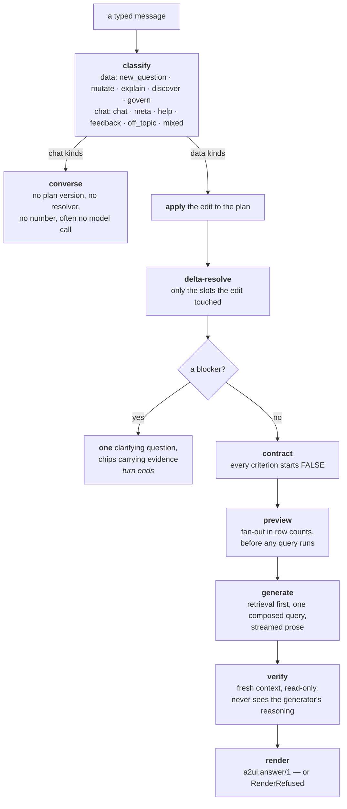
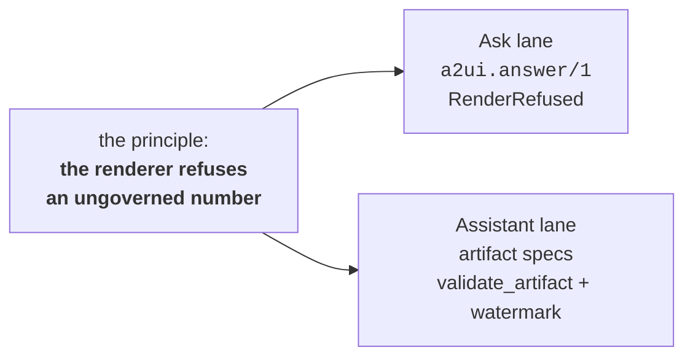

# 9 · The Ask Lane and the A2UI Answer Envelope

**Relevant source files**

- [`sahs/ask/loop.py`](../../synapse-agentic-harness-system/sahs/ask/loop.py)
- [`sahs/ask/classify.py`](../../synapse-agentic-harness-system/sahs/ask/classify.py) · [`resolve.py`](../../synapse-agentic-harness-system/sahs/ask/resolve.py) · [`plan.py`](../../synapse-agentic-harness-system/sahs/ask/plan.py)
- [`sahs/ask/contract.py`](../../synapse-agentic-harness-system/sahs/ask/contract.py) · [`generate.py`](../../synapse-agentic-harness-system/sahs/ask/generate.py) · [`verify.py`](../../synapse-agentic-harness-system/sahs/ask/verify.py)
- [`sahs/ask/render.py`](../../synapse-agentic-harness-system/sahs/ask/render.py) — **the A2UI envelope**
- [`sahs/ask/preview.py`](../../synapse-agentic-harness-system/sahs/ask/preview.py) · [`converse.py`](../../synapse-agentic-harness-system/sahs/ask/converse.py) · [`budget.py`](../../synapse-agentic-harness-system/sahs/ask/budget.py) · [`events.py`](../../synapse-agentic-harness-system/sahs/ask/events.py)
- [`apps/synapse_admin/frontend/js/pages/ask.js`](../../apps/synapse_admin/frontend/js/pages/ask.js) — the consumer

---

## Purpose and Scope

The second turn engine: a **deterministic pipeline** where the harness
drives and the model is invited only twice (generation and one
groundedness judge). Its output is a typed, self-describing answer
envelope — `a2ui.answer/1` — that the browser renders and **that the
serializer refuses to emit if the answer would be ungoverned.**

If [Page 8](08-agent-harness.md) is "give the model tools and get out of
the way," this page is the opposite discipline: "the path is known, so
code it, and put a gate at the end."

---

## The pipeline

```
classify → apply → delta-resolve → validate → generate → verify → render
```



> One stateful loop carrying the plan; stateless workers around it. The
> loop is the only thing that knows the conversation; the generator and
> the verifier each see one turn's artifacts and nothing else.

And:

> Every step emits its event before moving on, so **the stream IS the
> progress report** — the UI is a pure consumer, and a replay of the
> events file reproduces the turn exactly.

---

## The plan is the state

```python
"""Plan v2: the versioned semantic plan — the stateful spine of a
session. **Conversation history is NOT the state; this is.**"""
```

Two pins:

| pin | consequence |
|---|---|
| **grain is required** | a plan without a grain cannot reach the contract, so no answer can be rendered without saying what one row means. *The serializer refuses; it is not a lint.* |
| **mutation is single-slot and deterministic** | "same for Canada" changes exactly one slot, computed in code, never re-planned by a model. `apply_edit` **raises** if an edit would move more than one. |

And resolution is *delta*, not full re-plan:

> Changing a country filter does not re-resolve the metric — that is why
> "same for Canada" is instant.

Blockers are ranked (metric → grain → filter binding) and the **first**
one stops the turn. One question per turn, with named options that carry
their evidence.

> Below-margin is a **success state**, not a failure: the resolver never
> argmaxes.

---

## Classification, and the model calls that don't happen

```python
"""Temperature 0, strict JSON, and deterministic shortcuts that pay for
themselves: greetings, thanks and capability questions are matched in
code before this module is reached, a chip choice arrives already
structured, and the first turn of a session that is not conversational
is a new question by construction. The model is asked only when a human
typed free text this code could not place."""
```

`mixed` is the interesting kind: it carries a chat half *and* a data
half, answered in that order inside one turn.

### The conversational layer

`converse.py` handles the half of a conversation that is not about data.
Two pins:

- **No model call where code will do.** Greetings, thanks, farewells and
  "what can you do" are matched deterministically and answered from
  templates, *so the most common turns in any chat cost nothing and
  cannot drift.*
- **The reality law applies to self-description.** Every fact in an
  answer about the system is read from the promoted build or the served
  capability list. *The system never claims a capability it does not have
  and names the gated ones plainly.*

The voice is pinned, because tone is a product surface: *warm, brief,
plain. A sharp colleague who knows the data cold and never overstates. No
gushing, no roleplayed feelings, no AI-mystique language.*

And the module states its own known cost out loud rather than hiding it:
the first turn of a session still classifies as a data question with no
model call, so a conversational opener the matchers miss reaches the
resolver, finds nothing, and comes back with *"nothing in the promoted
build matches that yet"* plus candidate chips. Honest and recoverable —
and the reason the matchers cover greetings, thanks, capability,
how-it-works, build-freshness and help **in code**.

---

## The contract — acceptance before work, default-FAIL

```python
"""Every criterion starts false and flips only on evidence. Nothing
renders as an answer until the contract is satisfied, and the criteria
the verifier could not evaluate stay false — **an UNKNOWN is a failure,
never a pass.** That asymmetry is the whole point: a skeptical separate
judge is tractable, a self-critical generator is not."""
```

The criteria are written as promises the analyst can read, *because they
are shown to the analyst*:

| id | promise |
|---|---|
| `executes` | the query runs against the promoted build |
| `contract_ast` | every table, column and metric it names is real |
| `grain_declared` | one row means: *&lt;the plan's grain&gt;* |
| `fan_out_guard` | (multi-table only) the join is raw-safe, so no row is counted twice |
| `cost_gate` | the scan stays inside the cost gates |
| `grounded` | the written answer says only what the query supports |

---

## Generation and verification are separated on purpose

**Generate:**

> Retrieval first, always: the table card, the metric's definition line
> and its certified expression are read from the promoted build and put
> in front of the model, so composition is **assembly from real parts
> rather than recall.** The certified expression rides in VERBATIM and
> `validate_sql` refuses a query that dropped it
> (`metric_expression_missing`) — that is what "never invents a metric"
> means in code.
>
> The generator never sees the verdict: verification happens after this
> module has already streamed its prose, **so the answer cannot be
> written to flatter its own grade.**

**Verify:**

> It sees the artifacts (plan, SQL, result) and NOTHING of the
> generator's reasoning — no prompt, no draft, no self-report. Criteria
> flip only on evidence it gathers itself. UNKNOWN is a failure here,
> deliberately: **a cost gate that cannot read the byte estimate must not
> wave the query through.**
>
> The only model call is one groundedness judge, and its prompt carries
> the artifacts alone.

That is a small architectural fact with a large behavioural consequence:
the thing being graded and the grader do not share a context window.

---

## The fan-out preview — honest before the query runs

```python
"""The card the analyst reads is "1,020 rows stay 1,020 after the join"
or "this join may inflate totals". Both are decided from two facts the
build already carries and one it carries about the join:
  * the row count of each table (indexes/tables.jsonl);
  * whether the join key on the far side is a DECLARED primary key;
  * which witness family attests the join, and at what scope."""
```

| far-side key | verdict |
|---|---|
| a declared primary key | at most one row can match, so the base row count survives — **provable, not guessed** |
| not a declared key | **`unproven`**, and it says exactly which fact is missing |

> If it is not, we do NOT invent a multiplier.

And the scope rule again, brought forward to where it can still change
the plan:

> A witness that only ever appeared inside a CTE (`scoped_only`) is
> evidence the relationship exists, **never** evidence the raw tables
> join safely.

That same distinction is enforced *after* the fact by the verifier's
`fan_out_guard`. Two gates on the same rule, at two different times.

---

## `a2ui.answer/1` — the answer envelope

```python
"""The answer serializer: A2UI-shaped, and it REFUSES.

An answer without its meridian line or without a grain is not a
formatting problem, it is an **ungoverned answer**. The serializer raises
rather than emitting one, so the reality law is enforced at the last
gate rather than trusted upstream."""

SCHEMA = "a2ui.answer/1"

class RenderRefused(ValueError):
    """The payload would have been ungoverned; nothing was rendered."""
```

### The two refusals

```python
if not gen.definition_line:
    raise RenderRefused(
        "no meridian line for this metric: an answer that cannot say "
        "where its definition comes from is not servable")
if not plan.grain:
    raise RenderRefused(
        "no grain on this plan: an answer that cannot say what one row "
        "means is not servable")
```

### The payload

```json
{
  "schema": "a2ui.answer/1",
  "meridian_line": "…the one-sentence disclosure…",
  "grain": "one row per merchant per day",
  "metric": {"id": "metric:ab12cd34ef56", "label": "…", "fp": "…",
             "tier": "ha", "status": "certified", "table": "dw.…"},
  "prose": "…the streamed written answer…",
  "sql":   "…the composed query…",
  "why":   "…why this answers the ask…",
  "rows":  [...],
  "result_schema": [...],
  "bytes_processed": 41234567,
  "verdict": {"…": "the contract, criterion by criterion"},
  "plan":    {"…": "the versioned plan"},
  "build_id": "b_2cd603279061",
  "limits": ["validated by dry run, not executed live (live disabled)",
             "3 further rows withheld from this view",
             "unverified, the join is raw-safe…: …"],
  "actions": [
    {"id": "open_metric", "label": "open the metric profile",
     "href": "#/metric/…", "enabled": true},
    {"id": "open_table",  "label": "open the table profile",
     "href": "#/table/…",  "enabled": true},
    {"id": "promote", "label": "propose as a certified metric",
     "enabled": false, "note": "arrives with the steward loop (B2)"}
  ]
}
```

### Why this is the interesting part

This is a **generative-UI contract**: the agent does not emit HTML, it
emits a typed description of an answer, and the client decides how to
render it. The same idea as an AG-UI / A2UI event-and-component protocol,
with two properties bolted on that a generic protocol does not give you:

| property | how |
|---|---|
| **governance is in the schema** | `meridian_line` and `grain` are required fields. A renderer cannot forget the disclosure because a payload without it does not exist. |
| **limits are first-class, not prose** | `limits[]` collects every hedge — not executed live, rows withheld, warnings, each failed criterion, "the first composed query was refused by the validator and repaired before running." The UI renders them; the model cannot bury them in a paragraph. |
| **actions are declared, with `enabled`** | including a **disabled** action with a `note` saying when it arrives. Honest affordances beat hidden ones. |

The client (`ask.js`) is a pure consumer: it dispatches on
`payload.schema === "a2ui.answer/1"` and builds the answer card from the
fields. Replay works because the envelope is stored in the message.

### The same idea in the assistant lane

The assistant lane's equivalent of A2UI components is the **artifact
type system** — `chart`, `table`, `document`, `kpi`, `dashboard`,
`diagram`, each a validated JSON spec with in-schema provenance
([Page 8](08-agent-harness.md)). The v2 spec states the migration
explicitly:

> Artifacts are governed output the same way A2UI components were: any
> artifact showing a number carries its definition status and meridian
> line in-schema, or renders the EXPLORATORY watermark.
>
> Everything the A2UI component work produced survives as
> artifact/message types; nothing is wasted.

So the two lanes share one principle in two shapes:



---

## Budgets and breakers

```python
"""Budgets and breakers for Ask — in code, never in prompts.

The runaway cases are prevented in the orchestration layer: per-session
token caps, per-turn caps, **no worker spawning workers**, oversized
results truncated. The stop button and the breaker share ONE abort path,
so "stop" is exercised by every test that exercises the cap."""
```

And on cost reporting:

> Cost is reported only when a rate is configured (`SYNAPSE_COST_IN` /
> `SYNAPSE_COST_OUT`). **No rate, no invented number:** the meter shows
> tokens and says so.

---

## The event bus

Same envelope as everything else (`meridian.event/1`), keyed by `ev`,
carrying `session_id` / `turn_id` where the batch pipeline carries
`run_id`.

> The events FILE is the record: replay is re-consuming it, so a
> reconnecting browser sees the same turn it would have seen live.

Deliberately **poll-based rather than callback-based**: the turn pipeline
runs in a worker thread (the resolver is CPU work, the model calls are
blocking HTTP) while SSE consumers live on the event loop. *A
lock-protected append log that consumers read by sequence number is
thread-safe by construction, needs no loop plumbing, and loses nothing on
reconnect.*

---

## Next

→ [Page 10 · Web Surfaces and the Event Stream](10-surfaces.md)
