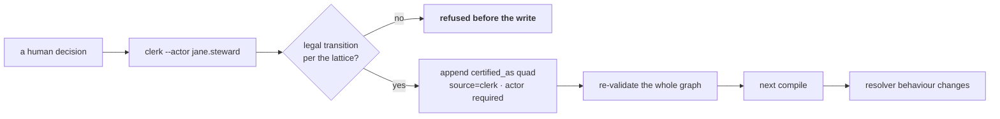
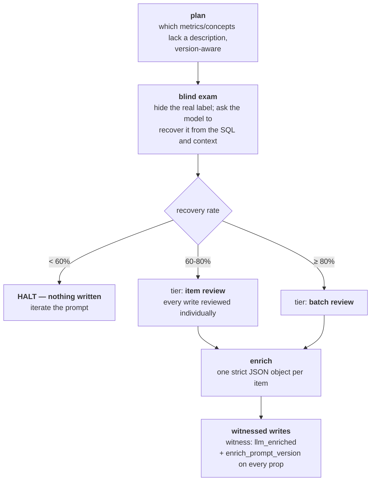

# 11 · Governance, Review and Enrichment

**Relevant source files**

- [`sahs/graph/clerk.py`](../../synapse-agentic-harness-system/sahs/graph/clerk.py)
- [`sahs/graph/review.py`](../../synapse-agentic-harness-system/sahs/graph/review.py)
- [`sahs/graph/ids.py`](../../synapse-agentic-harness-system/sahs/graph/ids.py) — the lattice
- [`sahs/enrich/loop.py`](../../synapse-agentic-harness-system/sahs/enrich/loop.py) · [`prompts.py`](../../synapse-agentic-harness-system/sahs/enrich/prompts.py) · [`client.py`](../../synapse-agentic-harness-system/sahs/enrich/client.py) · [`gateway_client.py`](../../synapse-agentic-harness-system/sahs/enrich/gateway_client.py)
- [`docs/runbooks/b1_enrich.md`](../../synapse-agentic-harness-system/docs/runbooks/b1_enrich.md)

---

## Purpose and Scope

How truth changes: the clerk (the only human write path), the governance
lattice, ReviewItems, and the enrichment loop that lets a model write
descriptions **behind a blind grader** without ever being trusted.

---

## The clerk — the only door

```bash
python -m sahs.graph.clerk --graph graph/ \
    --subject metric:ab12cd34ef56 --set-status certified \
    --actor jane.steward --note "approved in review 2026-09-02"
```

```python
"""The clerk is the ONLY human write path into L2 (E7): it appends a
``certified_as`` quad with ``source=clerk`` and a mandatory ``actor``,
refuses illegal lattice transitions BEFORE writing, and re-validates the
graph after. Status truth flows: clerk edge → next compile → resolver
behavior. **Governance is a write path into the same truth the resolver
reads — not a side channel.**"""
```



Four properties worth naming:

1. **Append, don't edit.** The old status stays in the file. `git blame`
   answers "who certified this, and when."
2. **`actor` is required by the model, not by convention.** `Prov` has
   `actor: str | None`, and validator check E7 makes it mandatory when
   `source == "clerk"`. An unsigned governance decision cannot be
   written.
3. **Refuse before writing.** An illegal jump never lands in the file,
   so the store never holds a state the lattice forbids.
4. **Same truth, not a side channel.** There is no governance database.
   A certification is a quad, in the same store, read by the same fold.

---

## The lattice

```python
STATUS_STATES = ("mined", "team_candidate", "pending", "certified",
                 "rejected", "deprecated", "retracted")

LEGAL_TRANSITIONS = {
    "mined":          {"team_candidate", "retracted"},
    "team_candidate": {"certified", "rejected", "retracted"},
    "pending":        {"certified", "rejected", "retracted"},
    "certified":      {"deprecated", "retracted"},
    "rejected":       {"retracted"},
    "deprecated":     {"retracted"},
}
```

**There is no `mined → certified` edge.** A mined pattern must first
become a team candidate — which is to say, somebody must claim it — and
only then can it be certified. Promotion cannot skip the step where a
human takes responsibility.

`governance_history()` on the store returns, per subject, the ordered
state sequence — so "how did this metric get certified" is a list, not an
archaeology project.

### Seeded states per source

| source | mints at | reason |
|---|---|---|
| `metrics_dmp` | `certified` | the meridian line |
| `extended_gmns` | `pending` | submitted for approval |
| `skill_contract` | `team_candidate` | a team's own contract |
| user variant | `team_candidate` (+ `prov.actor`) | somebody claimed it |
| mined / snippets / jobs | `mined` | evidence, not governance |

---

## ReviewItems — the work queue is in the graph

```
review:<fp12>  props {kind, subject, evidence[], proposal,
                      agent_recommendation?, priority,
                      status: open|decided|spawned_task,
                      decided_by?, decided_at?, verdict?, correction?}
+ edge (review:<id>, concerns, <subject>)
```

Ten kinds:

| kind | source |
|---|---|
| `structural_d1` … `structural_d5` | the reconciler's tickets |
| `metric_conflict` | the census |
| `naming` | alias and label work |
| `variant` | a confirmed user variant |
| `witness_divergence` | jobs vs audit disagreement |
| `enrichment_correction` | a steward correcting model output |

Priority, pinned:

```
support_effective × usage_recency_weight × blast_radius

blast_radius:  certified-adjacent conflict 3
             ≻ ungoverned-but-used         2
             ≻ cosmetic                    1
```

The schemas landed **before the first real build** so day-one quads never
need a remint — a small piece of foresight with a large payoff: the
review queue can be populated retroactively from builds that predate its
tooling.

### User variants are quads, not preferences

> A confirmed on-the-fly variant is written AT CREATION as ordinary
> metric quads — `witness: user_variant`,
> `certified_as → status:team_candidate` with `prov.actor = <user>`,
> `variant_of` → the nearest certified fingerprint — plus a
> `ReviewItem(kind=variant)`. **One store, one status lattice; variants
> are never "memory."** The resolver serves a `team_candidate` variant
> only with disclosure, never as the meridian line.

This is the boundary that keeps memory honest ([Page 8](08-agent-harness.md)):
a *preference* ("by spend they mean acquirer net spend") is memory; a
*definition* is a quad with a signature and a review item. The chat's
`remember` tool description says so explicitly — *NEVER a metric
definition or a number.*

---

## The enrichment loop — a model writes, and is not trusted

```python
"""The B1 loop: plan → blind gate (A5) → enrich → witnessed writes.

Reads ONLY the compiled build (the enricher sees what the serving agent
sees) plus the graph fold for the never-clobber guard; writes ordinary
append-only quads under ``witness: llm_enriched``. The A5 gate runs
before any write: <60% blind name recovery halts the run with nothing
written — **you iterate the prompt, never the graph.**"""
```



### The blind exam

The gate is not "does the output look good." It is: **hide the answer and
see if the model can recover it.**

```python
TIER_BATCH = 0.80    # ≥80% ⇒ batch-tier review eligible
TIER_ITEM  = 0.60    # 60–80% ⇒ item-review only
                     # <60% ⇒ do not run at scale
```

The grader is deliberately **strictly harder over time, never softer**:

```python
# v1.1 recovery grader: ≥50% of the true label's content tokens appear
# in the prediction, AND polarity agrees — the b1.1 smoke passed a
# Card Present / Card Not Present SWAP on token overlap alone, the one
# error class that would actually poison the graph.
RECOVERY_TOKEN_SHARE = 0.5
_NEGATIONS = {"not", "non", "excluding", "without"}
```

A grader that passes a Card-Present / Card-Not-Present swap is not a
grader. Adding a **negation veto** was the fix, and the rule going
forward is that grader changes may only tighten.

### Never clobber, and be version-aware

```python
# E13: the catalog answer wins FOREVER; enrichment only fills blanks,
# and the source flag keeps the provenance readable
```

```python
def _enriched_current(props) -> bool:
    """Version-aware idempotency: presence alone must not freeze a
    metric on the draft we least liked — a b1.2 prompt improvement
    re-enriches b1.1 output (append-only keeps the old draft as
    history; the fold's last-wins serves the newest)."""
```

Every enriched field lands beside its own `*_source`, so a card can say
whether a sentence came from a catalog or a model, and the compiler's
merge prefers the catalog **forever**.

### Prompts are versioned like code

```python
PROMPT_VERSION = "b1.4"
```

> Pinned prompt builders — versioned so a prompt change is a diff. Every
> prompt demands ONE strict JSON object and nothing else; the loop
> validates keys and counts anything malformed. Context is drawn from the
> compiled build only (cards + indexes) — **the enricher sees exactly
> what the serving agent would see, never the raw archives.**

And the system prompt sets the failure mode it wants:

> You never invent table or column names — you only describe what the SQL
> in front of you actually computes. When you are not confident, you say
> so via the `confidence` field **instead of guessing confidently.**

### The prompt history is the most instructive document in the tree

[`docs/runbooks/b1_enrich.md`](../../synapse-agentic-harness-system/docs/runbooks/b1_enrich.md)
keeps the whole record. Compressed:

| version | result | what was learned |
|---|---|---|
| **b1.1** | 19/34 = **56%** — halted, nothing written | 8 misses were *house-dialect paraphrases* (the model answered in literal SQL English — "Net Transaction Amount" for "Spend"); ~6 dropped a discriminating qualifier; **and the token grader passed a CP/CNP swap in both directions** |
| **b1.2** | 20/34 = **59%** — halted by one case | added a HOUSE_STYLE block; grader v1.1 added the negation veto, per-item share margins, and per-item `context_leak` *so a pass can be trusted (a leaky context measures leakage, not recovery)* |
| **b1.3** | 21/34 = **62%** — **gate opened**, tier `item` | first real writes: 23 metrics + 21 concepts, 0 collisions. Churn was high (5 fixed / 4 regressed), so a context probe was run on the misses |
| **b1.4** | — | the probe's three findings, fixed |

The b1.3 probe is the part worth reading twice, because two of its three
findings were **our** bugs, not the model's:

1. **Five cases were unwinnable from the shown context.** The certified
   metrics' scoping `WHERE` lives in their referenced full SQL, not the
   canonical expression, so *the model's "wrong" answers were faithful to
   the evidence.* One catalog SQL even aliases a Sessions metric
   `monthly_visits` — a steward finding, not a model error.
2. **The vocab shelf fed poison.** SQL keywords (`CASE`, `AS`) and
   two-letter column fragments (`cr`/`dr` = credit/debit, not "Customer
   Reference"/"Disaster Recovery") matched unrelated acronyms and caused
   a regression directly. Fixed with a keyword blocklist, a 3-letter
   minimum, trailing-s stemming, and catalog-phrase-first ordering.
3. **A polarity trap in the data.** The CP/CNP twins differ on POS
   cardholder-present codes where `'0'` means **present**. The model
   assumed 0 = absent. So would most people.

And the honest caveat is written into both the module and the runbook:

> iterating a prompt against exam feedback adds mild optimistic bias to
> A5 — the exam's specific names are never embedded, and **the true audit
> is steward review.**

That is the correct thing to say about any eval you also optimise
against, and most projects do not say it.

---

## The transport

```python
"""Vertex generateContent client — urllib + SA token, no SDK.

Mirrors the proven BQ substrate transport exactly; ``token_provider``
and ``transport`` are injectable so tests never touch the network.
Retries transient refusals (429/5xx) with exponential backoff; a
non-transient error surfaces as a typed EnrichTransportError with the
server's own message — **never a stack trace.**"""
```

There is a second, optional plane — `gateway_client.py` — for an
enterprise model gateway with its own identity provider (`GATEWAY_*`,
`IDP_*`). It is described in the README as *a validated candidate, not
the default*, which is the honest status for a plane that works but has
not earned the default position.

---

## Next

→ [Page 12 · Evaluation and Testing](12-evals.md)
