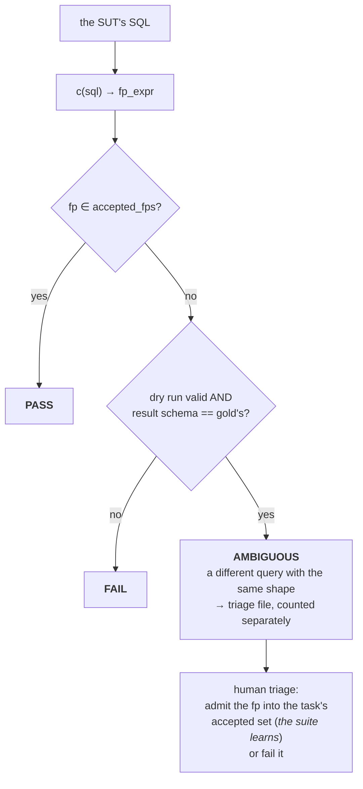

# 12 · Evaluation and Testing

**Relevant source files**

- [`sahs/evals/harness.py`](../../synapse-agentic-harness-system/sahs/evals/harness.py)
- [`sahs/evals/grading.py`](../../synapse-agentic-harness-system/sahs/evals/grading.py)
- [`sahs/evals/capability.py`](../../synapse-agentic-harness-system/sahs/evals/capability.py)
- [`sahs/evals/navigation.py`](../../synapse-agentic-harness-system/sahs/evals/navigation.py)
- [`sahs/evals/substrate.py`](../../synapse-agentic-harness-system/sahs/evals/substrate.py) · [`suts.py`](../../synapse-agentic-harness-system/sahs/evals/suts.py) · [`schema.py`](../../synapse-agentic-harness-system/sahs/evals/schema.py)
- [`sahs/assistant/evals.py`](../../synapse-agentic-harness-system/sahs/assistant/evals.py)
- [`docs/evals/e19_baseline.md`](../../synapse-agentic-harness-system/docs/evals/e19_baseline.md)
- [`tests/`](../../synapse-agentic-harness-system/tests/) · [`tests/tasks/`](../../synapse-agentic-harness-system/tests/tasks/)

---

## Purpose and Scope

How the system knows whether a change helped: the sampling harness, the
three-way verdict lattice, the capability matrix, the navigation evals,
the reference SUTs, and the offline test suite.

The governing principle:

> **Evals are the loss function; transcripts are the gradient.** No
> component ships without its delta. Every week someone reads twenty
> transcripts and turns what they find into tasks. **A score nobody has
> read the transcripts for is not a score.**

---

## The harness: pass@1 and pass^3

```python
"""n samples per task, c passes:
    pass@1 = mean(c/n)
    pass^3 = mean(C(c,3)/C(n,3))     — unbiased all-3-pass estimator

Deterministic SUTs run n=1 with ``deterministic=true``; pass^3 ≡ pass@1
and is **never simulated.** A deterministic SUT with 0 < c < n across
repeated trials is itself a bug alarm (the harness raises it)."""
```

`pass^3` is the "would it work three times in a row" number, computed as
an unbiased estimator rather than by running triples. And the harness
refuses to fake it for a deterministic system-under-test: if something
declared deterministic produces mixed results, that is a **bug alarm**,
not a data point.

| flag | gates on |
|---|---|
| `--fail-under` | the pass rate |
| `--max-ambiguous` | the ambiguous rate (optional) |

---

## The verdict lattice — three outcomes, not two

```python
"""nl2sql verdicts (pinned):
    1. answer's fp_expr ∈ task.grading.accepted_fps            → PASS
    2. fp mismatch AND (dry-run invalid OR schema ≠ gold's)    → FAIL
    3. fp mismatch AND schema matches                          → AMBIGUOUS
       — counted in neither pass nor fail; its own rate; appended to
       the triage file."""
```



Why the third state exists: fingerprint equality is a strong signal and
an incomplete one. A different query that produces the same result schema
and dry-runs clean is *probably* a legitimate alternative phrasing — and
scoring it as a failure would punish correct work while scoring it as a
pass would launder wrong work.

> **Ambiguous items never silently move the floor in either direction.**

Human triage resolves them, and admitting a fingerprint into a task's
accepted set is how *the suite learns.*

### Two more grading rules

**Cheap checks first.**

> Static result-shape (SELECT-list arity) runs before any dry-run — **no
> free FAIL should ever cost a network call.**

**Bytes-scanned is a warning, never a gate** — partition pruning makes it
flaky, and a flaky gate teaches people to ignore gates.

**Abstention is graded as its own class.**

> Answering when the task says abstain is its own loud failure reason
> (`answered_should_abstain`) — **a confident wrong answer is worse than
> silence**, and the report keeps that class visible.

---

## The reference SUTs — calibration instruments

```python
"""oracle  echoes gold — must score 100% pass, 0 ambiguous (harness sanity)
   null    always abstains — must score exactly the abstention share
           (calibrates the floor: silence is only right where silence is gold)"""
```

Two systems that cannot possibly be intelligent, whose scores are known
in advance. If the oracle does not score 100%, the harness is broken. If
the null SUT does not score exactly the abstention share, the abstention
answer key is broken.

Every eval suite should ship with its instruments calibrated. Most do
not.

---

## The execution substrate: dry-run only

```python
"""Decision locked (assumption A1): **dry-run only for now.**
BigQuery's dry-run costs nothing and returns the query's RESULT SCHEMA,
so the ground can grade validity + output-schema equivalence against
gold without touching a single data row. … It only ever sets
``dryRun: true``; **this module cannot execute anything by
construction.**"""
```

"Cannot, by construction" is the phrase to aim for. Not "must not," not
"is configured not to." A governed sample or synthetic warehouse slots in
behind the same interface with zero grader rework.

---

## The capability matrix

```python
"""E19 capability matrix (reconstructed) — the baseline E21 gates on.

RECONSTRUCTION NOTICE, deliberately loud: the E19 instruction itself
never landed in this repo; E20, the answering ladder, and E21 all cite
it. This module rebuilds that suite from those citations so Step 0b can
publish a baseline now. If the real E19 text differs, reconcile THIS
file to it."""
```

A missing spec is documented as missing, loudly, in the module that
substitutes for it. That is much better than a silent reconstruction
nobody knows is a reconstruction.

### The tiers, and the two that say "absent"

Baseline on build `b_2cd603279061`, scripted transport:

| tier | capability | score |
|---|---|---|
| T1 | vocabulary — acronyms expand, scope narrows, unscoped ambiguity refuses to bind | 4/4 |
| T2 | certified bind — the resolver binds the certified metric, fast | 2/2 |
| T3 | clarification — below-evidence stops with a question whose options carry evidence | 4/4 |
| T4 | mutation — "same for Canada" moves one slot, delta-only | 1/1 |
| T5 | contract — acceptance before work, default-FAIL, the judge failing closed | 2/2 |
| T6 | join and grain preview — fan-out judged from build facts, pre-SQL | 3/3 |
| T7 | receipts — meridian line, grain, SQL | 1/1 |
| T8 | composition | **absent — not built, not scored** |
| T9 | exploratory | **absent — not built, not scored** |
| T10 | abstention and honesty | 3/3 |
| T11 | conversation quality | 9/9 |

Two tiers report **absent — not built, not scored**. Not 0/3. Not
omitted. A matrix with holes should show its holes.

### The two-number line and the ablation

| config | margin | answered% | wrong-when-answered% | false-abstain% | false-answer% |
|---|---|---|---|---|---|
| pinned | 0.15 (shipped) | 100.0 | 0.0 | 0.0 | 0.0 |
| looser | 0.05 | 100.0 | 0.0 | 0.0 | 0.0 |
| strict | 0.30 | 100.0 | 0.0 | 0.0 | 0.0 |

And the finding is reported honestly:

> **Ablation note:** the three configurations produce identical lines on
> this build — none of these tasks sits near the margin boundary at this
> fixture's scale. On the full graph (3,000+ mined classes) the margin
> knob is expected to differentiate; **a flat line there would be a
> finding about the knob, not the suite.**

The pair of numbers — *answered%* and *wrong-when-answered%* — is the
shape that matters for a system allowed to abstain. A single accuracy
number cannot distinguish "answered everything, half of it wrong" from
"answered the two-thirds it could, all correct."

---

## Navigation evals: grade outcomes, read trajectories

```python
"""The task set holds questions whose answer lives in a card the fast
path cannot bind. Each run drives the REAL turn engine … and the grader
reads the final stored plan and the event stream — **never the tool
sequence**."""
```

| measured | question |
|---|---|
| **recall** | did the loop end where the task's evidence says an honest analyst would: the expected metric bound (`bind`), bound-or-asked (`either`), or an honest non-answer (`no_answer`)? |
| **precision** | did it stay out of tables the task forbids? The sub-graph the loop records is the evidence. |
| **trajectory hygiene** (soft) | tool calls per task, asks per task, literal-check rate (sample before a filtered plan), read-before-use rate, budget stops |

> **Hygiene never gates**: it feeds the weekly trajectory read.

Grading the *outcome* and reading the *trajectory* is the split that
keeps an agent honest. Grading the tool sequence would freeze the harness
into whatever path it happened to take on the day the task was written.

---

## The assistant suites

`sahs/assistant/evals.py` plus the task sets under `tests/tasks/`:

| suite | file | grades |
|---|---|---|
| navigation | `tasks/navigation/navigation.jsonl` | recall, precision, hygiene |
| capability matrix | `tasks/capability/matrix.jsonl` | the 11 tiers |
| artifact | `tasks/assistant/artifact.jsonl` | rubric + structural checks: every tile disclosed, export valid, data matches the query |
| reasoning | `tasks/assistant/reasoning.jsonl` | no-tool business reasoning, calibrated judge |
| playbook | `tasks/assistant/playbook.jsonl` | a "why" question must run the decomposition **with its checks** |
| recovery | `tasks/assistant/recovery.jsonl` | a failure classified `sql`/`cost` gets fixed; `environment`/`access` gets **reported, not retried** |
| curated | `tasks/curated/curated.jsonl` | hand-picked regressions |

Plus the behavioural, launch-gating suites the v3 spec adds: **sycophancy**
(a wrong premise stated confidently), **over-assumption** (an ambiguous
ask that should clarify), **format adherence**, **tone**.

> Before every ship, one real conversation read against the experience
> rubric; **the scripted walk proves plumbing only.**

---

## The offline test suite

```bash
python -m pytest synapse-agentic-harness-system/tests -q   # 411 tests, a few minutes
python -m pytest apps/synapse_admin/tests -q               # 65 tests, seconds
```

476 tests. **Everything runs offline** on 500KB of fixtures under
`tests/fixtures/`.

> Tests that would need a warehouse or a model **stub the plane and
> assert on what would have been sent.**

That is the pattern worth copying: do not mock the answer, assert on the
request. A test that stubs a warehouse response tells you your parser
works; a test that asserts the exact SQL, project and location you *would
have* sent tells you your integration works.

### The fixtures are real shapes

`tests/fixtures/` carries genuine (redacted) export layouts:
`real_extractions_production/` with two tables' 00–17 artifacts including
gzipped job history, `mdm_46_patched_v2/` with its response tree,
`sources/` with catalogs, skill packs, vocab CSVs and a studio export,
plus `identity/` sidecars and `golden_fps.json`.

So a loader test exercises the actual file shape, not a simplified
stand-in — and fixture CI runs every pipeline subcommand end to end,
which is the guard against runbook drift.

### The canary test

> A failure in `test_canon.py` after a dependency change almost always
> means the sqlglot pin moved.

`golden_fps.json` pins fingerprints. A parser upgrade turns it red, and
the remint is deliberate (`SAHS_REGEN_GOLDENS=1`). See
[Page 3](03-canon-and-identity.md).

---

## The PR checklist

Every harness PR body carries:

- [ ] **The delta line** (answered% / wrong-when-answered%, against
      `docs/evals/e19_baseline.md`), or an explicit statement that the
      change is not measurable by the suite **and why**.
- [ ] **Which principle justified the component**, and what would have to
      be true to delete it again.
- [ ] **A transcript** read, not just a score: what the model actually saw
      at the step this PR changes.

The third box is the one that catches things. And the note that makes the
whole ritual credible:

> the first real-graph run produced **no eval delta at all** and was
> still the most valuable run to date, because reading it found three
> transport bugs no scripted suite could see.

---

## Next

→ [Page 13 · Configuration and Operations](13-configuration.md)
