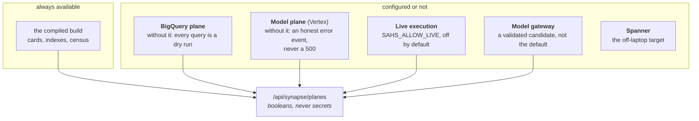

# 13 · Configuration and Operations

**Relevant source files**

- [`synapse-agentic-harness-system/.env.example`](../../synapse-agentic-harness-system/.env.example)
- [`sahs/util/auth.py`](../../synapse-agentic-harness-system/sahs/util/auth.py) · [`gateway.py`](../../synapse-agentic-harness-system/sahs/util/gateway.py)
- [`scripts/`](../../synapse-agentic-harness-system/scripts/) — the plane checks
- [`db/spanner/README.md`](../../synapse-agentic-harness-system/db/spanner/README.md) · [`docs/spanner_schema.md`](../../synapse-agentic-harness-system/docs/spanner_schema.md)
- [`docs/runbooks/`](../../synapse-agentic-harness-system/docs/runbooks/)

---

## Purpose and Scope

Every knob, where it is read, what it changes, and the checks that tell
you whether a plane is actually configured. Then the runbooks and the
deployment target.

---

## One `.env`, one precedence rule

```
synapse-agentic-harness-system/.env
```

Loaded by the pipeline CLI, the checks, **and** the web server.

> **CLI flag > shell-exported variable > this file > silo default.**

And a useful escape hatch: passing an empty flag value
(`--bq-archive ""`) skips that archive for one run even when the `.env`
carries it.

---

## The planes

The system is built as a set of **planes** that are configured or not.
Nothing is faked when one is missing; the surface says which capabilities
this machine carries.



`GET /api/synapse/planes` reports each as a boolean so the Home page can
say honestly what this install can do.

---

## Paths

| variable | default | changes |
|---|---|---|
| `MERIDIAN_SOURCES_DIR` | silo `sources/` | where the source exports live |
| `MERIDIAN_SKILLS_DIR` | `<sources>/skills` | the skills tree the shelf walks (areas = subfolders, nesting welcome) |
| `MERIDIAN_BQ_ARCHIVE` | unset | the warehouse extraction root |
| `MERIDIAN_MDM_ARCHIVE` | unset | the metadata archive root |
| `MERIDIAN_REGISTRY` | unset | `_batch_summary.csv` — the extracted-table registry |
| `MERIDIAN_CROSSWALK` | `<graph>/identity/crosswalk.jsonl` | table identity |
| `MERIDIAN_GRAPH_DIR` | silo `graph/` | where quads are written |
| `MERIDIAN_BUILDS_DIR` | silo `builds/` | where builds are written |
| `MERIDIAN_SILO_DIR` | `<repo>/synapse-agentic-harness-system` | where the app imports `sahs` from |

---

## The BigQuery plane

| variable | changes |
|---|---|
| `SYNAPSE_BQ_SA_KEY` | absolute path to the service-account key |
| `SYNAPSE_BQ_PROJECT` | the project that **runs and bills** the query |
| `SYNAPSE_BQ_DATA_PROJECT` | the project that **hosts** the tables — see [`qualify.py`](07-serving.md) |
| `SYNAPSE_BQ_API_BASE_URL` | a private endpoint |
| `BQ_LOCATION` | the dataset's location if regional (`US` default) |

> Without these, **every query is a dry run.**

The two-project distinction is the one that bites: BigQuery resolves a
two-part name against the *running* project, so `dw.gms_transaction`
means nothing unless the sandbox qualifies it with the data project
first. Smoke test:

```bash
python scripts/bq_check.py --table dw.gms_transaction
```

The BigQuery connection pins a **direct** route on the connection —
the environment's `NO_PROXY` is neither read nor written — so a
warehouse call and a model call cannot reroute each other.

---

## The model plane

| variable | changes |
|---|---|
| `SYNAPSE_VERTEX_SA_KEY` | the service-account key |
| `VERTEX_PROJECT_ID` | the project |
| `VERTEX_MODEL` | the model id |
| `SAHS_MODEL_PLANE` | which plane the assistant uses |
| `THINKING_BUDGET`, `SHOW_THOUGHTS` | thinking level and thought summaries |
| `SYNAPSE_COST_IN`, `SYNAPSE_COST_OUT` | dollars per million tokens — **no rate, no invented number**, the meter shows tokens and says so |

Vertex rides `HTTPS_PROXY`, pinned on the connection. Smoke tests:

```bash
python scripts/vertex_check.py
python scripts/flash_check.py       # the Flash-tier call (memory pass, judges)
python scripts/transport_check.py   # native function calling end to end
```

### The optional gateway plane

| variable | changes |
|---|---|
| `GATEWAY_BASE_URL`, `GATEWAY_ROUTE`, `GATEWAY_PATH_FORM`, `GATEWAY_MODEL` | the enterprise model gateway |
| `GATEWAY_SCOPES`, `GATEWAY_CA_BUNDLE` | scopes and corporate TLS trust |
| `GATEWAY_THINKING_BUDGETS`, `GATEWAY_JSON_THINKING_BUDGET` | per-call thinking |
| `IDP_TOKEN_URL`, `IDP_TIMESTAMP_UNIT`, `APP_ID`, `APP_SECRET` | the identity provider |
| `AUTH_MODE` | `generated` (mint a token) or `env` (use `GEMINI_BEARER_TOKEN`) |

```bash
python scripts/gateway_check.py
```

Status, per the README: *a validated candidate, not the default.*

---

## Execution limits

| variable | default | changes |
|---|---|---|
| `SAHS_ALLOW_LIVE` | **off** | whether the chat may execute at all |
| `SAHS_LIVE_MAX_BYTES` | 1 GB | the scan ceiling the model cannot lift |
| `ASK_EXECUTE` | — | live execution in the Ask lane |
| `SAHS_STORE` | — | the session store path |
| `SAHS_FILES_DIR` | — | where attachments land |

Both limits are **disclosed on every result**. Refused for cost, the
model narrows the scan; refused as disabled or restricted, it reports
configuration and stops retrying
([`warehouse_errors.py`](07-serving.md)).

---

## Identity and roles

Email-and-password sign-in, with the first rollout's knobs:

| variable | changes |
|---|---|
| `AUTH_PEPPER` | 32+ random characters — `python -c "import secrets; print(secrets.token_urlsafe(48))"` |
| `AUTH_SESSION_HOURS` (12) | the absolute life of a sign-in |
| `AUTH_IDLE_MINUTES` (30) | the idle expiry, pushed forward on use |
| `AUTH_COOKIE_SECURE` (`auto`) | `auto` = Secure over https; `false` for `http://localhost` only |
| `AUTH_BOOTSTRAP_ADMIN_EMAIL` | the sign-up with this address is the first admin |
| `AUTH_OPEN_SIGNUP` | 1 = anyone may sign up as `AUTH_DEFAULT_ROLE`; 0 = invitation only |
| `AUTH_ALLOWED_EMAIL_DOMAINS` | comma list; when set, sign-up accepts only these domains |
| `AUTH_DEFAULT_ROLE` (`analyst`) | `analyst` opens `/synapse/`; `admin` opens both surfaces |
| `AUTH_LOCK_AFTER` (5) | wrong passwords before the account locks |
| `AUTH_LOCK_MINUTES` (15) | the first lock; **doubles each further lock, capped at a day** |

Roles map to surfaces, which is the smallest authorization model that
matches the product: a steward gets the console, an analyst gets the ask
surface.

---

## Personalization and branding

| variable | changes |
|---|---|
| `SYNAPSE_USER_NAME` | the name memory is bound to and the account row shows |
| `SYNAPSE_LOGO` | the brand image for the ask surface |

---

## The plane checks

Nineteen scripts under `scripts/`. The ones you will run:

| script | answers |
|---|---|
| `preflight.sh` | is this machine ready at all? |
| `planes_check.py` | which planes are configured? |
| `bq_check.py --table …` | can we reach the warehouse, and does this table resolve? |
| `vertex_check.py` · `flash_check.py` | can we reach the model, at both tiers? |
| `gateway_check.py` | is the gateway plane real? |
| `transport_check.py` | does native function calling work end to end? |
| `files_check.py` | which attachment families are honestly supported here? |
| `graph_state.py` · `state_report.py` | what is in the store and the build right now? |
| `turn_doctor.py` | why did that turn behave like that? |
| `spanner_ddl_check.py` | does the DDL apply cleanly? |
| `serve_mcp.py` | expose the serving tools over MCP |
| `run_evals.py` · `e19_baseline.py` · `nav_eval.py` · `chat_eval.py` | the suites |
| `ask_demo.py` | a curl-able turn |
| `repair_sources.py` | fix a known export defect |

A check per plane, each answering one question, is a small investment
that pays every time somebody says "it doesn't work on my machine."

---

## The runbooks

Under `docs/runbooks/`, and **fixture CI runs every subcommand they
describe** — so a runbook cannot drift from the code without a test
noticing.

| runbook | covers |
|---|---|
| `p0_census.md` | canonicalize the corpus, publish the census |
| `p1_ground.md` | the grading ground and the task set |
| `p2_build.md` | author the crosswalk, build the graph, compile, **review the DIFF like a PR** |
| `p3_tools.md` | the serving tools |
| `b1_enrich.md` | the enrichment loop and its whole prompt history |
| `e18_ask.md` | the Ask lane |
| `e21_intelligence.md` | the capability ladder |
| `pipeline_end_to_end.md` | exports → promoted build, the whole way |
| `trajectory_ritual.md` | **the weekly transcript read** |

`docs/contracts/` documents the export shapes:
`mdm_extract_explained.md`, `bigquery_extraction_run_explained.md`,
`semantic_sources_explained.md`, `std_tech_metadata_layout.md`. Read
these before adapting a loader.

---

## The deployment target

The laptop was the deployment target throughout: one process, one
machine, warehouse access. `db/spanner/` is what the stores become when
the system leaves it.

| file | holds | replaces |
|---|---|---|
| `001_identity.sql` | users, credentials, roles, permissions, sessions, refresh tokens, MFA, invitations, preferences, the audit | nothing yet — the laptop has one configured person |
| `002_chat.sql` | chats, messages, artifacts, plans, feedback, files, events, memory, a person's own skills, staged knowledge files | the session sqlite, the events JSONL, the per-workspace files |
| `003_graph.sql` | nodes and edges with provenance as append-only assertions **plus the folded current state**, the crosswalk, the clerk's transitions, the builds, and a property graph over the fold | `graph/nodes/*.jsonl`, `graph/edges/*.jsonl`, `graph/identity/`, `graph/runs/` |

The first rollout is deliberately narrow: identity tables for
email-and-password sign-in, every chat table, and **the graph stays on the
filesystem.** Five identity tables wait for phase 2 and stay empty,
marked in the file.

Notice that `003_graph.sql` keeps *both* the append-only assertions and
the folded current state. The store's design — append, then fold — is not
a filesystem workaround; it is the model, and it survives the move to a
database.

The reasoning behind every table is in `docs/spanner_schema.md`.

| variable | changes |
|---|---|
| `SPANNER_PROJECT_ID`, `SPANNER_INSTANCE_ID`, `SPANNER_DATABASE_ID` | the database |
| `SYNAPSE_SPANNER_SA_KEY` | the service-account key |
| `SPANNER_EMULATOR_HOST` | local development |

---

## Before any non-localhost deployment

- **Lock down CORS.** It is open for local dev.
- **Set `AUTH_COOKIE_SECURE`** away from `false`.
- **Set `AUTH_PEPPER`** to real entropy.
- **Decide `SAHS_ALLOW_LIVE`** deliberately, with a scan ceiling.
- **Add a license file.** There isn't one yet.

---

## Back to

← [Wiki index](README.md) · [Page 1 · Overview](01-overview.md)
