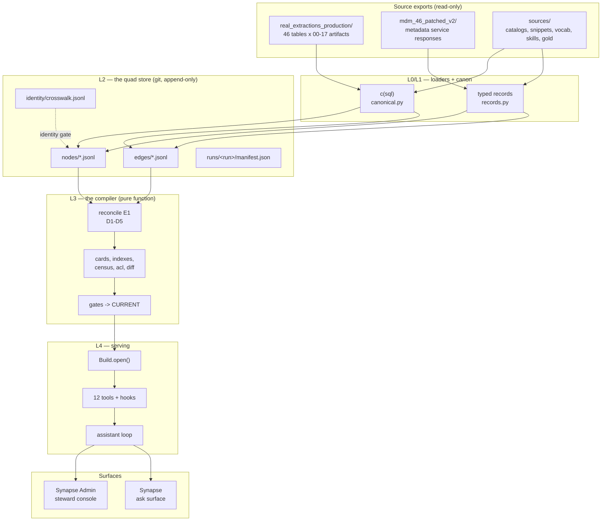

# wyla — Repository Wiki

**Relevant source files**

- [`README.md`](../../README.md)
- [`synapse-agentic-harness-system/pyproject.toml`](../../synapse-agentic-harness-system/pyproject.toml)
- [`synapse-agentic-harness-system/scripts/pipeline.py`](../../synapse-agentic-harness-system/scripts/pipeline.py)
- [`apps/synapse_admin/backend/app.py`](../../apps/synapse_admin/backend/app.py)
- [`synapse-agentic-harness-system/docs/harness-discipline.md`](../../synapse-agentic-harness-system/docs/harness-discipline.md)

---

## Purpose and Scope

This wiki documents `wyla`: a **semantic layer** for a BigQuery warehouse
plus an **agent harness** that answers data questions on top of it.

It covers the whole tree in two halves:

1. **The substrate** — how heterogeneous source exports become a
   provenance-typed graph, and how that graph is compiled into an
   immutable *build* the agent reads. Pages 2–7.
2. **The harness and surfaces** — how a language model is given tools,
   hooks, budgets and an event stream over that build, and how two web
   surfaces render it. Pages 8–13.

Not covered: `archive/`, the previous platform, kept for reference only.
Nothing runs from it.

---

## System at a glance

**The one rule:** the graph is compiled, never edited. Information flows
left to right; the only human write path into truth is the governance
clerk ([Page 11](11-governance-enrichment.md)).

---

## Page index

| # | Page | What it answers |
|---|---|---|
| 1 | [Overview and Repository Layout](01-overview.md) | What lives where; how to run it; the vocabulary |
| 2 | [Architecture and Data Flow](02-architecture.md) | The five layers, the stage boundaries, what crosses them |
| 3 | [Canonicalization and Identity](03-canon-and-identity.md) | `c(sql)`, fingerprints, the ID grammar |
| 4 | [The Quad Store and the Witness Model](04-quad-store.md) | Nodes, edges, `prov`, 15 witness families, the fold |
| 5 | [Loaders and Source Contracts](05-loaders.md) | Nine loaders, nine export shapes, quarantine, the ledger |
| 6 | [The Compiler and Build Artifacts](06-compiler.md) | Reconciliation, cards, indexes, census, gates, promotion |
| 7 | [Serving Tools and the Build API](07-serving.md) | `Build`, the resolver, the sandbox, SQL validation, MCP |
| 8 | [The Agent Harness](08-agent-harness.md) | The thin loop, 12 tools, hooks, budgets, modes, memory |
| 9 | [The Ask Lane and the A2UI Answer Envelope](09-ask-lane-a2ui.md) | The deterministic pipeline, the contract, `a2ui.answer/1` |
| 10 | [Web Surfaces and the Event Stream](10-surfaces.md) | The read plane, SSE, the chat surface, the cosmos |
| 11 | [Governance, Review and Enrichment](11-governance-enrichment.md) | The clerk, the lattice, ReviewItems, the blind-graded enricher |
| 12 | [Evaluation and Testing](12-evals.md) | pass@1 / pass^3, the verdict lattice, the capability matrix |
| 13 | [Configuration and Operations](13-configuration.md) | Every environment variable, the planes, the runbooks |

---

## Vocabulary

Read these once; the rest of the wiki assumes them.

| term | meaning |
|---|---|
| **quad** | one statement: `(s, r, o)` plus a `prov` block. Nodes are quads about one id. |
| **witness** | *who saw it* — the independent evidence family behind an assertion. 15 of them. |
| **prov** | source, run, evidence pointer, status, support, actor, witness. On every statement. |
| **build** | an immutable directory `builds/b_<graph_hash12>/`. Content-addressed by the graph. |
| **CURRENT** | one line of text naming the promoted build. Written with `os.replace`. |
| **card** | a ≤2K-token markdown page. The agent's entire world. |
| **meridian line** | the one-sentence disclosure a number carries: which definition, whose authority. |
| **the meridian** | the certified line. `metrics_dmp` sits on it; everything else is off it, and says so. |
| **crosswalk** | the human-verified table identity file. 46 signed rows. Unresolvable ⇒ build blocks. |
| **census** | the honest difficulty meter: how contested each meaning is, recomputed every build. |
| **tier marks** | `● ha` · `◆ gr` · `◐ in` · `○ gu` — the four-symbol trust language. Crimson = conflict only. |
| **D1–D5** | the five structural disagreement handlers between catalog, metadata service and warehouse. |
| **E-numbers** | pinned design amendments (E1 identity, E4 atomic promotion, E7 governance, E12 witnesses, …). Cited in code comments as the reason a rule exists. |

---

## Ten principles the code holds to

From [`docs/harness-discipline.md`](../../synapse-agentic-harness-system/docs/harness-discipline.md).
Each one has already changed a decision in this tree.

1. Don't build an agent where a workflow will do.
2. Keep it simple: environment, tools, system prompt — iterate on those and nothing else.
3. Think like the agent: literally read its context window.
4. Tools get the care of a user interface.
5. Start with the API, never a framework.
6. Evals are the loss function; transcripts are the gradient.
7. Budget everything in code.
8. **Make the environment truthful before making the model clever.**
9. Ship the smallest honest thing, then measure, then add.
10. Delete on upgrade.

---

## Companion documents

- [`docs/paper/compiling-a-semantic-layer.md`](../paper/compiling-a-semantic-layer.md) — the paper on graph construction.
- [`docs/presentation/synapse-system-overview.html`](../presentation/synapse-system-overview.html) — the deck.
- `synapse-agentic-harness-system/docs/runbooks/` — the operational procedures.
- `synapse-agentic-harness-system/docs/contracts/` — the export shapes the loaders read.
- `synapse-agentic-harness-system/docs/specs/` — the design notes the code cites.
