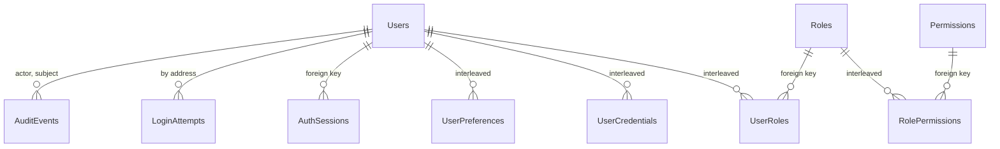
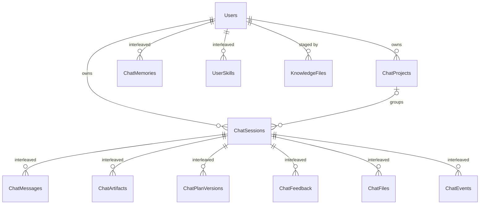

# Synapse on Spanner: the schema, explained

The stores Synapse keeps when it leaves the laptop, table by table,
with the reasons: who may open which surface, where a person's chats,
messages, files, memory and skills live, and the graph as a graph.
This document is the hand-off. The DDL is in `db/spanner/` (three
GoogleSQL files, applied in order); `scripts/spanner_ddl_check.py`
holds those files to the database's rules and to the Python
registries; `tests/test_spanner_ddl.py` holds this document to the
DDL. Nothing in the app reads Spanner yet: the first rollout is built
against this contract, and §6 says how the `.env` names the target.

**The scope decided for the first rollout** (2026-09-09):

* **People sign up with an email and a password and sign in with
  them.** No second factor, no email verification, no invitation
  flow, no refresh tokens. The tables for those stay in the DDL
  (§3.8) so the day they land is a code change, not a migration;
  they are empty until then.
* **A role decides which surface opens**: `admin` opens the Lumi
  console at `/` and Synapse; `analyst` opens Synapse at `/synapse/`;
  `steward` opens Synapse, with its permission set still to be
  decided.
* **Everything in a chat is tracked**: the chat, every message, the
  files it carried, the artifacts, the plan versions, the feedback,
  the events of every turn, the memory the person edits, the skills
  they saved, the knowledge files they staged. Each is a row with the
  person as its owner.
* **The graph stays on the filesystem** as it is today (`graph/` as
  append-only JSONL, `builds/` as compiled snapshots). §5 keeps the
  Spanner Graph design for the day it moves; nothing in the first
  rollout depends on it.
* **No SQLite anywhere in the deployment.** The laptop keeps its
  SQLite chat store (`SAHS_STORE=local`, today's behaviour exactly);
  the deployment runs on Spanner (`SAHS_STORE=spanner`). There is no
  SQLite identity store in between to maintain.

Contents: §1 what the laptop has and what changes · §2 the
conventions every table follows · §3 identity · §4 the chat store ·
§5 the graph · §6 the `.env` contract · §7 applying, checking,
seeding · §8 moving the laptop's data · §9 size, cost, retention ·
§10 decisions taken and open.

## 1 · What the laptop has, and what changes

Today one configured person (`LUMI_USER_NAME`) uses two surfaces off
one process: the Lumi console at `/` and Synapse at `/synapse/`. The
chat store is SQLite — `sahs/ask/store.py` holds sessions, messages,
plan versions and feedback; `sahs/assistant/store.py` adds artifacts,
projects, memories and the session's organisation columns (project,
starred, archived, handoff, notes, model). The events of every turn
are a JSONL file per session; a chat's files live in a workspace
folder under `graph/runs/chat/workspaces/`; a person's own skills in
`graph/skills/users/<owner>/`; staged knowledge in
`sources/artifacts/`. The graph is append-only JSONL
(`sahs/graph/quads.py`) folded into current state at compile time.

| the laptop today | on Spanner | first rollout |
|---|---|---|
| `LUMI_USER_NAME`, one configured person | `Users`, `UserCredentials`, `UserRoles` | yes |
| nothing: no sign-in | `AuthSessions`, `LoginAttempts`, `AuditEvents` | yes |
| `sessions.sqlite3` → `sessions`, `projects` | `ChatSessions`, `ChatProjects` | yes |
| `sessions.sqlite3` → `messages` | `ChatMessages` | yes |
| `sessions.sqlite3` → `artifacts`, `plan_versions`, `feedback` | `ChatArtifacts`, `ChatPlanVersions`, `ChatFeedback` | yes |
| `<workspace>/files/manifest.json` and the bytes | `ChatFiles` (the bytes on disk or in a bucket) | yes |
| `<session>.jsonl`, the events | `ChatEvents` | yes |
| `sessions.sqlite3` → `memories` (one person's) | `ChatMemories`, per person | yes |
| `graph/skills/users/<owner>/*.md` | `UserSkills` | yes |
| `sources/artifacts/<unit>/*` | `KnowledgeFiles` | yes |
| browser local storage (theme, last chat) | `UserPreferences` | yes |
| `graph/**/*.jsonl`, `graph/identity/crosswalk.jsonl`, `builds/` | `Graph*`, `Builds`, the property graph | later (§5) |

What changes with Spanner: the person becomes a row, every chat and
memory and skill is owned by one, a role decides which surface opens,
and — later — the graph's fold is a table the property graph reads.
What does not change: the append-only discipline (assertions are
never edited; the fold is derived), the provenance on every record,
the one-writer rule for the graph, the E14 door for user packs
(usable now, labelled unreviewed), and the chat's own contract — the
`converse` events, the message payloads, the artifact specs. The
store changes underneath the same code paths: `SessionStore` /
`AssistantStore` gain a Spanner implementation and an owner on every
read and write; `AssistantRuntime`, `run_assistant_turn` and the
routes in `apps/lumi/backend/chat.py` keep their shape.

## 2 · Conventions every table follows

**Dialect and names.** GoogleSQL. Tables and columns are PascalCase;
a table is plural (`Users`, `ChatMessages`); an id column is
`<Thing>Id`; a moment is `<Verb>At` (`CreatedAt`, `RetiredAt`,
`OccurredAt`) — never `At` or `Hash` alone, both reserved words. The
lint refuses a reserved word as a column name.

**Keys are random.** Every generated id is `GENERATE_UUID()` in a
`STRING(36)`, never a sequence or a timestamp prefix. Spanner splits
a table by key range, and a monotonic key writes every new row to the
same split (a hot tail). The graph's own ids
(`table:dw.gms_transaction`, `metric:0141ad8167c0`) are natural keys
and stay so (§5).

**Commit timestamps.** A column that means "when this row landed" is
`TIMESTAMP NOT NULL OPTIONS (allow_commit_timestamp = true)` and the
app writes `PENDING_COMMIT_TIMESTAMP()`: the database's clock, not a
host's, so order across hosts is honest. Columns that mean "until
when" (`ExpiresAt`, `AbsoluteExpiresAt`, `LockedUntil`) are ordinary
timestamps the app computes.

**Interleaving.** A child that is only ever read with its parent is
`INTERLEAVE IN PARENT … ON DELETE CASCADE`: its key starts with the
parent's key, its rows live in the parent's split, and reading a chat
with its messages is one range read rather than a join across splits.
Children of a chat: messages, artifacts, plan versions, feedback,
files, events. Children of a person: credentials, roles, preferences,
memories, skills. Deleting the parent deletes the children in the
same transaction. An index that only ever serves reads within one
parent is interleaved too (`ChatMessagesBySeq`, `ChatMemoriesActive`).

**Foreign keys** hold the references that are not interleaved — a
chat's owner, a role on a grant, a run on an assertion. Each costs a
read per write; they are on the columns where a dangling reference
would be a bug the app cannot see.

**Retention is declared.** A table whose rows expire carries a
`ROW DELETION POLICY (OLDER_THAN(<column>, INTERVAL n DAY))`; the
database deletes in the background and the app never runs a cleanup
job. §9 lists every policy.

**Nothing secret is stored recoverable.** A password is a salted,
peppered hash. A session token is stored as its SHA-256; the browser
holds the only copy of the token. (Phase 2: TOTP secrets as
KMS-wrapped bytes, recovery codes as hashes.) A copy of the database
alone yields no way in.

**Soft delete for people.** A person is never hard-deleted while
audit rows reference them: `Status = 'deleted'`, `DeletedAt` set, and
the deletion job replaces email, username and display name with
tombstones; the interleaved children cascade when the row finally
goes (§3.9).

**CHECK lists are the code's registries.** The statuses, kinds,
relations and witnesses a column may hold are listed in the DDL, and
for the graph half the lint holds the lists equal to the Python
registries (`sahs.graph.ids.ID_PATTERNS`, `sahs.graph.quads.RELATIONS`
and `WITNESSES`), so a relation added in code fails the check until
the DDL learns it.

**JSON where the app kept JSON.** A message's payload, an artifact's
spec, a plan, a session's handoff and notes, an event's payload are
`JSON` columns: the app validated their shape before the store did on
the laptop, and still does.

**One writer per row family.** The process that runs a turn writes
that chat's rows; the bootstrap job writes the seed; the graph's
single writer (later) writes assertions and the fold in one
transaction. There is no second writer to race.

## 3 · Identity (`001_identity.sql`)

Fifteen tables. The first rollout writes ten — `Users`,
`UserCredentials`, `Roles`, `Permissions`, `RolePermissions`,
`UserRoles`, `AuthSessions`, `LoginAttempts`, `UserPreferences`,
`AuditEvents` — and five wait for phase 2 (§3.8).



### 3.1 `Users` — the person

| column | holds |
|---|---|
| `UserId` | random UUID; the key every other table points at |
| `Email`, `EmailNormalized` | the address as typed, and the case-folded trimmed form the database derives (`LOWER(TRIM(Email))`, stored) that the unique index `UsersByEmail` is on: `Saheb@…` and `saheb@…` are one person and the app never compares strings itself |
| `Username`, `UsernameNormalized` | a handle (`^[A-Za-z0-9][A-Za-z0-9._-]{2,63}$`, checked by the database), unique the same way (`UsersByUsername`). The rollout's sign-up form does not ask for one: the app derives it from the address's local part (`saheb.singh`), adds a numeric suffix on a collision, and the person may change it later. It exists so a surface can name a person without showing an address |
| `DisplayName` | what the account block shows |
| `Status` | `pending_verification` \| `active` \| `locked` \| `disabled` \| `deleted`. The DDL default is `pending_verification` for the day email verification lands; the rollout writes `active` at sign-up, explicitly. `locked` is an admin's lock (the automatic lockout is a column, §3.5), `disabled` an admin's decision, `deleted` the tombstone |
| `EmailVerifiedAt` | null in the rollout (no mail) |
| `FailedLoginCount`, `LockedUntil` | the lockout counters (§3.5) |
| `LastLoginAt`, `PasswordChangedAt` | shown on the admin page; `PasswordChangedAt` also bounds which sessions a password change revokes |
| `MustChangePassword` | set by an admin who handed out a temporary password; the next sign-in reaches the change-password page and nothing else until it is changed |
| `MfaRequired` | phase 2; false in the rollout |
| `Timezone`, `Locale` | for the day the surfaces render times in the person's zone |
| `CreatedAt`, `UpdatedAt`, `DeletedAt` | commit timestamps; `DeletedAt` marks the tombstone |

`UsersByStatus (Status, CreatedAt)` serves the admin page's lists.

### 3.2 `UserCredentials` — the password

One row per password a person has had, interleaved in the person.
The current one is the child row with `RetiredAt IS NULL`; a person
has at most a handful of rows, so the app reads the key range
`(UserId)` and filters — no index. (An earlier draft indexed
`RetiredAt` null-filtered, which keeps exactly the retired rows and
none of the current ones; it is gone.)

| column | holds |
|---|---|
| `Kind` | `password`, the only kind; the CHECK keeps it so |
| `PasswordHash` | the encoded string — algorithm, parameters, salt and hash in one field: `$argon2id$v=19$m=65536,t=3,p=4$<salt>$<hash>`. The salt and the parameters ride inside, so the cost can be raised later and old rows still verify; the app re-hashes at the next successful sign-in when the row is below the current cost |
| `Algorithm`, `Params` | the same facts as columns, for the question "how many rows are still on the old cost" |
| `PepperVersion` | which server-side pepper was applied (§3.2.1) |
| `CreatedAt`, `RetiredAt` | a change retires the old row and inserts the new one in the same transaction; the last five retired rows stay for the reuse check, older ones are pruned by the app on the next change |

**3.2.1 Hashing.** Argon2id (`argon2-cffi`; 64 MiB of memory, three
passes, four lanes) is the choice: memory-hard, the current OWASP
recommendation. If the serving host cannot take that dependency, the
standard library's `hashlib.scrypt` (`n=16384, r=8, p=1`, encoded as
`$scrypt$n=16384,r=8,p=1$<salt>$<hash>`, `Algorithm = 'scrypt'`) is
acceptable and the column records which; both verify side by side.
Before hashing, the password is keyed with a **pepper**: what the
hash function sees is `HMAC-SHA256(AUTH_PEPPER, password)`. The
pepper lives in the environment (`AUTH_PEPPER`, §6 — in
Secret Manager on the deployment, in the `.env` on a laptop), never
in the database, so a copy of the table alone cannot be cracked
offline.
`PepperVersion` is 1 in the rollout. To rotate: the new pepper is
added under version 2, verification uses the row's version, and the
row is re-hashed with the current version on the person's next
successful sign-in — never a bulk re-hash, because the pepper is
applied to the password, which only the person has. A pepper is never
changed in place: every password would stop verifying at once.

**3.2.2 Policy** (NIST 800-63B): at least 12 characters, at most 200,
no composition rules; refused when it contains the address, its local
part, the username or the display name; refused when on the short
list everybody tries; refused when it is one of the person's last
five. A breached-password check (k-anonymity against the
Have I Been Pwned range API) is phase 2: it needs an outbound route
the deployment may not have.

### 3.3 `Roles`, `Permissions`, `RolePermissions`, `UserRoles` — who may open what

Roles are rows, not code. `Roles.Surfaces` is an array of the
surfaces a role may open — `lumi` is the console at `/`, `synapse`
the analyst surface at `/synapse/` — so the mapping the product wants
is data reviewed with the schema (the seed at the foot of the file)
and changed without a deploy:

| role | surfaces | who |
|---|---|---|
| `admin` | `lumi`, `synapse` | runs the graph: builds, sources, reviews, users |
| `analyst` | `synapse` | asks: chats, artifacts, own skills — the role a sign-up receives |
| `steward` | `synapse` | decides: certifies and deprecates metrics. The permission set is still to be decided, so the row exists, seeded with the analyst's permissions, and grows when it is |

`Permissions` are dotted names, `resource.action` — `chat.use`,
`chat.autopilot`, `skills.own`, `skills.share`, `knowledge.stage`,
`metrics.certify`, `graph.build`, `sources.manage`, `users.manage`,
`audit.read` — and `RolePermissions` (interleaved in the role) says
which role holds which. The app checks permissions, never role names
(`'users.manage' in request.permissions`), so a steward's set is
decided by inserting rows. The seed grants admin every permission,
and analyst and steward `chat.use`, `chat.autopilot`, `skills.own`
and `knowledge.stage`.

`UserRoles` (interleaved in the person) is a grant: `RoleId`, a
`Scope` (`''` everywhere; a business unit for the day a steward is a
steward of one line of business), `GrantedBy`, `GrantedAt`,
`ExpiresAt`, `RevokedAt`. A grant is never deleted; it is revoked, so
the audit and the grant agree. The person's effective roles are the
rows with `RevokedAt IS NULL AND (ExpiresAt IS NULL OR ExpiresAt > now)`;
their surfaces and permissions are the union over those roles.
`UserRolesByRole` answers "who are the admins".

### 3.4 `AuthSessions` — being signed in

A sign-in is 32 random bytes (`secrets.token_bytes(32)`, base64url in
the cookie) that only the browser holds; the row holds their SHA-256
(`TokenHash BYTES(32)`, unique index `AuthSessionsByToken`), so a
database read cannot mint a session. Each request hashes the cookie,
looks the hash up (one index read), checks `RevokedAt IS NULL` and
both expiries, and pushes the idle expiry forward.

| column | holds |
|---|---|
| `SessionId` | random UUID, the name the audit uses for the session |
| `UserId` | the person, a foreign key |
| `TokenHash` | SHA-256 of the cookie's bytes |
| `CreatedAt`, `LastSeenAt` | when it began, when it was last used — `LastSeenAt` written at most once a minute, so a busy tab does not write a row per request |
| `ExpiresAt` | the idle expiry: now + `AUTH_IDLE_MINUTES`, pushed forward on use |
| `AbsoluteExpiresAt` | `CreatedAt` + `AUTH_SESSION_HOURS`, never pushed |
| `Ip`, `UserAgent`, `DeviceLabel` | where from; the account page lists "your sessions" and revokes one |
| `MfaPassedAt` | phase 2; null |
| `RevokedAt`, `RevokedReason` | `logout` \| `password_changed` \| `admin` \| `expired` — a session is revoked, not deleted, so "was this session alive at 14:02" stays answerable |

Rows die a week after the absolute expiry (the row deletion policy):
long enough for an investigation, short enough that the table is the
live sessions plus a week. The index
`AuthSessionsByUser (UserId, RevokedAt, ExpiresAt)` lists a person's
live sessions and revokes them all on a password change.

The cookie is
`synapse_session=<token>; Path=/; HttpOnly; SameSite=Lax; Secure` —
`Secure` when the request came over TLS or a proxy said so in
`X-Forwarded-Proto`, which `AUTH_COOKIE_SECURE=auto` decides; `false`
is for `http://localhost` only. Cross-site request
forgery is held off twice: `SameSite=Lax` keeps the cookie off
cross-site POSTs, and every state-changing route accepts only
`Content-Type: application/json`, which a cross-site form cannot send
without a preflight the API refuses.

### 3.5 `LoginAttempts` — every try, for the lockout and the audit

One row per sign-in attempt, success or not, keyed at random, kept 30
days: `EmailNormalized` (as typed, so attempts against an address
that does not exist are still counted), `UserId` when the address
resolved, `Ip`, `UserAgent`, `Succeeded`, `Reason` (`ok` \|
`bad_password` \| `unknown_user` \| `locked` \| `disabled` \|
`mfa_failed`), `OccurredAt`. Two indexes, by address and by IP,
newest first, are the rate limiter: more than a handful of attempts
from one address in a minute is refused before the password is
checked.

The account lockout lives on the user row: a wrong password
increments `FailedLoginCount`; at `AUTH_LOCK_AFTER` (5) the app sets
`LockedUntil` to now + `AUTH_LOCK_MINUTES` × 2^(failures − 5), capped
at a day, and `Status` stays `active` — the lock is the column, so it
lifts on its own. A success resets the count. The response for a
locked account says so and for how long; the response for a wrong
password and for an unknown address is the same sentence, so the form
does not reveal which addresses exist.

### 3.6 `UserPreferences` — what a person set for themselves

`(UserId, Name) → Value JSON`, interleaved in the person, with
`UpdatedAt`: the default model plane, the theme, the depth they
prefer, the last chat opened. Small, keyed by name, read once at
boot. The laptop keeps these in the browser's local storage; on
Spanner they follow the person across browsers.

### 3.7 `AuditEvents` — who did what to whom

Append-only by convention (the app has no update path), keyed at
random, kept 400 days, published on the change stream `AuditStream`
(seven days of retention) for the security tooling. `ActorUserId` is
who acted (null for a failed sign-in by an unknown address),
`SubjectUserId` whom it concerned, `Action` a dotted name —
`signup`, `login.ok`, `login.failed`, `login.locked`, `logout`,
`password.changed`, `password.reset_by_admin`, `role.granted`,
`role.revoked`, `session.revoked`, `user.disabled`, `user.enabled`,
`user.deleted` — `Outcome` (`ok` \| `refused` \| `locked` \| `error`),
`Ip`, `UserAgent`, `RequestId` (the request's correlation id, also in
the app log), `Details` JSON — never a secret, never a password,
never a token. Three indexes, by subject, by actor and by action,
each newest first: the three questions an investigation asks.

### 3.8 Phase 2: kept in the DDL, empty in the rollout

These five tables are applied with the file and hold no rows until
their flows land, so that day is a code change, not a migration:

| table | for | the rollout does instead |
|---|---|---|
| `RefreshTokens` | long sign-ins. Refresh tokens rotate in families: each use issues a child and marks the parent used; a used token presented again is reuse, and the whole family is revoked (`ReuseDetectedAt`) | one session cookie with an idle and an absolute expiry (§3.4); a person signs in again after twelve hours |
| `MfaFactors` | a TOTP secret as Cloud KMS ciphertext with its key version, or a WebAuthn credential's public key and sign count | no second factor; `MfaRequired` false |
| `MfaRecoveryCodes` | hashed, single-use recovery codes | — |
| `ActionTokens` | every one-shot token a person receives by mail — verify the address, reset the password, accept an invitation — hashed, single-purpose, short-lived, gone a day after expiry | no mail: sign-up activates at once; a forgotten password is reset by an admin who sets a temporary one with `MustChangePassword` |
| `Invitations` | an invitation names the address and the role it will carry; accepting it creates the person with that role | open sign-up with the default role, gated by `AUTH_ALLOWED_EMAIL_DOMAINS` when set; or an admin creates the person |

### 3.9 The flows

**Bootstrap** (a job that runs once and is idempotent): apply the
seed — the three roles with their surfaces, the permissions, the
role-permission rows — inserting by name where absent. Nothing grants
an admin here.

**Sign-up** — `POST /api/auth/signup {email, name, password}`: refuse
when sign-up is closed (`AUTH_OPEN_SIGNUP=0`) and the address is not
the bootstrap admin's; refuse an address outside
`AUTH_ALLOWED_EMAIL_DOMAINS` when that is set; check the policy
(§3.2.2); then in one read-write transaction insert `Users` (status
`active`, the username derived), `UserCredentials` (the hash),
`UserRoles` (the default role — or `admin` when the address equals
`AUTH_BOOTSTRAP_ADMIN_EMAIL` — granted by nobody) and an
`AuditEvents` row `signup`. A duplicate address fails the unique
index and the response says "that address already has an account":
the one place the form reveals an address exists, acceptable because
sign-up requires the person to hold the address. Then sign the person
in, so sign-up lands them on their surface.

**Sign-in** — `POST /api/auth/login {login, password}` (`login` is
the address or the username): rate-limit by IP; resolve the person by
the normalised form; if `LockedUntil` is ahead, refuse with the time
left; verify the hash (a constant-time compare, and when the address
is unknown a dummy hash is still computed so timing does not reveal
it); on failure increment the counter, maybe lock, write
`LoginAttempts` and the audit, refuse with the one sentence; on
success reset the counter, re-hash if below cost, insert
`AuthSessions`, set the cookie, write the attempt and `login.ok`,
return the person (§3.10). A person with `MustChangePassword` gets a
session that may only reach the change-password route until they use
it.

**Each request**: read the cookie, hash it, look up
`AuthSessionsByToken`, check revoked and both expiries, push the idle
expiry (and `LastSeenAt` at most once a minute), load the person's
live roles with their surfaces and permissions (cached per process
for a minute, keyed by `UserId`), attach them to the request. A
missing or dead session on a page route redirects to `/login?next=…`;
on an API route it is `401`. A page the roles do not open is `403`,
naming the surface the person may open. The chat runtime's owner seam
(`AssistantRuntime.owner`, the configured name today) becomes the
request's `UserId`.

**Sign-out** — `POST /api/auth/logout`: set `RevokedAt` and
`RevokedReason = 'logout'`, clear the cookie, audit.

**Change password** — `POST /api/auth/password {current, new}`:
verify the current, check the policy and the last five, retire the
row and insert the new one, set `PasswordChangedAt`, clear
`MustChangePassword`, revoke every other session of the person
(`password_changed`), audit.

**Admin** (`users.manage`): list people; create one with a temporary
password (`MustChangePassword`); set a temporary password for one who
forgot theirs; grant and revoke a role; disable and re-enable; delete
— the tombstone: `Status = 'deleted'`, `DeletedAt`, every session
revoked, and the deletion job replaces `Email` with
`deleted+<UserId>@invalid`, `Username` with `deleted-<UserId>` and
`DisplayName` with `Deleted user`, leaving the chats owned by the
tombstone so their audit trail stays whole. Every one an audit row
with the actor.

### 3.10 The API and the pages

| route | does |
|---|---|
| `POST /api/auth/signup` | email, name, password → the person, signed in; the role is `AUTH_DEFAULT_ROLE`, or `admin` for the bootstrap address |
| `POST /api/auth/login` | email or username + password → session cookie; every outcome in `LoginAttempts` and the audit |
| `POST /api/auth/logout` | revokes the session, clears the cookie |
| `GET /api/auth/me` | `{user_id, email, username, name, roles, surfaces, permissions, must_change_password}`; the account block reads it; `401` when signed out |
| `POST /api/auth/password` | change one's own password; revokes the other sessions |
| `GET /api/auth/sessions` · `DELETE /api/auth/sessions/{id}` | one's own live sessions; revoke one |
| `GET /api/admin/users` · `POST /api/admin/users` · `PATCH /api/admin/users/{id}` | list, create (with a temporary password), edit name and status — `users.manage` |
| `POST /api/admin/users/{id}/roles` · `DELETE /api/admin/users/{id}/roles/{role}` | grant, revoke — `users.manage` |
| `POST /api/admin/users/{id}/password` | a temporary password with `MustChangePassword` — `users.manage` |
| `DELETE /api/admin/users/{id}` | the tombstone — `users.manage` |
| `GET /api/admin/audit?subject=&actor=&action=&since=` | `audit.read` |

Every body is JSON; a refusal is
`{"error": "<code>", "message": "<sentence>"}` with the codes
`invalid`, `locked`, `disabled`, `closed`, `refused`, `unavailable` —
the last when Spanner cannot be reached: the app never falls back to
open.

The pages: `/login` and `/signup` on both shells (one HTML each,
served without a session; the brand and logo endpoints stay public so
the login page carries the logo), `/account` for the password and the
sessions, `/admin/users` on the Lumi shell. A request without a valid
session is sent to `/login`; a session whose roles carry no `lumi`
cannot open `/`, no `synapse` cannot open `/synapse/`. The account
block's hard-coded name and role (`apps/synapse/frontend/index.html`)
become `/api/auth/me`.

What the rollout leaves out, on purpose: email verification and the
reset-by-mail flow (no mail service; §3.8), a second factor, refresh
tokens, the breached-password check, single sign-on. Each has a table
or a column already in the file.

## 4 · The chat store (`002_chat.sql`)

Eleven tables, a one-to-one map of the SQLite store with the person
added.



The map from the SQLite columns:

| SQLite (`sahs/ask/store.py`, `sahs/assistant/store.py`) | Spanner | note |
|---|---|---|
| `sessions.id` | `ChatSessions.SessionId` | a UUID on Spanner; the laptop's `s_<hex>` ids are carried over as they are by the migration (both fit `STRING(36)`) |
| `sessions.kind` | `ChatSessions.Kind` | `analyst` \| `steward` (the Ask surface's two hats) \| `assistant` (v3) |
| `sessions.actor` | `ChatSessions.OwnerUserId` | the person, a foreign key |
| `sessions.title`, `build_id`, `skills`, `project_id`, `starred`, `archived`, `handoff`, `notes`, `model` | the same names in PascalCase | `Skills` an `ARRAY<STRING>`, `Handoff` and `Notes` `JSON`; `Model` checked to `''` \| `vertex` \| `eag`, the plane the chat rides, `''` the deployment default |
| — | `ChatSessions.MessageCount` | new: the shelf lists only chats with messages without counting them |
| `messages.*` | `ChatMessages` | `Seq` is new (the laptop ordered by `created_at`); `OwnerUserId` repeated for the search index |
| `artifacts.*` | `ChatArtifacts` | keyed `(SessionId, ArtifactId, Version)` |
| `plan_versions.*`, `feedback.*` | `ChatPlanVersions`, `ChatFeedback` | `feedback.actor` → `ChatFeedback.UserId` |
| `projects.*` | `ChatProjects` | with `OwnerUserId` |
| `memories.*` | `ChatMemories` | keyed by the person now |
| `<workspace>/files/manifest.json` rows | `ChatFiles` | the manifest's fields as columns; the bytes stay outside |
| `<session>.jsonl` lines | `ChatEvents` | `Seq` is the line number |
| `graph/skills/users/<owner>/<name>.md` | `UserSkills` | the file's text and the fields the loader reads off it |
| `sources/artifacts/<unit>/<name>.<ext>` | `KnowledgeFiles` | who staged it, which run ingested it |

### 4.1 `ChatProjects`

A project is a folder with its own instructions and pinned skills:
`Name`, `Instructions` (`STRING(MAX)`), `Skills` (the pinned pack
names, at most four), `Archived`, owned by `OwnerUserId`.
`ChatProjectsByOwner (OwnerUserId, Archived, UpdatedAt DESC)` lists
them.

### 4.2 `ChatSessions`

One row per chat. The shelf reads one index,
`ChatSessionsByOwner (OwnerUserId, Archived, UpdatedAt DESC)`: a
person's chats newest first, archived apart, starred sorted in the app
(a few hundred rows at most). `ChatSessionsByProject` lists a project's chats.
`MessageCount` is maintained by the turn's closing transaction so the
shelf can drop empty chats without counting; `UpdatedAt` moves on
every message, star, archive, rename and model switch, as on the
laptop. `Handoff` is the JSON the Ask surface passes between hats;
`Notes` the working notes (the last eight); both nullable.

### 4.3 `ChatMessages`

Interleaved in the chat, keyed `(SessionId, MessageId)` with `Seq`
for order (`ChatMessagesBySeq`) and `TurnId` to find the pair a turn
produced (`ChatMessagesByTurn`; both indexes interleaved in the chat,
so they live in its split). `Role` is `user` \| `assistant` \|
`choice` (the Ask surface's choice cards). `Text` is the message;
`Payload` the JSON the store kept — the answer payload, the chips,
the trace, and for a user message the names of the files it carried,
never their bytes. `OwnerUserId` is repeated from the chat so the
search index can partition by person: `ChatMessagesText` is a
full-text search index over `Text_Tokens` (a hidden `TOKENLIST`
column, `TOKENIZE_FULLTEXT(Text)`), `PARTITION BY OwnerUserId`, and
the fuzzy finder's query is

```sql
SELECT m.SessionId, m.Seq, m.Text
FROM ChatMessages m
WHERE m.OwnerUserId = @me AND SEARCH(m.Text_Tokens, @q)
ORDER BY m.CreatedAt DESC
LIMIT 50;
```

Titles are matched from the shelf's rows in the app. The search index
needs the full-text feature; the emulator accepts the DDL and the
index becomes useful on a real instance.

### 4.4 `ChatArtifacts`

Versioned: an edit is a new version, never an overwrite, so "what did
the dashboard say on Tuesday" stays answerable. `Type` is `chart` \|
`table` \| `document` \| `dashboard` \| `diagram` \| `query`; `Spec`
the JSON the renderer validated before the store took it; `TurnId`
the turn that made the version.

### 4.5 `ChatPlanVersions`, `ChatFeedback`

As the Ask store keeps them: a plan is `(SessionId, Version)` with
its `Parent` version, `Plan` JSON and `Summary`; feedback is a `Vote`
(`up` \| `down`) with a `Subject` (`answer` \| `verdict` \| `chip`),
an optional `Note`, and `UserId` — the voter, which on the laptop was
`actor`.

### 4.6 `ChatFiles`

The manifest the workspace keeps today, as rows: `Name`, `Suffix`,
`Mime`, `Family` (the family the support table in
`sahs/assistant/files.py` gives the suffix), `Rides` — `inline`, the
model reads the bytes natively (PDF, images); `text`, the file is
text; `convert`, an Office file converted to text here — `SizeBytes`,
`TextChars`, `Note` (the conversion's note), `SentTurn` (the turn that
carried it; null while pending, so the pending files are the child
rows with `SentTurn IS NULL`), `CreatedAt`. **The bytes never enter
Spanner.** `ObjectPath` names where they are: under `SAHS_FILES_DIR`
on the serving host in the first rollout (the workspace folder, as
today), or `gs://bucket/prefix/<SessionId>/<FileId>` when that
variable names a bucket. `Text` — the converted text, at most 200,000
characters — stays in the row because the model reads it as text
anyway and conversion is the expensive step.

### 4.7 `ChatEvents`

The per-turn record the surface replays (the JSONL per session
today): one row per event, `(SessionId, Seq)`, `TurnId`, `Ev` (the
event name: `turn_started`, `thought`, `text`, `call`, `done`, …),
`Ts`, `Payload` JSON — what the model saw, every tool result. Ninety
days by the row deletion policy: the JSONL on the laptop is forever,
but on a shared host the events are the largest table by far and the
transcript reads that matter happen within days. `ChatEventsStream`
(one day of retention) exists so a second serving process can tail a
live turn instead of polling; the first rollout keeps the transport
as it is — the process that runs the turn streams to the browser —
and only writes the rows.

Writes: an event row is appended as it happens (a small commit each;
a turn makes a few dozen); the closing transaction of a turn writes
the assistant message, bumps `MessageCount` and `UpdatedAt` and marks
the files sent, together, so a crash mid-turn leaves events but never
a half-written message.

### 4.8 `ChatMemories`

Interleaved in the **person**, not the chat: memory is bound to the
person (`docs/specs/synapse_v3_harness.md` §7). `Text` (at most 2,000
characters), `Scope` (`global` \| `project:<ProjectId>`), `Status`
(`active` \| `retired`, never deleted), `Source` — who wrote it:
`assistant` when the model states a preference in chat, `person` from
the Memory page, the post-turn memory pass under its own name —
`CreatedAt`, `RetiredAt`. The index
`ChatMemoriesActive (UserId, Status, Scope)` reads what the prompt
discloses. The Memory page under Customize renders the active global
rows as `memory.md` and saves a diff — a line added is a row with
source `person`, a line removed is retired — the same
`save_memory_markdown` as today with `UserId` in the key. This is
where "per user" lands: on the laptop memory is global because there
is one person; here every row is someone's.

### 4.9 `UserSkills`

A person's own skills (`graph/skills/users/<owner>/` today),
interleaved in the person and keyed by `Name` — the slug the pop-up
derives, `^[a-z0-9][a-z0-9-]{0,39}$`, checked by the database:
`Title`, `Description` (the first paragraph), `Text` (the pack, in
the house format), `Origin` (`unreviewed`, the E14 label every own
pack carries; `reviewed` once a steward has read it), `Shared` and
`SharedBy` for the day a steward promotes one to the shared shelf
(`UserSkillsShared (Shared, Name)` lists those), `CreatedAt`,
`UpdatedAt`. The three ways in from the pop-up — bring a file, write
one, Draft with Synapse — all end in one upsert here; the loader
reads a person's rows in place of their folder and the same
`load_skill` tool serves them; an own pack shadows a shared one of
the same name for its owner and never a built-in. The built-in packs
stay files shipped with the app.

### 4.10 `KnowledgeFiles`

A knowledge file staged for a business unit
(`sources/artifacts/<unit>/` today): `BusinessUnit`, `Name`, `Ext`
(`md` \| `txt` \| `csv` \| `json` \| `yaml` \| `yml` \| `sql`),
`Content`, `StagedBy` (the person, a foreign key), `StagedAt`,
`IngestedRun` (the build-graph run that read it — null until one
does, never pretended in), `RetiredAt`. Unique on
`(BusinessUnit, Name, Ext)`: staging the same name again replaces the
content and clears `IngestedRun`. The graph build is a filesystem job in the
first rollout (§5), so its ingest step exports the active rows to
`sources/artifacts/<unit>/` before it runs and writes `IngestedRun`
when it has read them; the Skills shelf lists these rows as knowledge
with the staging person as the author.

### 4.11 Submissions and their reviews (the approval workflow)

The prototype keeps the PRD's workflow beside the packs on the
filesystem: an append-only ledger (`graph/runs/reviews/ledger.jsonl`,
one record per event — submitted, resubmitted, ai_review, approved,
rejected, withdrawn) and the text of every version under
`files/<id>/v<n>.md`; the current state of a submission is a fold, the
graph's discipline. On Spanner that is one table and its children,
to add to `002_chat.sql` when the store lands:

* `Submissions` — `SubmissionId` (random), `Kind` (`skill` \|
  `knowledge`), `Name`, `Title`, `Description`, `Purpose`,
  `BusinessUnit`, `Ext`, `SubmitterUserId` (a foreign key),
  `ApproverUserId` (assigned from `Users.ManagerUserId`, the column
  the directory fills; never chosen), `ApproverBand`, `Version`,
  `Status` (`pending` \| `published` \| `rejected` \| `withdrawn`),
  `SubmittedAt`, `UpdatedAt`, `DecidedAt`, `DecidedBy`,
  `PublishedPath`; an index `(ApproverUserId, Status, UpdatedAt DESC)`
  is the manager's queue, `(SubmitterUserId, UpdatedAt DESC)` the
  person's own;
* `SubmissionVersions` — interleaved: `Version`, `Text`, `CreatedAt`;
* `SubmissionEvents` — interleaved, append-only: `Seq`, `Event`,
  `ActorUserId`, `Comment`, `Review` (the model's read as JSON:
  summary, insights with category, confidence and reference,
  recommendation, and who read it), `OccurredAt`; the notices the
  PRD lists are this table read for a person, and `NoticesSeen` on
  `UserPreferences` says how far they have read.

Two columns join the identity file for it: `Users.ManagerUserId` and
`Users.Band`, from the HR directory at sign-up or by an admin. Only a
`published` submission is written to `UserSkills` or `KnowledgeFiles`;
`pending` and `rejected` never are, which is how the loader never sees
them.

### 4.12 The reads each surface makes

| the surface | reads | through |
|---|---|---|
| the shelf (Recent, starred, archived) | a person's chats | `ChatSessionsByOwner` |
| opening a chat | the chat, its messages in order, its artifacts, its pending files | the key range `(SessionId)` over the interleaved children |
| Search chats | messages matching words, across a person's chats | `ChatMessagesText`, partitioned by `OwnerUserId` |
| a turn | the chat's last messages, the active memories, the person's skills | `ChatMessagesBySeq`, `ChatMemoriesActive`, the key range `(UserId)` on `UserSkills` |
| Customize → Memory | the active global memories | `ChatMemoriesActive` |
| Customize → Skills | the built-in packs (files), the person's rows, the shared rows, the knowledge rows | `UserSkills` by key, `UserSkillsShared`, `KnowledgeFilesByName` |
| the account block | the person | `GET /api/auth/me` |

## 5 · The graph (`003_graph.sql`): designed now, deployed later

The first rollout leaves the graph where it is: `graph/` on the
serving host as append-only JSONL, `builds/` as compiled snapshots,
`build-graph` and `compile` as the jobs they are today. The file is
applied with the other two so the tables exist, and it stays empty.
What follows is the design for the day it moves.

**Two tables per family, one discipline.** `GraphNodeAssertions` and
`GraphEdgeAssertions` are the JSONL: one row per record, keyed by
identity plus `Seq`, provenance flattened into typed columns
(`Source`, `RunId`, `Witness`, `Status`, `Support`, `Evidence`,
`Actor`, `Retrieved`, `ValidFor`), append-only. `GraphNodes` and
`GraphEdges` are the fold — the last active assertion per identity —
maintained by the single writer in the same transaction as the
append, so a reader of the fold never sees a state the history does
not explain. Edge identity is
`(SubjectId, Relation, ObjectId, Witness)`, one quad per witness family,
so independent testimony never collapses (E12/A1) and
`support_by_witness` is a GROUP BY.

**The registries are the constraints.** The CHECK lists on
`GraphNodes.Kind`, `GraphEdges.Relation` and `GraphEdges.Witness` are
the Python registries (`ID_PATTERNS`, `RELATIONS`, `WITNESSES`) and
the lint fails when they drift. The relation registry's endpoint
typing (a `has_column` edge goes table → col) stays in the writer,
where it is today.

**The property graph.** `SynapseGraph` is defined over the fold with
dynamic labels (the node's `Kind`, the edge's `Relation`) and dynamic
properties (the record's `Props`), so GQL reads the way the compiler
thinks:

```sql
GRAPH SynapseGraph
MATCH (t:table {NodeId: 'table:dw.gms_transaction'})-[:has_column]->(c:col)
RETURN c.NodeId, c.Props.data_type;

GRAPH SynapseGraph
MATCH (m:metric)-[e:measured_on]->(t:table)
WHERE e.Status = 'active' AND e.Witness IN ('jobs_30d', 'studio')
RETURN m.Label, t.NodeId, e.Support;

GRAPH SynapseGraph
MATCH (a:table)-[j:joins_via]->(b:table)
WHERE j.Props.scope = 'scoped_only'
RETURN a.NodeId, b.NodeId, j.Witness;
```

History stays SQL over the assertion tables: "what did we assert
about this metric in run X" is a range read on `(NodeId, Seq)`. On an
instance that predates dynamic labels, the fallback is the same two
tables with static labels (`db/spanner/README.md`).

**Around the graph.** `GraphRuns` anchors provenance (one row per
`build-graph` invocation, with its manifest); `GraphCrosswalk` is the
identity layer (a source's name for a thing → the graph's id, with
how sure and from where); `GraphStatusTransitions` is the clerk's
ledger — every move through mined → team_candidate → pending →
certified → deprecated with the actor, a `UserId` now, and the
reason; `Builds` records which compiled snapshot is promoted, so
"which build served this answer" resolves against a row. The cards a
build renders stay files on the serving host.

**Loading.** Keys are the graph's own ids, which cluster by kind
prefix (`table:`, `metric:`); a bulk load writes many prefixes at
once and the assertion tables carry `Seq` last, so the hot-range risk
is the prefix, not the time — acceptable for a graph of this size
(tens of thousands of nodes), noted for the day it is not (a hash
shard column in front of the key).

**What deploying it takes**, when the day comes: the writer
(`sahs/graph/quads.py`'s append plus `GraphDir.fold`) gains a Spanner
backend that appends the assertion and updates the fold in one
transaction; the compiler reads the fold instead of folding the
files; the clerk writes `GraphStatusTransitions.ActorUserId` from the
session instead of a name. Nothing in the chat depends on it: the
chat reads the compiled build's cards, which stay files either way.

## 6 · Configuration: the `.env` contract

The deployment is configured by the same `.env` the laptop uses;
`.env.example` carries this block, commented. Nothing in this
checkout reads these yet — the store the team builds reads them by
these names — and `SAHS_STORE=local`, the default, is today's
behaviour exactly.

| variable | meaning | default |
|---|---|---|
| `SAHS_STORE` | `local`: the SQLite chat store, the events JSONL, one configured person, no sign-in. `spanner`: people and chats on Spanner, sign-in required | `local` |
| `SPANNER_PROJECT_ID`, `SPANNER_INSTANCE_ID`, `SPANNER_DATABASE_ID` | the database; all three required under `spanner` | — |
| `LUMI_SPANNER_SA_KEY` | the service-account key file, as `LUMI_BQ_SA_KEY` and `LUMI_VERTEX_SA_KEY` name theirs; the account needs `roles/spanner.databaseUser` on the database. Unset on a host with workload identity, where `GOOGLE_APPLICATION_CREDENTIALS` or the metadata server applies | — |
| `SPANNER_EMULATOR_HOST` | `localhost:9010` for development against the emulator; never set in production | — |
| `AUTH_PEPPER` | 32 or more random characters (`python -c "import secrets; print(secrets.token_urlsafe(48))"`); never in source control, never printed, never changed in place once anyone has a password (§3.2.1) | required under `spanner` |
| `AUTH_SESSION_HOURS` | the absolute life of a sign-in | `12` |
| `AUTH_IDLE_MINUTES` | the idle expiry, pushed forward on use | `30` |
| `AUTH_COOKIE_SECURE` | `auto` \| `true` \| `false` (§3.4) | `auto` |
| `AUTH_BOOTSTRAP_ADMIN_EMAIL` | the sign-up with this address is granted `admin`; without it the deployment has no admin until a grant is written by hand (§7) | — |
| `AUTH_OPEN_SIGNUP` | `1`: anyone may sign up, as `AUTH_DEFAULT_ROLE`; `0`: only the bootstrap address, everyone else created by an admin | `1` |
| `AUTH_ALLOWED_EMAIL_DOMAINS` | comma list; when set, sign-up accepts only these domains | any |
| `AUTH_DEFAULT_ROLE` | the role a sign-up receives | `analyst` |
| `AUTH_LOCK_AFTER`, `AUTH_LOCK_MINUTES` | wrong passwords before the lock, and the first lock's length; it doubles each further lock, capped at a day | `5`, `15` |
| `SAHS_FILES_DIR` | where a chat's file bytes live under `spanner`: a folder on the serving host, or `gs://bucket/prefix` | the workspace folder, as today |

The rules the reader of these follows: under `spanner`, a missing
required variable is a refusal to start that lists what is missing —
never a fall-back to `local`, never an open surface; the pepper and
the key path are never printed (the `redact_url` discipline the proxy
credentials already have); precedence is the laptop's — a
shell-exported variable, then the `.env`, then the default.

## 7 · Applying, checking, seeding

**Check without a Spanner.** `python scripts/spanner_ddl_check.py`
(exit 1 on any finding) reads the three files as statements and holds
them to what the database will: every table keyed; every interleave
on a parent defined earlier with a key that extends the parent's;
every foreign key and index on columns that exist; a search index on
`TOKENLIST` columns; every row deletion policy on a timestamp; no
reserved word as a column name; the property graph keyed on primary
keys; the graph's CHECK lists equal to the Python registries.
`tests/test_spanner_ddl.py` runs it and pins the shape this document
promises.

**Apply.** `db/spanner/README.md` has the emulator recipe and the
commands; each file is one DDL batch, applied atomically, so a file
that fails leaves nothing half-made. The DDL is applied by a person
holding `roles/spanner.databaseAdmin`; the app's service account
holds `roles/spanner.databaseUser` and nothing more.

**Seed.** The bootstrap job runs the commented INSERTs at the foot of
`001_identity.sql` — the roles, the permissions, the role-permission
rows — idempotent on `Name`. The first admin is the sign-up with
`AUTH_BOOTSTRAP_ADMIN_EMAIL`; failing that, the grant by hand:

```sql
INSERT INTO UserRoles (UserId, RoleId, Scope, GrantedAt)
SELECT u.UserId, r.RoleId, '', PENDING_COMMIT_TIMESTAMP()
FROM Users u CROSS JOIN Roles r
WHERE u.EmailNormalized = 'you@yourcompany.com' AND r.Name = 'admin';
```

## 8 · Moving the laptop's data

One-way, run once per store, in the README's order: the people first
(one row per distinct `LUMI_USER_NAME` / `actor` seen in the SQLite
stores, `active`, a temporary password from the admin with
`MustChangePassword`); then the chats and everything interleaved in
them (`Seq` from row order, `MessageCount` counted once); then the
files' manifests, with the bytes copied under `SAHS_FILES_DIR`; then
own skills and staged knowledge. The graph is not moved in the first
rollout. The laptop's ids are kept as they are, so a link to a chat
survives the move.

## 9 · Size, cost, retention

| table | rows expire |
|---|---|
| `AuthSessions` | 7 days after `AbsoluteExpiresAt` |
| `LoginAttempts` | 30 days after `OccurredAt` |
| `AuditEvents` | 400 days after `OccurredAt` |
| `ChatEvents` | 90 days after `Ts` |
| `RefreshTokens` (phase 2) | 30 days after `ExpiresAt` |
| `ActionTokens` (phase 2) | 1 day after `ExpiresAt` |

Everything else is kept: a chat until its person archives or deletes
it (a delete cascades through the interleaved children); memories are
retired, never deleted; skills until their person deletes them;
knowledge until retired. Two change streams: `AuditStream` (seven
days) and `ChatEventsStream` (one day).

Sizes: a message is a few kilobytes, its turn's events ten times
that; a hundred people with a few hundred chats each stay well under
a gigabyte a year, and 100 processing units carry it. The Spanner
limits that matter: a single column value is at most 10 MiB (the app
caps a message's text and a file's converted text far lower), a
commit at most 100 MB of mutations (a turn's closing transaction is
a handful of rows), and a parent row with all of its interleaved
children should stay well inside a few gigabytes (a chat with ninety
days of events is megabytes).

## 10 · Decisions taken, decisions open

Taken on 2026-09-09: the first rollout is email and password, a role
per surface, every chat tracked, the graph on the filesystem, no
SQLite in the deployment (the design above). The five phase-2 tables
stay in the DDL, empty. The search index partitions by the person.
The bytes of a file stay outside the database.

Open:

* the steward's permission set — the role exists with the analyst's
  permissions; `metrics.certify` and the rest are a decision;
* open sign-up with a domain gate versus invitation only — the rollout
  is open (`AUTH_OPEN_SIGNUP=1`, `AUTH_ALLOWED_EMAIL_DOMAINS` when set);
  `Invitations` and `ActionTokens` are there for the other answer;
* single tenancy: no organisation column; the day a second company
  shares an instance, `OrgId` leads every key;
* the cards: files on the serving host; a `BuildCards` table
  (`BuildId, Kind, Name, Text`) when the serving host stops being one
  machine;
* the bytes of a file: a host folder first; a bucket
  (`SAHS_FILES_DIR=gs://…`) when a second host serves.
